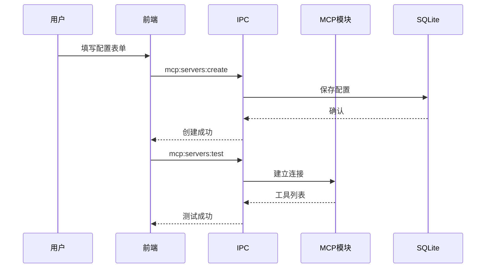
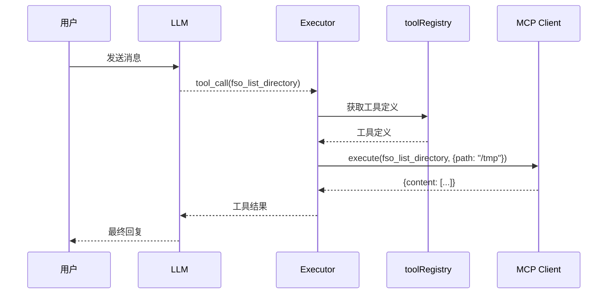

# talor-desktop MCP 功能迭代设计文档

> 本文档是 L3 迭代设计，描述本次变更的 delta。
> 依赖 L1 项目现状文档 `OVERVIEW-talor-desktop.md` 和 L2 需求文档 `requirements.md`。
> 追溯链：`US-001~US-008` → 本文档（`FD-talor-desktop-mcp`）→ `IMPL-talor-desktop-mcp`（IMPL-001~011）
> 依赖的 AC：`AC-001-01` ~ `AC-007-04`（共 19 条）

---

<!--
doc-id: FD-talor-desktop-mcp
status: approved
version: 1.0
last-updated: 2026-03-25
depends-on: [OVERVIEW-talor-desktop, REQ-talor-desktop-mcp]
generates: [IMPL-talor-desktop-mcp]
-->

---

## F.1 变更背景

### 关联需求

- US-001: 配置 MCP Server
- US-002: 测试 MCP Server 连接
- US-003: 启用/禁用 MCP Server
- US-004: 删除 MCP Server
- US-005: Agent 调用 MCP 工具
- US-006: 查看 MCP 工具列表
- US-007: 通过标准 MCP 配置导入 Server
- US-008: 通过 UI 管理 MCP Server

### 变更原因

当前 talor-desktop 已实现工具调用能力，但：
1. 工具扩展性差 — 新增工具需修改代码
2. 外部系统集成缺失 — 无法调用 GitHub、Jira 等
3. 社区生态隔离 — 无法使用 MCP 生态工具

通过引入 MCP 支持，扩展 Agent 能力边界。

### 变更范围

1. 新增 `src/main/mcp/` 模块（MCP Client + 配置管理）
2. 新增 `src/renderer/pages/Settings/MCPServerList.tsx`（网格卡片列表）
3. 新增 `src/renderer/pages/Settings/MCPServerForm.tsx`（配置表单）
4. 新增 IPC handlers（mcp:*）
5. 扩展 `toolRegistry` 支持 MCP 工具

---

## F.1.1 Phase 拆分

由于功能复杂，拆分为两个 Phase：

### Phase 6: MCP Server 配置管理

**目标**：用户可配置、管理 MCP Server

**IMPL 任务**：
- IMPL-001: 数据库 mcp_servers 表
- IMPL-002: MCP 配置 IPC 接口（CRUD）
- IMPL-003: MCP 配置存储（config-store）
- IMPL-004: MCPServerList 组件（网格卡片）
- IMPL-005: MCPServerForm 组件（表单）
- IMPL-006: 连接测试功能
- IMPL-007: MCP Config 导入/导出

**AC 覆盖**：AC-001, AC-002, AC-003, AC-004, AC-007, AC-008（19 条）

### Phase 7: MCP 工具集成

**目标**：Agent 可调用 MCP 工具

**IMPL 任务**：
- IMPL-008: MCP Client 核心（STDIO + HTTP 传输）
- IMPL-009: MCP 工具发现与注册
- IMPL-010: 工具调用集成到 toolRegistry
- IMPL-011: 工具列表展示

**AC 覆盖**：AC-005, AC-006

---

## F.2 全局影响

### Schema 变更

**新增配置表（mcp_servers）**：
```sql
CREATE TABLE mcp_servers (
  id TEXT PRIMARY KEY,
  name TEXT NOT NULL,
  type TEXT NOT NULL CHECK(type IN ('stdio', 'http')),
  command TEXT,
  args TEXT,
  env TEXT,
  url TEXT,
  auth_type TEXT DEFAULT 'none',
  auth_token TEXT,
  auth_api_key TEXT,
  enabled INTEGER DEFAULT 1,
  created_at TEXT,
  updated_at TEXT
);
```

**配置文件扩展**：
```json
{
  "mcp": {
    "servers": [...]
  }
}
```

### IPC 接口新增

| 接口 | 方法 | 说明 |
|------|------|------|
| `mcp:servers:list` | invoke | 列出所有 MCP Server |
| `mcp:servers:create` | invoke | 创建 MCP Server |
| `mcp:servers:update` | invoke | 更新 MCP Server |
| `mcp:servers:delete` | invoke | 删除 MCP Server |
| `mcp:servers:test` | invoke | 测试连接 |
| `mcp:tools:list` | invoke | 列出所有工具（含 MCP） |

### 新增模块

| 模块 | 路径 | 职责 |
|------|------|------|
| MCP Client | `src/main/mcp/client.ts` | MCP 协议客户端 |
| STDIO 传输 | `src/main/mcp/transport/stdio.ts` | STDIO 进程通信 |
| HTTP 传输 | `src/main/mcp/transport/http.ts` | HTTP SSE 通信 |
| 配置管理 | `src/main/mcp/config.ts` | Server 配置 CRUD |
| IPC Handlers | `src/main/ipc/mcp.ts` | IPC 通道处理 |

### 技术选型

**MCP Client SDK**：

| 方案 | 优点 | 缺点 |
|------|------|------|
| 官方 `@modelcontextprotocol/sdk` | 协议完整、维护成本低 | ESM only、可能需要构建调整 |
| 自实现 | 完全控制、无依赖 | 工作量大、维护成本高 |

**推荐**：优先使用官方 `@modelcontextprotocol/sdk`，如遇 ESM 兼容问题再考虑自实现 STDIO/HTTP 传输层。

**依赖版本**：
```json
{
  "@modelcontextprotocol/sdk": "^0.5.0"
}
```

---

## F.3 状态机变更

### MCP Server 状态机

```
         ┌──────────┐
         │  未连接   │
         └────┬─────┘
              │ 启用/连接成功
              ▼
    ┌─────────────────┐
    │                 │
┌───▼────┐    ┌─────▼────┐
│ 已连接  │    │  连接中  │
└────────┘    └────┬─────┘
     ▲              │
     │ 禁用/断开    │ 失败
     └──────────────┘
```

### 状态定义

| 状态 | 说明 | 触发条件 |
|------|------|---------|
| `disconnected` | 未连接 | 初始状态/手动断开 |
| `connecting` | 连接中 | 正在建立连接 |
| `connected` | 已连接 | 连接成功 |
| `disabled` | 已禁用 | enabled=false |

---

## F.4 接口协议

### MCP Client 接口

```typescript
interface MCPServerConfig {
  id: string
  name: string
  type: 'stdio' | 'http'
  command?: string
  args?: string[]
  env?: Record<string, string>
  url?: string
  auth?: {
    type: 'none' | 'bearer' | 'apiKey'
    token?: string
    apiKey?: string
  }
  enabled: boolean
}

interface MCPToolProvider {
  name: string
  version?: string
  listTools(): Array<{
    name: string
    description: string
    inputSchema: Record<string, unknown>
  }>
  execute(
    toolName: string,
    input: unknown,
    context: ToolExecuteContext
  ): Promise<{ content: Array<{ type: string; text?: string }> }>
}
```

### IPC 接口定义

```typescript
// mcp:servers:list
interface MCPServer[]

// mcp:servers:create
interface CreateMCPServerParams {
  name: string
  type: 'stdio' | 'http'
  command?: string
  args?: string[]
  env?: Record<string, string>
  url?: string
  auth?: {...}
  enabled?: boolean
}

// mcp:servers:test
interface TestConnectionResult {
  success: boolean
  toolCount?: number
  error?: string
}
```

---

## F.5 并发与幂等要求

### 幂等要求

| 操作 | 幂等键 | 处理方式 |
|------|--------|---------|
| 创建 Server | name | 名称重复则报错 |
| 更新 Server | id | 局部更新，字段覆盖 |
| 删除 Server | id | 重复删除 idempotent |
| 测试连接 | id | 可重复执行 |

### 并发策略

- MCP Server 连接串行执行，不支持并发
- UI 列表刷新需等待连接完成
- 工具调用可并发（继承现有能力）

---

## F.6 涟漪分析

### 下游影响

| 变更内容 | 影响下游 | Breaking? | 迁移步骤 |
|---------|---------|----------|---------|
| 新增 mcp_servers 表 | 数据库 | 是 | 首次启动自动创建 |
| 新增 IPC 接口 | 前端 | 否 | 新增接口无需迁移 |
| 扩展 toolRegistry | 工具调用 | 否 | 向后兼容 |

### 需同步修改

| 模块 | 同步内容 |
|------|---------|
| `OVERVIEW-talor-desktop.md` | 新增 MCP 职责 |
| `toolRegistry` | MCP 工具集成 |

---

## F.7 流程图

### MCP Server 配置流程



### 工具调用流程



---

## F.8 AC 验证契约

### F.8.0 验证环境规划

**代码分支**：`feature/mcp` 或现有开发分支

**基础设施依赖**：

| 服务 | 启动方式 | 健康检查 |
|------|---------|---------|
| talor-desktop | `npm run dev` | 页面加载完成 |
| SQLite (mcp_servers) | 自动创建 | 首次启动 |

**AC 数据冲突分析**：

| AC 组 | 冲突风险 | 隔离策略 |
|-------|---------|---------|
| Server CRUD | 名称唯一性 | 每条 AC 使用独立名称 |
| 连接测试 | 端口占用 | 使用不同端口的 mock server |

### F.8.1 验证契约表

| AC ID | 验证策略 | 断言要点 | 关键参数溯源 |
|-------|---------|---------|--------------|
| AC-001-01 | 前端表单提交 | Server 出现在列表 | name="文件系统", type="stdio" |
| AC-001-02 | 前端表单提交 | Server 出现在列表 | name="GitHub API", type="http" |
| AC-001-03 | 前端编辑 | 名称更新成功 | 原 name="测试", 新 name="正式" |
| AC-002-01 | 点击测试按钮 | 显示成功提示 + 工具数量 | STDIO command |
| AC-002-02 | 点击测试按钮 | 显示成功提示 + 工具数量 | HTTP url |
| AC-002-03 | 点击测试按钮 | 显示超时错误 | 不存在的地址 |
| AC-003-01 | 点击禁用开关 | 状态变为已禁用 | enabled=false |
| AC-003-02 | 点击启用开关 | 触发连接+发现 | enabled=true |
| AC-004-01 | 点击删除+确认 | 列表中消失 | Server 存在 |
| AC-005-01 | 发送消息触发工具 | 返回文件列表 | MCP Server 已连接 |
| AC-005-02 | 调用耗时工具 | 返回超时错误 | 工具执行 >30s |
| AC-006-01 | 查看工具列表 | 显示 Server 名称+数量 | 已连接 Server |
| AC-006-02 | 查看 Server 列表 | 显示各 Server 状态 | 多种状态 Server |
| AC-007-01 | 粘贴 JSON 导入 | 创建对应 Server | JSON 格式正确 |
| AC-007-02 | 导入重复名称 | 提示覆盖确认 | 同名 Server 存在 |
| AC-007-03 | 导入错误 JSON | 显示格式错误 | JSON 语法错误 |
| AC-007-04 | 点击导出按钮 | 导出标准 JSON | 至少一个 Server |
| AC-008-01 | 首次打开页面 | 显示空状态提示 | 无配置 |
| AC-008-02 | 鼠标悬停卡片 | 显示阴影效果 | 至少一个 Server |

---

## F.9 UI 设计规范

### 页面布局

- 入口：设置页面 → "MCP Server" 标签页
- 布局：3 列网格卡片（响应式：桌面 3/平板 2/手机 1）

### 组件规范

| 组件 | 规范 |
|------|------|
| 网格布局 | Grid 3 列，gap 16px |
| Server 卡片 | 白色背景，圆角 12px，固定宽度 240px |
| 状态指示器 | ● 已连接(绿) / ○ 未连接(灰) / ○ 已禁用(灰) |
| 操作按钮 | [测试] [编辑] [删除] 居中 |

---

## 依赖文档版本快照

| 文档 | version | last-updated |
|------|---------|-------------|
| `requirements.md` | v1.0 | 2026-03-25 |
| `OVERVIEW-talor-desktop.md` | v1.3 | 2026-03-22 |
