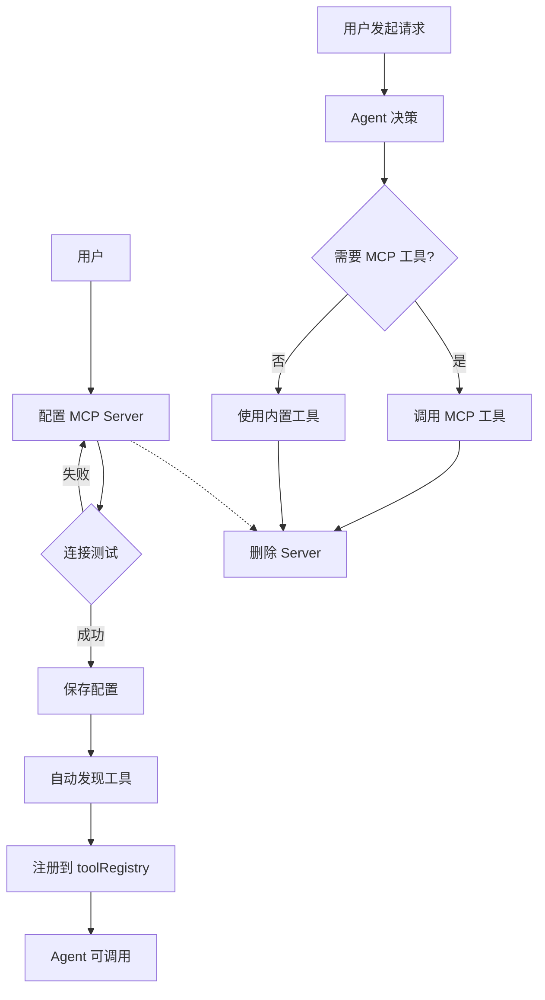

# talor-desktop MCP 功能需求文档

> 本文档是 L2 产品需求，定义 MCP 功能的用户故事和验收标准。
> 依赖 L1 项目现状文档 `OVERVIEW-talor-desktop.md`。
> 追溯链：`overview.md` → `requirements.md` (本文档) → `feature.md` → `implementation.md`

---

<!--
doc-id: REQ-talor-desktop-mcp
status: approved
version: 1.0
last-updated: 2026-03-25
depends-on: [OVERVIEW-talor-desktop]
generates: [FD-talor-desktop-mcp]
-->

---

## 1.1 需求背景

当前 talor-desktop 已实现工具调用能力，内置了 7 个文件操作工具（read/write/edit/glob/grep/ls/bash）。但这些工具能力有限，无法满足更复杂的开发需求：

1. **工具扩展性差** — 新增工具需要修改代码，无法动态加载
2. **外部系统集成缺失** — 无法调用 GitHub、Jira、数据库等外部工具
3. **社区生态隔离** — 无法使用 MCP 生态中丰富的预构建工具

通过引入 MCP (Model Context Protocol) 支持，用户可以连接外部 MCP Server，将丰富的外部工具引入 talor-desktop，扩展 Agent 的能力边界。

---

## 1.2 目标

### 主要目标

1. **MCP Server 配置管理** — 用户可添加、编辑、删除、测试 MCP Server 连接
2. **工具自动发现** — 连接 MCP Server 后自动发现并注册其提供的工具
3. **工具调用集成** — Agent 可调用 MCP 工具，与内置工具无差异化使用

### 目标范围

| 目标 | 说明 |
|------|------|
| O1 | 用户可配置多个 MCP Server（STDIO + HTTP 模式） |
| O2 | MCP Server 配置持久化，重启后保留 |
| O3 | 连接测试功能验证 Server 可达性 |
| O4 | MCP 工具自动注册到 toolRegistry |
| O5 | Agent 可通过自然语言调用 MCP 工具 |

### 明确排除

| 排除项 | 原因 |
|--------|------|
| MCP Server 开发/部署 | 用户自行管理 MCP Server |
| MCP Prompts/Resources | MVP 阶段仅支持 Tools |
| MCP Sampling/Elicitation | MVP 阶段不实现 |
| MCP Server 进程管理 UI | 后续迭代 |

---

## 1.2.1 标准 MCP 配置格式

支持导入标准 MCP 配置文件格式：

```json
{
  "server-name": {
    "type": "stdio",
    "command": "npx",
    "args": ["-y", "@modelcontextprotocol/server-filesystem", "/path"],
    "env": {
      "KEY": "value"
    }
  },
  "another-server": {
    "type": "http",
    "url": "https://mcp.example.com/endpoint",
    "auth": {
      "type": "bearer",
      "token": "your-token"
    }
  }
}
```

### 字段映射

| MCP Config 字段 | 内部字段 | 必填 | 说明 |
|-----------------|---------|------|------|
| `type` | `type` | 是 | `"stdio"` 或 `"http"` |
| `command` | `command` | STDIO 时必填 | 执行命令 |
| `args` | `args` | 否 | 命令参数数组 |
| `env` | `env` | 否 | 环境变量对象 |
| `url` | `url` | HTTP 时必填 | 服务器地址 |
| `auth` | `auth` | 否 | 认证配置 |
| `auth.type` | `auth.type` | 否 | `"none"`, `"bearer"`, `"apiKey"` |
| `auth.token` | `auth.token` | 否 | Bearer token |
| `auth.apiKey` | `auth.apiKey` | 否 | API Key |

---

## 1.3 业务术语表

| 术语 | 定义 | 代码命名 | 易混淆项 |
|------|------|----------|----------|
| MCP Server | 提供工具/提示/资源的外部服务进程 | `MCPServer` | LLM Provider |
| STDIO 传输 | 通过标准输入输出与本地进程通信 | `StdioTransport` | HTTP 传输 |
| HTTP 传输 | 通过 HTTP/WebSocket 与远程服务通信 | `HttpTransport` | STDIO 传输 |
| 工具发现 | 连接 Server 后获取其提供的工具列表 | `discoverTools` | 工具注册 |
| 工具注册 | 将外部工具注册到本地 toolRegistry | `registerExternalProvider` | 工具发现 |
| 连接状态 | Server 当前是否可达 | `connectionStatus` | 启用状态 |
| MCP Config Import | 通过标准 MCP 配置文件导入 Server | `importFromConfig` | 手动配置 |
| MCP Config Export | 导出 Server 配置为标准格式 | `exportToConfig` | 手动配置 |

---

## 1.4 用户故事

### US-001: 配置 MCP Server

**作为** 开发者
**我希望** 在 talor-desktop 中配置 MCP Server
**以便于** 扩展 Agent 的工具能力

**真实数据样例**：
- 输入：type=stdio, name="文件系统", command="npx", args=["-y", "@modelcontextprotocol/server-filesystem", "/Users/quinn/Desktop"]
- 输出：Server 记录保存成功，出现在列表中

**边界 Case**：
- 当 command 不存在时 → 显示"命令不存在，请检查路径"
- 当 URL 格式不正确时 → 显示"请输入有效的 HTTP URL"
- 当配置重复名称时 → 显示"该名称已存在，请使用其他名称"

---

### US-002: 测试 MCP Server 连接

**作为** 开发者
**我希望** 在配置后测试 MCP Server 连接是否正常
**以便于** 验证配置正确性

**真实数据样例**：
- 输入：Server ID = "srv-001"
- 输出：连接成功，显示"✅ 连接正常，发现 12 个工具"

**边界 Case**：
- 当 Server 无响应超时 → 显示"❌ 连接超时（30秒），请检查 Server 是否运行"
- 当 Server 返回错误 → 显示"❌ 连接失败：{错误信息}"
- 当认证失败 → 显示"❌ 认证失败，请检查 API Key 或 Token"

---

### US-003: 启用/禁用 MCP Server

**作为** 开发者
**我希望** 启用或禁用某个 MCP Server
**以便于** 控制 Agent 是否可以使用该 Server 的工具

**真实数据样例**：
- 输入：Server ID = "srv-001", enabled = false
- 输出：Server 状态变为"已禁用"，其工具不再出现在工具列表中

**边界 Case**：
- 当禁用正在使用的 Server → 不影响当前会话，新会话不加载
- 当启用已连接的 Server → 自动发现并注册工具

---

### US-004: 删除 MCP Server

**作为** 开发者
**我希望** 删除不再需要的 MCP Server 配置
**以便于** 管理配置列表

**真实数据样例**：
- 输入：Server ID = "srv-001"
- 输出：Server 记录删除，其工具从 toolRegistry 移除

**边界 Case**：
- 当删除正在连接的 Server → 立即断开连接，移除工具
- 当删除不存在的 Server → 显示"Server 不存在"

---

### US-005: Agent 调用 MCP 工具

**作为** 用户
**我希望** 通过自然语言让 Agent 调用 MCP 工具
**以便于** 使用外部工具完成复杂任务

**真实数据样例**：
- 输入："列出桌面上的所有文件"
- Agent 决策：调用 MCP 工具 `filesystem_list_directory`，参数 `{ "path": "/Users/quinn/Desktop" }`
- 输出：工具执行结果，Agent 整合后回复

**边界 Case**：
- 当 MCP 工具执行超时 → 显示工具执行超时错误
- 当 MCP 工具执行失败 → 显示错误信息，Agent 可尝试其他方式
- 当工具参数不完整 → Agent 自动补充或询问用户

---

### US-006: 查看 MCP 工具列表

**作为** 用户
**我希望** 查看当前可用的 MCP 工具
**以便于** 了解 Agent 可以使用哪些工具

**真实数据样例**：
- 输入：查看工具列表
- 输出：显示 "文件系统 (3 工具)", "GitHub (5 工具)", "数据库 (4 工具)"

**边界 Case**：
- 当无 MCP Server → 显示"暂无 MCP Server，请先配置"
- 当 Server 未连接 → 显示工具来源为"（未连接）"

---

### US-007: 通过标准 MCP 配置导入 Server

**作为** 开发者
**我希望** 通过标准 MCP 配置文件导入多个 Server
**以便于** 快速配置常用的 MCP Server

**真实数据样例**：
- 输入：MCP Config JSON
```json
{
  "github": {
    "type": "http",
    "url": "https://api.githubcopilot.com/mcp/"
  },
  "filesystem": {
    "type": "stdio",
    "command": "npx",
    "args": ["-y", "@modelcontextprotocol/server-filesystem", "/Users/quinn/Desktop"]
  }
}
```
- 输出：成功导入 2 个 Server

**边界 Case**：
- 当配置格式错误 → 显示"配置文件格式错误，请检查 JSON 语法"
- 当 Server 名称重复 → 提示"Server {name} 已存在，是否覆盖？"
- 当配置项缺失 → 显示"缺少必要字段 {field}，请补充"

---

### US-008: 通过 UI 管理 MCP Server

**作为** 开发者
**我希望** 通过图形界面管理 MCP Server
**以便于** 直观地查看和操作 Server 配置

**真实数据样例**：
- 打开设置页面 → 显示"MCP Server 配置"标题 → 列表展示所有 Server
- 每个 Server 显示：名称、类型（STDIO/HTTP）、连接状态、启用状态

**边界 Case**：
- 当首次使用 → 显示空状态"暂无 MCP Server，点击上方按钮添加"
- 当 Server 数量较多 → 支持滚动加载

---

## 1.5 业务流程图



---

## 1.5.1 页面 UI 设计

### 页面入口
- 位置：设置页面 → "MCP Server" 标签页
- 与现有 "Provider 配置" 页面并列

### MCP Server 配置页面布局（网格卡片）

```
┌─────────────────────────────────────────────────────────────────┐
│ Talor                              对话  设置                     │
├─────────────────────────────────────────────────────────────────┤
│  Provider 配置    MCP Server                                    │
├─────────────────────────────────────────────────────────────────┤
│                                                                  │
│  [+ 新增 Server]  [↻ 导入配置]                                  │
│                                                                  │
│  ┌─────────────────┐  ┌─────────────────┐  ┌─────────────────┐  │
│  │      📁         │  │       🔧        │  │       🗄️        │  │
│  │   文件系统       │  │   GitHub API   │  │     数据库      │  │
│  │                 │  │                 │  │                 │  │
│  │  ● 已连接       │  │  ○ 未连接       │  │  ○ 已禁用      │  │
│  │                 │  │                 │  │                 │  │
│  │  STDIO         │  │  HTTP           │  │  STDIO         │  │
│  │  npx server-   │  │  api.github...  │  │  node db-s...  │  │
│  │  filesystem    │  │                 │  │                 │  │
│  │                 │  │                 │  │                 │  │
│  │  工具: 3 个    │  │  工具: 5 个     │  │  工具: 4 个    │  │
│  │                 │  │                 │  │                 │  │
│  │ [测试][编辑]    │  │ [测试][编辑]    │  │ [测试][编辑]    │  │
│  └─────────────────┘  └─────────────────┘  └─────────────────┘  │
│                                                                  │
│  [+ 新增 Server]  [↻ 导入配置]                                  │
└─────────────────────────────────────────────────────────────────┘
```

### 卡片详情

每个卡片包含：
- **图标**: 根据 Server 类型显示（📁 文件系统、🔧 API、🗄️ 数据库等）
- **名称**: Server 名称
- **状态指示器**: 
  - ● 已连接（绿色）
  - ○ 未连接（灰色）
  - ○ 已禁用（灰色 + 禁用图标）
- **类型**: STDIO 或 HTTP
- **连接信息**: 命令/URL（截断显示）
- **工具数量**: 发现 X 个工具
- **操作按钮**: 测试、编辑、删除

### 新增/编辑 Server 表单

```
┌─────────────────────────────────────────────────────────────┐
│  新增 MCP Server                                            │
├─────────────────────────────────────────────────────────────┤
│                                                             │
│  类型:  ● STDIO  ○ HTTP                                    │
│                                                             │
│  名称:  ┌─────────────────────────────────────────┐        │
│         │ 例如：文件系统                              │        │
│         └─────────────────────────────────────────┘        │
│                                                             │
│  ─── STDIO 模式 ───                                        │
│  命令:  ┌─────────────────────────────────────────┐        │
│         │ npx                                      │        │
│         └─────────────────────────────────────────┘        │
│  参数:  ┌─────────────────────────────────────────┐        │
│         │ -y @modelcontextprotocol/server-...   │        │
│         └─────────────────────────────────────────┘        │
│                                                             │
│  ─── HTTP 模式 ───                                         │
│  URL:   ┌─────────────────────────────────────────┐        │
│         │ https://mcp.example.com                  │        │
│         └─────────────────────────────────────────┘        │
│  认证:  ○ 无   ○ Bearer Token   ○ API Key                 │
│  Token: ┌─────────────────────────────────────────┐        │
│         │                                           │        │
│         └─────────────────────────────────────────┘        │
│                                                             │
│         [测试连接]      [取消]  [保存]                       │
└─────────────────────────────────────────────────────────────┘
```

### 导入配置弹窗

```
┌─────────────────────────────────────────────────────────────┐
│  导入 MCP 配置                                              │
├─────────────────────────────────────────────────────────────┤
│                                                             │
│  请粘贴 MCP Server 配置 (JSON):                             │
│  ┌─────────────────────────────────────────────────────┐    │
│  │ {                                                     │    │
│  │   "github": {                                       │    │
│  │     "type": "http",                                 │    │
│  │     "url": "https://api.githubcopilot.com/mcp/"   │    │
│  │   }                                                 │    │
│  │ }                                                   │    │
│  └─────────────────────────────────────────────────────┘    │
│                                                             │
│  预览: 导入 1 个 Server                                    │
│         • github (HTTP)                                     │
│                                                             │
│         [取消]  [导入]                                      │
└─────────────────────────────────────────────────────────────┘
```

### 组件设计规范

| 组件 | 规范 |
|------|------|
| 网格布局 | 3 列 Grid 布局，响应式：桌面 3 列 / 平板 2 列 / 手机 1 列 |
| Server 卡片 | 白色背景，圆角 12px，hover 时阴影效果，固定宽度 240px |
| 卡片图标 | 居中显示，32x32px，根据名称自动识别类型或显示默认 🔧 |
| 状态指示器 | 已连接: 绿色圆点 ● / 未连接: 灰色圆点 ○ / 已禁用: 灰色 + 禁用图标 |
| 启用开关 | Toggle 在卡片内显示，点击切换 |
| 操作按钮 | 卡片底部居中：[测试] [编辑] [删除] |
| 空状态 | 居中显示大图标 + "暂无 MCP Server" + 引导按钮 |

| ID | 功能 | 所属 US | 优先级 |
|----|------|---------|--------|
| F01 | MCP Server 配置表单 | US-001 | P0 |
| F02 | MCP Server 列表展示 | US-001 | P0 |
| F03 | STDIO 模式配置 | US-001 | P0 |
| F04 | HTTP 模式配置 | US-001 | P0 |
| F05 | 连接测试 | US-002 | P0 |
| F06 | 启用/禁用切换 | US-003 | P0 |
| F07 | 删除 Server | US-004 | P0 |
| F08 | 工具自动发现 | US-005 | P0 |
| F09 | MCP 工具调用 | US-005 | P0 |
| F10 | 工具列表展示 | US-006 | P1 |
| F11 | 配置持久化 | US-001 | P0 |
| F12 | 连接状态显示 | US-006 | P1 |
| F13 | MCP Config 导入 | US-007 | P0 |
| F14 | MCP Config 导出 | US-007 | P1 |
| F15 | Server 配置编辑 | US-001 | P0 |
| F16 | Server 详情页面 | US-008 | P0 |
| F17 | 空状态提示 | US-008 | P1 |

---

## 1.7 优先级与取舍原则

### 优先级排序

1. **P0 - 核心功能**
   - MCP Server CRUD（配置、编辑、删除）
   - 连接测试
   - 工具发现与注册
   - 工具调用

2. **P1 - 重要体验**
   - 连接状态显示
   - 工具列表展示
   - 错误信息优化

3. **P2 - 增强功能**
   - MCP Prompts 支持
   - MCP Resources 支持
   - 进程管理 UI

### 取舍原则

| 场景 | 决策 |
|------|------|
| 连接失败 | 阻断式错误提示，不静默失败 |
| 工具执行超时 | 30秒超时，返回超时错误 |
| 并发冲突 | 不支持多 Server 并发连接，串行处理 |
| 认证失败 | 明确提示认证类型，不暴露敏感信息 |

### 降级策略

| 场景 | 降级方案 |
|------|---------|
| MCP Server 不可达 | 显示离线状态，Agent 切换到内置工具 |
| 工具执行失败 | 返回错误信息，Agent 可尝试其他方式 |
| 配置损坏 | 跳过损坏配置，启动后提示用户修复 |

---

## 1.8 验收标准

> **断言类型说明**：
> - `[响应]` — HTTP/IPC 响应层验证（Layer 1）
> - `[数据]` — 数据库/存储层验证（Layer 1）
> - `[事件]` — 系统事件/副作用验证（Layer 1+2）
> - `[页面]` — UI 渲染层验证（Layer 2）

---

### Phase 6 AC（MCP Server 配置管理）

#### AC-001-01: 添加 STDIO 模式 MCP Server

- **Given**: 用户在 MCP Server 配置页面，点击"新增 Server"
- **When**: 选择 type="stdio"，填写 name="文件系统"，command="npx"，args=["-y", "@modelcontextprotocol/server-filesystem", "/Users/quinn/Desktop"]
- **Then**:
  - `[数据]` mcp_servers 表新增记录，type='stdio', name='文件系统'
  - `[页面]` 列表显示"文件系统（STDIO）"卡片

**验证前置条件**：talor-desktop 正常运行，可打开设置页面

---

#### AC-001-02: 添加 HTTP 模式 MCP Server

- **Given**: 用户在 MCP Server 配置页面，点击"新增 Server"
- **When**: 选择 type="http"，填写 name="GitHub API"，url="https://mcp.example.com/github"
- **Then**:
  - `[数据]` mcp_servers 表新增记录，type='http', name='GitHub API', url='https://mcp.example.com/github'
  - `[页面]` 列表显示"GitHub API（HTTP）"卡片

**验证前置条件**：talor-desktop 正常运行

---

#### AC-001-03: 编辑 MCP Server 配置

- **Given**: 已存在 Server，name="测试 Server"
- **When**: 点击"编辑"，修改 name="正式 Server"，保存
- **Then**:
  - `[数据]` mcp_servers 表记录 name 更新为"正式 Server"
  - `[页面]` 列表显示"正式 Server"

**验证前置条件**：存在至少一个已配置的 Server

---

#### AC-002-01: STDIO Server 连接测试成功

- **Given**: 已配置 STDIO Server，command="npx"，args=["-y", "@modelcontextprotocol/server-filesystem", "/tmp"]
- **When**: 点击"测试连接"
- **Then**:
  - `[响应]` IPC 返回 { status: 'success', tools_count: N }
  - `[页面]` 显示"✅ 连接成功，发现 N 个工具"

**验证前置条件**：npx 可用，目标路径存在

---

#### AC-002-02: HTTP Server 连接测试成功

- **Given**: 已配置 HTTP Server，url="https://mcp.example.com"
- **When**: 点击"测试连接"
- **Then**:
  - `[响应]` IPC 返回 { status: 'success', tools_count: N }
  - `[页面]` 显示"✅ 连接成功，发现 N 个工具"

**验证前置条件**：目标 HTTP Server 可达

---

#### AC-002-03: 连接超时处理

- **Given**: 已配置 Server，Server 无响应
- **When**: 点击"测试连接"
- **Then**:
  - `[响应]` IPC 返回 { status: 'failure', error_code: 'TIMEOUT' }
  - `[页面]` 显示"❌ 连接超时（30秒），请检查 Server 是否运行"

**验证前置条件**：配置一个不存在的 Server 地址

---

#### AC-003-01: 禁用 MCP Server

- **Given**: Server 处于"已连接"状态
- **When**: 点击禁用开关
- **Then**:
  - `[数据]` mcp_servers 表记录 enabled=0
  - `[页面]` 显示"已禁用"
  - `[事件]` 触发工具列表更新

**验证前置条件**：存在已连接的 Server

---

#### AC-003-02: 启用 MCP Server

- **Given**: Server 处于"已禁用"状态
- **When**: 点击启用开关
- **Then**:
  - `[数据]` mcp_servers 表记录 enabled=1
  - `[事件]` 触发连接和工具发现
  - `[页面]` 显示"已连接"

**验证前置条件**：存在已禁用的 Server

---

#### AC-004-01: 删除 MCP Server

- **Given**: 已配置 Server，name="测试"
- **When**: 点击"删除"，确认删除
- **Then**:
  - `[数据]` mcp_servers 表记录删除
  - `[页面]` 列表中不显示该 Server

**验证前置条件**：存在至少一个已配置的 Server

---

#### AC-007-01: 通过 JSON 导入 MCP 配置

- **Given**: 用户在 MCP Server 页面，点击"导入配置"
- **When**: 粘贴以下 JSON 并点击导入
```json
{
  "github": {
    "type": "http",
    "url": "https://api.githubcopilot.com/mcp/"
  }
}
```
- **Then**:
  - `[数据]` mcp_servers 表新增记录，name='github', type='http'
  - `[页面]` 列表显示 "github (HTTP)"

**验证前置条件**：talor-desktop 正常运行，可打开 MCP 配置页面

---

#### AC-007-02: 导入重复名称处理

- **Given**: 已存在 Server name="github"
- **When**: 导入包含 name="github" 的配置
- **Then**:
  - `[响应]` 提示"Server github 已存在，是否覆盖？"
  - `[数据]` 确认后 mcp_servers 表记录更新

**验证前置条件**：存在同名 Server

---

#### AC-007-03: 导入格式错误处理

- **Given**: 用户粘贴了格式错误的 JSON
- **When**: 点击导入
- **Then**:
  - `[响应]` 返回错误 "配置文件格式错误，请检查 JSON 语法"
  - `[页面]` 显示错误提示

**验证前置条件**：无

---

#### AC-007-04: 导出 MCP 配置

- **Given**: 已配置 2 个 MCP Server
- **When**: 点击"导出配置"
- **Then**:
  - `[响应]` 返回 JSON 字符串，包含所有 Server 配置
  - `[页面]` 触发文件下载

**验证前置条件**：存在至少一个已配置的 Server

---

#### AC-008-01: MCP 页面空状态

- **Given**: 用户首次打开 MCP Server 页面，无任何配置
- **When**: 页面加载完成
- **Then**:
  - `[页面]` 显示空状态提示"暂无 MCP Server，点击上方按钮添加"

**验证前置条件**：无配置的全新环境

---

#### AC-008-02: Server 卡片交互

- **Given**: 列表中有多个 Server
- **When**: 鼠标悬停在某个 Server 卡片上
- **Then**:
  - `[页面]` 卡片显示轻微阴影效果 (CSS transition)

**验证前置条件**：存在至少一个 Server

---

### Phase 7 AC（MCP Tool 集成）

#### AC-005-01: Agent 调用 STDIO MCP 工具

- **Given**: 已配置并启用 STDIO MCP Server，name="文件系统"，command="npx"，args=["-y", "@modelcontextprotocol/server-filesystem", "/tmp"]
- **When**: 用户发送消息"列出 /tmp 目录下的文件"
- **Then**:
  - `[响应]` Agent 决策调用 MCP 工具 `filesystem_list_directory`
  - `[响应]` 返回工具执行结果，包含文件列表
  - `[页面]` Agent 整合结果后回复用户

**验证前置条件**：talor-desktop 正常运行，配置好 STDIO MCP Server，Server 进程可启动

---

#### AC-005-02: Agent 调用 HTTP MCP 工具

- **Given**: 已配置并启用 HTTP MCP Server，name="GitHub"，url="https://mcp.example.com/github"
- **When**: 用户发送消息"查询 GitHub 仓库 talor 的信息"
- **Then**:
  - `[响应]` Agent 决策调用 MCP 工具
  - `[响应]` 返回工具执行结果（JSON）
  - `[页面]` Agent 整合结果后回复用户

**验证前置条件**：talor-desktop 正常运行，目标 HTTP MCP Server 可达

---

#### AC-005-03: MCP 工具执行超时处理

- **Given**: 已配置并启用 MCP Server，该 Server 响应慢
- **When**: 用户触发耗时较长的 MCP 工具调用
- **Then**:
  - `[响应]` 30 秒后返回超时错误
  - `[页面]` 显示"工具执行超时，请重试或检查 Server 状态"

**验证前置条件**：配置一个响应慢的 MCP Server

---

#### AC-006-01: 查看 MCP 工具列表

- **Given**: 已配置并启用 2 个 MCP Server，每个 Server 提供多个工具
- **When**: 用户查看工具列表
- **Then**:
  - `[响应]` 返回包含 MCP 工具的工具列表
  - `[页面]` 显示各 Server 名称 + 工具数量（如"文件系统 (3 工具)", "GitHub (5 工具)"）

**验证前置条件**：talor-desktop 正常运行，至少配置 1 个 MCP Server

---

#### AC-006-02: MCP Server 连接状态显示

- **Given**: 已配置多个 MCP Server，部分已连接，部分未连接
- **When**: 用户查看 MCP Server 列表
- **Then**:
  - `[页面]` 显示每个 Server 的连接状态（已连接/未连接/已禁用）

**验证前置条件**：存在多个不同状态的 MCP Server

---

## 1.9 变更传播

> 若本文档的 US/AC/术语有变更，需同步更新下游文档

| 变更项 | 传播至 |
|--------|--------|
| 新增 AC → | feature.md (§F.8), implementation.md |
| 术语定义变更 → | feature.md (§F.3) |
| 优先级变更 → | implementation.md (§4.2) |
