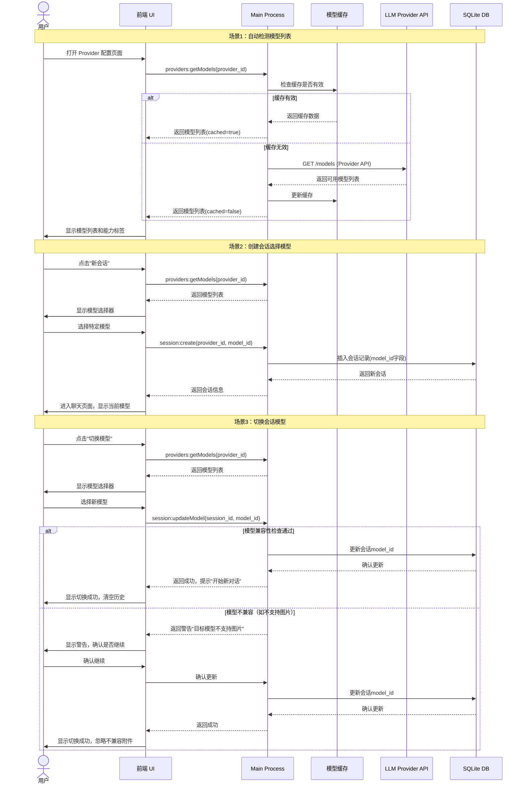
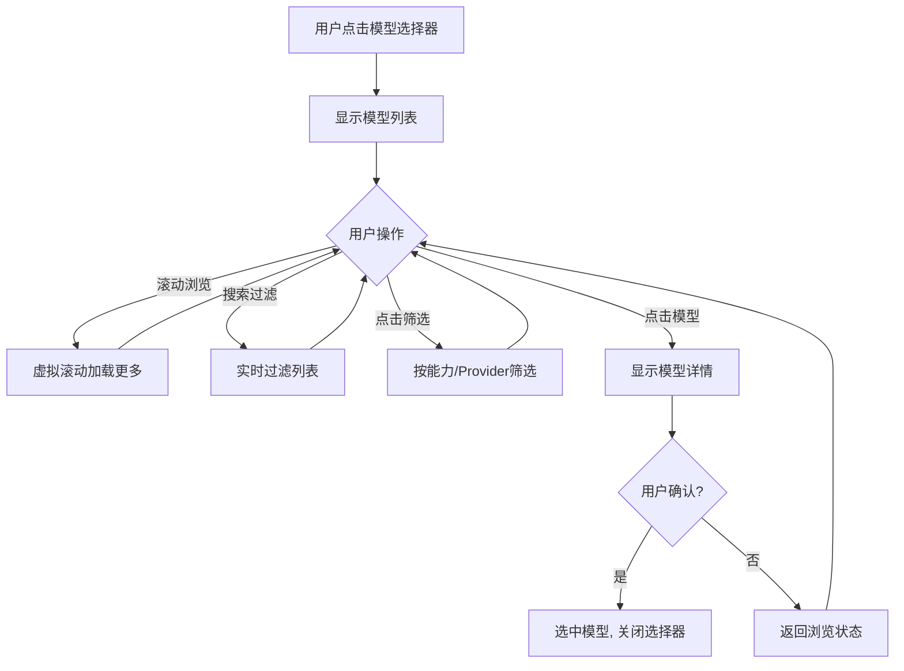

<!--
doc-id: FD-talor-desktop-model-management
status: review
version: 1.0
last-updated: 2026-03-22
depends-on: [REQ-talor-model-management]
generates: [IMPL-talor-model-management]
-->

# FEATURE — talor-desktop 模型管理功能设计

> 追溯链：US-010, US-011, US-012 → 本文档（FD-talor-desktop-model-management）→ IMPL-talor-model-management
> 依赖的 AC：AC-010-01 至 AC-010-04, AC-011-01 至 AC-011-04, AC-012-01 至 AC-012-05
> 项目现状见 `vibe/overviews/OVERVIEW-talor-desktop.md`。需求见 `requirements.md`。实施计划见 `IMPLEMENTATION.md`。

---

## §F.1 变更背景

当前 talor-desktop 已实现 Provider 配置管理和流式对话功能（Phase 1-2.3），但存在以下限制：
1. 用户无法查看 Provider 支持的具体模型列表，需要手动查找文档
2. 用户不了解模型的能力特性（是否支持图片、工具调用等）
3. 会话创建时自动使用 Provider 的第一个模型，无法选择特定模型

本功能旨在解决这些问题，通过：
1. **自动模型发现**：从 Provider API 获取可用模型列表
2. **能力检测**：检测模型支持的功能特性
3. **模型选择**：在会话创建和使用中支持模型选择

**关联 US**：US-010（自动检测模型列表）、US-011（查看模型能力）、US-012（会话选择模型）

---

## §F.2 全局影响

### 新增 ADR
- **ADR-012：模型信息缓存策略**
  - **决策**：模型列表和能力信息缓存 5 分钟，减少 API 调用
  - **原因**：Provider 模型列表变化不频繁，频繁调用增加延迟和 API 限制风险
  - **备选方案**：实时调用（延迟高）、永久缓存（信息过时）

### Schema 变更
**现有 Schema**（`src/main/store/config-store.ts`）：
```typescript
interface Provider {
  id: string;
  type: 'ollama' | 'openai' | 'anthropic' | 'google';
  name: string;
  base_url: string;
  api_key?: string; // encrypted
  is_default: boolean;
  // 现有字段结束
}
```

**新增字段**：
```typescript
interface Provider {
  // ... 现有字段
  models?: ModelInfo[];           // 缓存的模型列表
  models_last_updated?: string;   // ISO 时间戳
  models_cache_ttl?: number;      // 缓存有效期（秒），默认 300
}

interface ModelInfo {
  id: string;                    // provider_id/model_name，如 "ollama/qwen3:4b"
  name: string;                  // 模型名称，如 "qwen3:4b"
  provider_id: string;           // 所属 Provider ID
  display_name: string;          // 显示名称，如 "Qwen 3 (4B)"
  description?: string;          // 模型描述
  capabilities: ModelCapability[]; // 能力列表
  supports_vision?: boolean;     // 是否支持视觉（图片理解）
  supports_tools?: boolean;      // 是否支持工具调用
  max_tokens?: number;           // 最大 token 数
  // 未来可扩展：价格、性能指标等
}

interface ModelCapability {
  category: 'text' | 'vision' | 'tools' | 'video' | 'audio';
  type: string;                  // 如 "text_generation", "image_understanding"
  supported: boolean;            // 是否支持
  description: string;           // 能力描述
  detected_at?: string;          // 检测时间
  source: 'auto' | 'manual' | 'default'; // 来源：自动检测/手动设置/默认值
}
```

**会话 Schema 变更**（`src/main/repos/session-repo.ts`）：
```typescript
interface ChatSession {
  id: string;
  title: string;
  provider_id: string;
  // 新增字段
  model_id?: string;             // 会话使用的具体模型 ID
  created_at: string;
  updated_at: string;
}
```

### IPC 协议新增端点
**现有端点**（`src/main/ipc/providers.ts`）：
- `providers:list`, `providers:create`, `providers:update`, `providers:delete`, `providers:setDefault`, `providers:testConnection`

**新增端点**：
- `providers:getModels` - 获取 Provider 的模型列表
- `providers:refreshModels` - 强制刷新模型列表
- `providers:detectCapabilities` - 检测模型能力
- `providers:updateModelCapabilities` - 更新模型能力配置（手动）

**现有端点**（`src/main/ipc/session.ts`）：
- `session:list`, `session:create`, `session:delete`, `session:rename`

**修改端点**：
- `session:create` - 新增 `model_id` 参数
- `session:updateModel` - 新增端点：更新会话使用的模型

### 新增 Patterns
1. **模型缓存模式**：TTL 缓存 + 强制刷新 + 过期自动更新
2. **能力检测降级模式**：自动检测失败 → 保守默认值 → 用户手动配置
3. **模型选择器组件模式**：统一的前端模型选择器，支持能力过滤

---

## §F.3 新增/变更的状态机转换

### Provider 模型状态机（新增）
**状态**：
- `idle` - 空闲，未加载模型
- `loading` - 正在加载模型列表
- `loaded` - 模型列表已加载
- `error` - 加载失败
- `refreshing` - 正在刷新模型列表

**转换**：
- `idle` → `loading`：用户打开 Provider 配置页面或手动触发加载
- `loading` → `loaded`：模型列表加载成功
- `loading` → `error`：加载失败（网络错误、API 错误等）
- `loaded` → `refreshing`：用户手动刷新或缓存过期
- `refreshing` → `loaded`：刷新成功
- `refreshing` → `error`：刷新失败
- `error` → `loading`：用户重试
- 任何状态 → `idle`：Provider 配置被删除或修改

### 会话模型状态机（新增）
**状态**：
- `default` - 使用 Provider 默认模型
- `selected` - 使用用户选择的特定模型
- `unavailable` - 选择的模型不可用
- `switching` - 正在切换模型

**转换**：
- `default` → `selected`：用户创建会话时选择特定模型
- `selected` → `switching`：用户尝试切换模型
- `switching` → `selected`：切换成功
- `switching` → `unavailable`：目标模型不可用
- `unavailable` → `selected`：用户选择其他可用模型
- `selected` → `unavailable`：模型变为不可用（如 API 变更）
- 任何状态 → `default`：用户重置为默认模型

---

## §F.4 新增/变更的接口协议

### 后端接口（Python talor） - 可选扩展
> 注：当前 Phase 2 架构下，talor-desktop 直接调用 LLM API，不依赖 Python 后端。此部分为未来扩展预留。

**现有接口**：无相关接口

**新增接口**（未来）：
- `GET /api/providers/{provider_id}/models` - 获取 Provider 模型列表
- `GET /api/models/{model_id}/capabilities` - 获取模型能力详情
- `POST /api/providers/{provider_id}/models/refresh` - 刷新模型列表

### 前端 IPC 接口（新增/变更）

**1. 获取模型列表**：
```typescript
// 请求
interface GetModelsRequest {
  provider_id: string;
  force_refresh?: boolean; // 强制刷新，忽略缓存
}

// 响应
interface GetModelsResponse {
  models: ModelInfo[];
  cached: boolean; // 是否来自缓存
  last_updated: string; // 最后更新时间
  ttl_remaining: number; // 缓存剩余时间（秒）
}
```

**2. 刷新模型列表**：
```typescript
// 请求
interface RefreshModelsRequest {
  provider_id: string;
}

// 响应
interface RefreshModelsResponse {
  models: ModelInfo[];
  refreshed_at: string;
}
```

**3. 检测模型能力**：
```typescript
// 请求
interface DetectCapabilitiesRequest {
  provider_id: string;
  model_id: string;
}

// 响应
interface DetectCapabilitiesResponse {
  capabilities: ModelCapability[];
  detection_method: 'api' | 'heuristic' | 'default';
  confidence: 'high' | 'medium' | 'low';
}
```

**4. 更新会话模型**：
```typescript
// 请求（session:create 修改）
interface CreateSessionRequest {
  provider_id: string;
  model_id?: string; // 新增：可选模型 ID
  title?: string;
}

// 请求（新增 session:updateModel）
interface UpdateSessionModelRequest {
  session_id: string;
  model_id: string;
}

// 响应
interface UpdateSessionModelResponse {
  session: ChatSession;
  warning?: string; // 如"切换模型将开始新对话"
}
```

---

## §F.5 并发与幂等要求

### 幂等要求表
| 操作 | 幂等键 | 处理方式 |
|------|--------|---------|
| 刷新模型列表 | `provider_id` + `timestamp`（分钟级） | 同一分钟内重复请求返回缓存结果 |
| 检测模型能力 | `provider_id` + `model_id` | 缓存检测结果，重复检测返回缓存 |
| 更新会话模型 | `session_id` + `model_id` | 相同模型 ID 的重复更新视为无操作 |
| 模型缓存更新 | `provider_id` + `models_hash` | 模型列表未变化时不更新缓存 |

### 并发锁策略表
| 资源 | 锁类型 | 范围 | 超时 |
|------|--------|------|------|
| Provider 模型列表 | 读写锁 | 每个 Provider 独立 | 30 秒 |
| 模型能力检测 | 互斥锁 | 每个 Model 独立 | 10 秒 |
| 会话模型切换 | 互斥锁 | 每个 Session 独立 | 5 秒 |

### 重试机制表
| 操作 | 重试次数 | 退避策略 | 重试条件 |
|------|---------|---------|---------|
| 获取模型列表 | 3 | 指数退避（1s, 2s, 4s） | 网络错误、5xx 错误 |
| 检测模型能力 | 2 | 固定间隔（2s） | 超时、临时错误 |
| 刷新缓存 | 1 | 无 | 仅首次失败记录日志 |

### 竞态条件风险点表
| 风险点 | 场景 | 防护措施 |
|--------|------|---------|
| 模型列表过时 | 用户刷新时另一处正在使用旧列表 | 使用版本号或时间戳，操作前检查 freshness |
| 能力检测冲突 | 多个线程同时检测同一模型能力 | 互斥锁 + 检测结果缓存 |
| 会话模型切换 | 切换过程中用户发送消息 | 切换期间禁用消息发送，显示加载状态 |
| 缓存更新 | 读取时正在更新缓存 | 双缓冲缓存：读取旧缓存，更新新缓存后原子替换 |

---

## §F.6 涟漪分析

### 下游影响表
| 变更内容 | 影响下游 | Breaking Change? | 迁移步骤 |
|----------|---------|-----------------|---------|
| Provider 接口新增 models 字段 | Provider 配置页面、Provider 表单 | 否（可选字段） | 无，向后兼容 |
| Session 接口新增 model_id 字段 | 会话列表、会话创建、聊天页面 | 否（可选字段） | 无，现有会话 model_id 为 undefined |
| 新增 IPC 端点 | 前端 Settings 页面、Chat 页面 | 否（新增端点） | 逐步集成新功能 |
| 模型缓存存储 | 本地存储结构 | 否（新增文件） | 首次使用自动创建缓存 |
| 能力检测逻辑 | 附件发送验证、工具调用 | 否（增强现有逻辑） | 更新附件验证使用新能力标志 |

### 需同步修改的关联模块 checklist
- [ ] **Provider 配置页面**（`src/renderer/pages/Settings/ProviderList.tsx`）：添加"查看模型"按钮
- [ ] **Provider 表单页面**（`src/renderer/pages/Settings/ProviderForm.tsx`）：添加模型列表预览
- [ ] **会话创建组件**：添加模型选择器
- [ ] **聊天页面头部**：显示当前模型，添加模型切换按钮
- [ ] **附件验证逻辑**：使用模型能力标志验证附件兼容性
- [ ] **错误处理**：增强模型不可用错误处理

### 需通知的团队 checklist
- [ ] **无**：当前为 talor-desktop 独立功能，不依赖其他团队

---

## §F.7 流程图



---

## §F.8 UI设计规范

### 组件设计规范

#### 1. ModelCard 组件（模型卡片）
**用途**：在Provider配置页面展示单个模型信息

**Props接口**：
```typescript
interface ModelCardProps {
  model: ModelInfo;
  isSelected?: boolean;
  onSelect?: (modelId: string) => void;
  onRefresh?: () => void;
  isLoading?: boolean;
}
```

**设计规格**：
```
┌─────────────────────────────────────┐
│  🤖 Qwen 3 (4B)                     │
│  ──────────────────────────────     │
│  • 文本生成 ✅                       │
│  • 图片理解 ❌                       │
│  • 工具调用 ❌                       │
│                                     │
│  [选择]        [刷新]                │
│  最后更新: 2分钟前                   │
└─────────────────────────────────────┘
```

**状态设计**：
- **默认状态**：白色背景，灰色边框
- **选中状态**：蓝色边框 (#3b82f6)，浅蓝色背景
- **加载状态**：半透明，显示旋转图标
- **错误状态**：红色边框 (#ef4444)，错误图标

#### 2. ModelSelector 组件（模型选择器）
**用途**：会话创建和模型切换时的选择器

**设计规格**：
```
┌─────────────────────────────────────────────────────┐
│  🔍 选择模型                        [×]关闭         │
│  ──────────────────────────────────────────────     │
│  [全部] [支持图片] [支持工具] [Ollama] [OpenAI]     │
│  ┌─────────────┐ ┌─────────────────────────────┐   │
│  │             │ │  🤖 GPT-4o                  │   │
│  │  模型列表   │ │  ──────────────────────     │   │
│  │  • qwen3:4b │ │  • 文本生成 ✅              │   │
│  │  • llama3.2 │ │  • 图片理解 ✅              │   │
│  │  • mistral  │ │  • 工具调用 ✅              │   │
│  │             │ │                             │   │
│  │             │ │  最大token: 128,000         │   │
│  │             │ │  价格: $5/1M input          │   │
│  └─────────────┘ └─────────────────────────────┘   │
│                                                     │
│               [取消]          [选择]                │
└─────────────────────────────────────────────────────┘
```

**交互设计**：
1. **筛选交互**：点击筛选标签实时更新列表
2. **搜索交互**：输入时实时过滤，支持模糊搜索
3. **选择交互**：点击模型卡片选中，双击直接确认
4. **键盘导航**：支持方向键导航，Enter确认，Esc取消

#### 3. ModelCapabilityMatrix 组件（能力矩阵）
**用途**：展示模型能力详情

**设计规格**：
```
┌─────────────────────────────────────────────────────┐
│  能力矩阵                                          │
│  ──────────────────────────────────────────────     │
│  │ 能力类别    │ 具体能力      │ 支持状态 │ 检测方式 │
│  ├────────────┼───────────────┼──────────┼─────────┤
│  │ 文本       │ 文本生成      │ ✅ 支持  │ 自动检测 │
│  │            │ 代码生成      │ ✅ 支持  │ 自动检测 │
│  │            │ 翻译          │ ⚠️ 部分   │ 手动设置 │
│  ├────────────┼───────────────┼──────────┼─────────┤
│  │ 视觉       │ 图片理解      │ ✅ 支持  │ 自动检测 │
│  │            │ 图表分析      │ ❌ 不支持 │ 自动检测 │
│  │            │ 视频分析      │ ❌ 不支持 │ 默认值   │
│  ├────────────┼───────────────┼──────────┼─────────┤
│  │ 工具       │ 函数调用      │ ✅ 支持  │ 自动检测 │
│  │            │ 网页浏览      │ ❌ 不支持 │ 默认值   │
│  └────────────┴───────────────┴──────────┴─────────┘
│                                                     │
│               [测试能力]      [手动设置]            │
└─────────────────────────────────────────────────────┘
```

#### 4. ModelStatusBadge 组件（模型状态徽章）
**用途**：在聊天页面头部显示当前模型状态

**设计规格**：
```
聊天页面头部布局：
┌─────────────────────────────────────────────────────┐
│  Talor ── 代码审查会话 ── [🤖 GPT-4o ●] [⚙️]        │
└─────────────────────────────────────────────────────┘

状态徽章变体：
- 正常： [🤖 GPT-4o ●]   (绿色圆点)
- 加载： [🤖 GPT-4o ↻]   (旋转图标)
- 警告： [🤖 GPT-4o ⚠️]   (黄色警告)
- 错误： [🤖 GPT-4o ❌]   (红色错误)
```

### 页面布局规范

#### Provider配置页面布局更新
```
现有布局：
┌─────────────────────────────────────────────┐
│  Settings > Provider 管理                    │
│  ──────────────────────────────────────     │
│  ┌─────────────┐ ┌─────────────────────┐   │
│  │ Provider列表│ │ Provider表单         │   │
│  │ • Ollama    │ │ 名称: [Ollama本地]   │   │
│  │ • OpenAI    │ │ 类型: [Ollama]       │   │
│  │             │ │ Base URL: [...]      │   │
│  └─────────────┘ └─────────────────────┘   │
└─────────────────────────────────────────────┘

新增模型列表区域：
┌─────────────────────────────────────────────┐
│  Settings > Provider 管理                    │
│  ──────────────────────────────────────     │
│  ┌─────────────┐ ┌─────────────────────┐   │
│  │ Provider列表│ │ Provider表单         │   │
│  │ • Ollama    │ │ 名称: [Ollama本地]   │   │
│  │ • OpenAI    │ │ 类型: [Ollama]       │   │
│  │             │ │ Base URL: [...]      │   │
│  └─────────────┘ │                       │   │
│                  │ ┌─────────────────┐   │   │
│                  │ │ 可用模型        │   │   │
│                  │ │ ┌───────────┐   │   │   │
│                  │ │ │ qwen3:4b  │   │   │   │
│                  │ │ │ llama3.2  │   │   │   │
│                  │ │ └───────────┘   │   │   │
│                  │ │ [刷新模型列表]   │   │   │
│                  │ └─────────────────┘   │   │
│                  └─────────────────────┘   │
└─────────────────────────────────────────────┘
```

#### 会话创建对话框更新
```
现有布局：
┌─────────────────────────────────────────────┐
│  新建会话                      [×]关闭       │
│  ──────────────────────────────────────     │
│  Provider: [Ollama本地]                     │
│  会话标题: [代码审查]                       │
│                                             │
│               [取消]      [创建]             │
└─────────────────────────────────────────────┘

新增模型选择：
┌─────────────────────────────────────────────┐
│  新建会话                      [×]关闭       │
│  ──────────────────────────────────────     │
│  Provider: [Ollama本地]                     │
│  模型: [🤖 qwen3:4b ▼]                     │
│  会话标题: [代码审查]                       │
│                                             │
│               [取消]      [创建]             │
└─────────────────────────────────────────────┘

点击模型下拉显示：
┌─────────────────────────────────────────────┐
│  新建会话                      [×]关闭       │
│  ──────────────────────────────────────     │
│  Provider: [Ollama本地]                     │
│  模型: [🤖 qwen3:4b]                       │
│    ▼                                        │
│    ┌─────────────────────────────────┐     │
│    │ • qwen3:4b     文本✅           │     │
│    │ • llama3.2     文本✅           │     │
│    │ • mistral:7b   文本✅ 图片❌     │     │
│    └─────────────────────────────────┘     │
│  会话标题: [代码审查]                       │
│                                             │
│               [取消]      [创建]             │
└─────────────────────────────────────────────┘
```

### 交互流程图

#### 模型选择交互流程


#### 能力检测交互流程
```mermaid
graph TD
    A[用户查看模型详情] --> B[显示能力矩阵]
    B --> C{用户操作}
    C -->|点击"测试能力"| D[执行能力测试]
    D --> E{测试结果}
    E -->|成功| F[更新能力状态为✅]
    E -->|失败| G[显示错误, 保持原状态]
    C -->|点击"手动设置"| H[显示能力配置表单]
    H --> I[用户修改能力状态]
    I --> J[保存手动设置]
    J --> K[标记为"手动设置", 更新矩阵]
```

### 响应式设计规范

#### 断点定义
- **桌面大屏** (≥1280px)：完整三栏布局
- **桌面标准** (1024px-1279px)：标准两栏布局
- **平板横屏** (768px-1023px)：紧凑两栏布局
- **平板竖屏** (480px-767px)：单栏布局，详情面板抽屉式
- **手机** (<480px)：简化单栏布局，最小功能集

#### 组件响应式规则

**ModelSelector 响应式**：
```
桌面 (≥1024px): 两栏选择器 (600px × 400px)
平板 (768px-1023px): 全屏模态 (90vw × 80vh)
手机 (<768px): 底部抽屉式 (100vw × 60vh)
```

**ModelCard 响应式**：
```
桌面: 固定宽度 280px
平板: 宽度 45% (两列)
手机: 宽度 100% (单列)
```

### 无障碍设计

#### 键盘导航
- **Tab键**：在可交互元素间顺序导航
- **方向键**：在列表和网格中导航
- **Enter键**：激活选中元素
- **Esc键**：关闭对话框和下拉菜单
- **Space键**：切换复选框和单选按钮

#### 屏幕阅读器支持
- **ARIA标签**：所有交互元素必须有aria-label
- **状态通知**：使用aria-live区域通知状态变化
- **焦点管理**：对话框打开时焦点锁定，关闭时返回原焦点
- **语义化HTML**：使用正确的HTML5语义标签

#### 颜色对比度
- **正常文本**：对比度 ≥ 4.5:1
- **大文本**：对比度 ≥ 3:1
- **交互状态**：不同状态有足够视觉区分
- **色盲友好**：不使用仅靠颜色区分的状态

### 性能优化设计

#### 虚拟滚动
- **模型列表**：超过50项启用虚拟滚动
- **能力矩阵**：超过20行启用虚拟滚动
- **懒加载**：图片和详情内容滚动到视口再加载

#### 缓存策略
- **内存缓存**：最近查看的模型信息缓存5分钟
- **本地存储**：用户手动设置永久存储
- **预加载**：打开Provider页面时预加载模型列表

#### 加载优化
- **骨架屏**：数据加载时显示骨架屏
- **渐进加载**：先加载基本信息，后加载详情
- **错误边界**：组件级错误捕获，防止整个页面崩溃