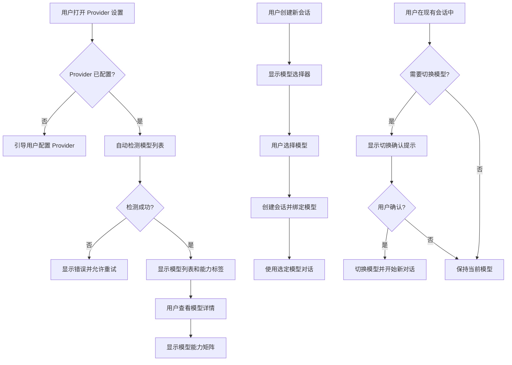

<!--
doc-id: REQ-talor-model-management
status: review
version: 1.0
last-updated: 2026-03-22
depends-on: [OVERVIEW-talor-desktop]
generates: FEATURE-talor-model-management
-->

# Talor Desktop 模型管理功能需求文档

> 纯用户视角。本文档描述**用户需要什么**，不描述系统如何实现。
> 所有术语命名以 §1.3 术语表为准——AI 在编写代码、注释、变量名时必须严格遵循。
> 项目现状见 `vibe/overviews/OVERVIEW-talor-desktop.md`。功能设计见 `FEATURE-talor-model-management.md`。实施计划见 `IMPLEMENTATION.md`。

---

## Pre-generation Checklist

- [x] 已与需求方确认业务背景和核心目标（用户请求已确认）
- [x] 已列出所有业务术语并确认定义（特别是易混淆词）
- [x] 每个用户故事已附真实数据样例（非 schema）
- [x] 边界 Case 和异常场景已逐一列举
- [x] 已确认功能范围：模型列表自动检测、模型能力检测、会话模型选择

---

## 1.1 需求背景

Phase 2 已完成 Talor Desktop 的流式对话功能，用户可以选择 Provider 并开始对话。然而，当前存在以下痛点：

1. **模型列表不透明**：用户配置 Provider 后，不知道该 Provider 支持哪些具体模型，需要手动查找文档或尝试猜测
2. **模型能力未知**：用户不知道某个模型是否支持图片理解、工具调用、视频处理等高级功能
3. **模型选择固定**：创建会话时自动使用 Provider 的第一个可用模型，用户无法在会话中切换模型

这些痛点导致用户体验不完整，用户无法充分利用不同模型的特性。本功能旨在解决这些问题，让用户能够：
- 自动发现 Provider 支持的所有模型
- 了解每个模型的能力特性
- 在会话中灵活选择最适合当前任务的模型

---

## 1.2 目标

- [ ] **目标 1**：用户配置 Provider 后，系统自动检测并显示该 Provider 支持的所有可用模型列表
- [ ] **目标 2**：用户查看模型详情时，能看到该模型支持的能力（推理、工具调用、图片、视频等）
- [ ] **目标 3**：用户创建新会话时，可以从可用模型列表中选择特定模型
- [ ] **目标 4**：用户可以在现有会话中切换模型（需重新开始对话）
- [ ] **目标 5**：模型能力检测失败时，用户能看到明确的错误提示和降级方案
- [ ] **目标 6**：模型列表支持手动刷新和自动更新（当 Provider 配置变更时）

**本次不包含的目标**（明确排除，避免范围蔓延）：

- 模型性能基准测试（响应时间、准确率等）
- 模型价格计算和费用预估
- 模型推荐算法（基于任务类型自动推荐）
- 模型版本管理（特定版本的回滚）
- 多模型并行调用（ensemble）

---

## 1.3 业务术语表（Glossary）

> ⭐ 关键：AI 在命名变量、函数、注释、数据库字段时**必须以此表为准**，不得使用同义词。

| 术语 | 定义 | 代码命名 | 易混淆项 |
|------|------|---------|---------|
| 模型列表（Model List） | Provider 支持的所有可用模型集合 | `modelList` / `ModelList` | 模型目录：list 强调集合，catalog 强调分类和描述 |
| 模型信息（Model Info） | 单个模型的详细信息，包括名称、ID、能力等 | `modelInfo` / `ModelInfo` | 模型配置：info 是只读信息，config 是可修改的配置 |
| 模型能力（Model Capability） | 模型支持的功能特性，如文本生成、图片理解、工具调用等 | `modelCapability` / `ModelCapability` | 模型特性：capability 强调功能能力，feature 强调产品特性 |
| 能力检测（Capability Detection） | 检测模型支持哪些具体能力的过程 | `capabilityDetection` | 能力测试：detection 是发现过程，testing 是验证过程 |
| 模型选择器（Model Selector） | UI 组件，允许用户从列表中选择模型 | `modelSelector` | Provider 选择器：modelSelector 选择具体模型，providerSelector 选择服务商 |
| 模型刷新（Model Refresh） | 重新从 Provider 获取模型列表的过程 | `modelRefresh` | 模型更新：refresh 是重新获取，update 是修改信息 |
| 能力标志（Capability Flag） | 表示模型是否支持某项能力的布尔标志 | `capabilityFlag` | 能力枚举：flag 是布尔值，enum 是多选一 |
| 模型缓存（Model Cache） | 本地缓存的模型列表信息，减少 API 调用 | `modelCache` | 模型存储：cache 是临时缓存，storage 是持久化存储 |
| 会话模型（Session Model） | 会话当前使用的具体模型 | `sessionModel` | 默认模型：sessionModel 是会话特定，defaultModel 是全局默认 |
| 模型切换（Model Switch） | 在会话中更换使用的模型 | `modelSwitch` | 模型变更：switch 强调切换动作，change 强调变化结果 |
| 能力分类（Capability Category） | 能力的分组，如"文本"、"视觉"、"工具"等 | `capabilityCategory` | 能力类型：category 是分类，type 是具体类型 |
| 模型发现（Model Discovery） | 自动发现 Provider 支持模型的过程 | `modelDiscovery` | 模型扫描：discovery 强调发现新信息，scan 强调遍历检查 |
| 降级方案（Fallback Strategy） | 当能力检测失败时的备用方案 | `fallbackStrategy` | 错误处理：fallback 是降级方案，error handling 是通用错误处理 |

---

## 1.4 用户故事

---

### US-010：自动检测 Provider 支持的模型列表

**用户故事**：作为用户，当我配置好一个 LLM Provider 后，我希望系统能自动检测并显示该 Provider 支持的所有可用模型，这样我就不需要手动查找文档或猜测哪些模型可用。

**正常场景**：

| 输入 | 期望输出 |
|------|---------|
| 用户添加新的 Ollama Provider | 系统自动检测并显示 Ollama 支持的所有模型（如 qwen3:4b, llama3.2:3b, mistral:7b） |
| 用户点击"刷新模型列表"按钮 | 系统重新从 Provider 获取最新模型列表并更新显示 |

**真实数据样例**：

```json
// Provider 配置
{
  "id": "ollama-local",
  "type": "ollama",
  "name": "本地 Ollama",
  "base_url": "http://localhost:11434/v1"
}

// 检测到的模型列表
{
  "models": [
    {
      "id": "ollama/qwen3:4b",
      "name": "qwen3:4b",
      "provider_id": "ollama-local",
      "display_name": "Qwen 3 (4B)",
      "description": "阿里通义千问 3 4B 参数版本"
    },
    {
      "id": "ollama/llama3.2:3b",
      "name": "llama3.2:3b",
      "provider_id": "ollama-local",
      "display_name": "Llama 3.2 (3B)",
      "description": "Meta Llama 3.2 3B 参数版本"
    }
  ]
}
```

**异常场景 & 边界 Case**：

1. **当 Provider 连接失败时**：系统应显示连接错误，并提供重试按钮
2. **当 Provider 返回空模型列表时**：系统应显示"未检测到可用模型"提示，并提供手动添加选项
3. **当检测过程超时（>10秒）时**：系统应显示加载超时提示，允许用户取消或继续等待
4. **当网络不稳定导致部分模型获取失败时**：系统应显示已成功获取的模型，并标记失败项
5. **当用户没有配置 API Key（对于需要认证的 Provider）时**：系统应提示用户需要先配置 API Key

---

### US-011：查看模型能力详情

**用户故事**：作为用户，当我查看模型列表时，我希望了解每个模型支持的具体能力（如是否支持图片理解、工具调用等），这样我就能选择最适合当前任务的模型。

**正常场景**：

| 输入 | 期望输出 |
|------|---------|
| 用户点击模型列表中的某个模型 | 显示该模型的详细信息，包括支持的能力列表 |
| 用户查看 OpenAI GPT-4o 模型 | 显示支持：文本生成、图片理解、工具调用 |
| 用户查看 Ollama qwen3:4b 模型 | 显示支持：文本生成（可能不支持图片） |

**真实数据样例**：

```json
// 模型能力详情
{
  "model_id": "openai/gpt-4o",
  "capabilities": [
    {
      "category": "text",
      "type": "text_generation",
      "supported": true,
      "description": "文本生成和对话"
    },
    {
      "category": "vision",
      "type": "image_understanding",
      "supported": true,
      "description": "图片内容理解和描述"
    },
    {
      "category": "tools",
      "type": "function_calling",
      "supported": true,
      "description": "工具调用和函数执行"
    },
    {
      "category": "video",
      "type": "video_analysis",
      "supported": false,
      "description": "视频内容分析（暂不支持）"
    }
  ]
}
```

**异常场景 & 边界 Case**：

1. **当能力检测失败时**：系统应显示"能力检测失败"标记，并提供手动设置选项
2. **当模型支持未知能力时**：系统应标记为"未知"，不假设支持或不支持
3. **当能力检测结果不一致时**：系统应使用最新检测结果，并记录检测时间戳
4. **当用户手动覆盖能力设置时**：系统应保存用户设置，并标记为"用户指定"
5. **当 Provider 不支持能力检测 API 时**：系统应使用默认能力配置或提示用户手动配置

---

### US-012：在会话中选择特定模型

**用户故事**：作为用户，当我创建新会话或使用现有会话时，我希望能够选择使用哪个具体模型，这样我就可以根据任务需求选择最合适的模型。

**正常场景**：

| 输入 | 期望输出 |
|------|---------|
| 用户创建新会话 | 显示模型选择器，允许从可用模型列表中选择 |
| 用户选择"GPT-4o"模型创建会话 | 会话使用 GPT-4o 模型进行对话 |
| 用户在现有会话中切换模型 | 系统提示"切换模型将开始新对话"，确认后切换 |

**真实数据样例**：

```json
// 会话创建请求
{
  "provider_id": "openai-prod",
  "model_id": "openai/gpt-4o",  // 用户选择的模型
  "title": "代码审查会话"
}

// 会话信息
{
  "id": "session-123",
  "title": "代码审查会话",
  "provider_id": "openai-prod",
  "model_id": "openai/gpt-4o",  // 会话绑定的模型
  "created_at": "2026-03-22T10:30:00Z"
}
```

**异常场景 & 边界 Case**：

1. **当选择的模型不再可用时**：系统应提示"模型不可用"，并提供选择其他模型或使用默认模型
2. **当切换模型导致会话历史不兼容时**：系统应提示"切换模型将开始新对话"，并确认用户是否继续
3. **当用户没有选择模型时**：系统应使用 Provider 的默认模型，并标记为"自动选择"
4. **当模型选择器中的模型列表为空时**：系统应显示"暂无可用模型"提示，并引导用户先配置 Provider
5. **当选择的模型不支持当前会话中的附件类型时**：系统应提示"该模型不支持图片附件"，并提供继续或更换模型的选项

---

## 1.5 业务流程图



---

## 1.5.1 页面设计规范

### 整体布局
talor-desktop 采用标准桌面应用布局，遵循现有设计模式：
- **顶部导航栏**：应用标题 + 设置按钮 + 返回聊天按钮
- **主内容区**：根据当前页面动态渲染（Home/Chat/Settings）
- **响应式设计**：支持窗口缩放，最小宽度 800px

### 模型管理相关页面设计

#### 1. Provider 配置页面（Settings → Provider 管理）
**现有布局**：选项卡式设计，左侧 Provider 列表，右侧表单区域
**新增功能集成**：
- **模型列表展示区**：在 Provider 表单下方新增"可用模型"区域
- **模型卡片设计**：每个模型显示为卡片，包含：
  - 模型名称和图标
  - 能力标签（文本✅、图片🖼️、工具🔧等）
  - 刷新按钮和最后更新时间
- **加载状态**：显示旋转图标和"检测模型中..."文字
- **错误状态**：红色边框 + 错误图标 + 重试按钮

#### 2. 模型选择器组件
**设计规范**：
- **触发方式**：下拉选择器或模态对话框
- **布局**：两栏设计
  - 左侧：模型列表（虚拟滚动支持）
  - 右侧：选中模型详情（能力矩阵、描述等）
- **筛选功能**：
  - 按能力筛选（只显示支持图片的模型）
  - 按 Provider 筛选
  - 搜索框（按名称搜索）
- **视觉设计**：
  - 选中状态：蓝色边框 + 选中图标
  - 不可用状态：灰色 + 禁用图标
  - 推荐模型：星标标记

#### 3. 聊天页面模型显示
**位置**：聊天页面头部，会话标题右侧
**设计**：
- **当前模型标签**：显示模型名称 + 能力图标
- **模型切换按钮**：齿轮图标，点击打开模型选择器
- **状态指示**：
  - 正常：绿色圆点
  - 不可用：红色圆点 + 警告图标
  - 切换中：旋转图标

#### 4. 模型详情页面
**访问路径**：Provider 配置页面点击模型卡片
**布局**：
- **头部**：模型名称 + 返回按钮
- **能力矩阵**：表格形式展示所有能力支持状态
- **测试区域**：快速测试模型能力（如发送图片测试视觉能力）
- **配置区域**：手动覆盖能力设置

### 交互设计规范

#### 加载状态
- **短加载**（<1s）：显示加载图标
- **长加载**（1-5s）：显示进度条 + 取消按钮
- **超时**（>5s）：显示超时提示 + 重试选项

#### 错误处理
- **连接错误**：红色横幅 + 错误码 + 重试按钮
- **能力检测失败**：黄色警告 + 手动配置选项
- **模型不可用**：橙色警告 + 选择其他模型按钮

#### 确认对话框
- **模型切换**：显示"切换模型将开始新对话"确认
- **能力覆盖**：显示"手动设置将覆盖自动检测"确认

### 视觉设计规范

#### 颜色方案
- **主色**：蓝色 (#3b82f6) - 用于选中状态、主要按钮
- **成功色**：绿色 (#10b981) - 用于支持的能力
- **警告色**：黄色 (#f59e0b) - 用于警告状态
- **错误色**：红色 (#ef4444) - 用于错误状态
- **禁用色**：灰色 (#9ca3af) - 用于禁用状态

#### 图标系统
- 文本能力：📝
- 图片能力：🖼️
- 工具能力：🔧
- 视频能力：🎥
- 音频能力：🎵
- 刷新：🔄
- 设置：⚙️
- 警告：⚠️
- 错误：❌

#### 间距规范
- **卡片间距**：16px
- **内部间距**：8px
- **边距**：24px
- **图标尺寸**：20px × 20px

### 响应式设计
- **桌面**（≥1024px）：完整三栏布局
- **平板**（768px-1024px）：两栏布局，详情面板可折叠
- **小窗口**（<768px）：单栏布局，使用抽屉式面板

---

## 1.6 功能清单

| ID | 功能 | 所属 US | 优先级(P0/P1/P2) |
|----|------|---------|-----------------|
| F-010 | Provider 模型列表自动检测 | US-010 | P0 |
| F-011 | 模型列表手动刷新 | US-010 | P1 |
| F-012 | 模型能力自动检测 | US-011 | P0 |
| F-013 | 模型能力手动配置 | US-011 | P2 |
| F-014 | 模型详情展示页面 | US-011 | P1 |
| F-015 | 新会话模型选择器 | US-012 | P0 |
| F-016 | 现有会话模型切换 | US-012 | P1 |
| F-017 | 模型不可用处理 | US-012 | P1 |
| F-018 | 模型缓存管理 | US-010, US-011 | P2 |
| F-019 | 能力检测降级策略 | US-011 | P1 |

---

## 1.7 优先级与取舍原则

### 优先级排序
1. **正确性** > **完整性** > **性能** > **用户体验**
   - 模型列表和能力信息必须准确，错误信息比缺失信息更严重
   - 核心功能（模型检测、选择）必须完整实现
   - 性能优化不能牺牲正确性
   - 用户体验改进在核心功能稳定后进行

### 关键取舍声明
1. **出错时阻断用户流程，不静默失败**：当模型检测失败时，必须明确提示用户，不允许静默使用默认值
2. **数据一致性优先于实时性**：模型列表缓存可以有一定延迟（如5分钟），但必须保证显示的信息是准确的
3. **安全边界明确**：用户只能选择已配置 Provider 的模型，不能通过此功能访问未授权的模型

### 降级策略
1. **模型检测失败**：显示"检测失败"提示，允许用户手动输入模型信息
2. **能力检测失败**：使用保守假设（如只假设支持文本生成），并标记为"检测失败"
3. **网络超时**：使用缓存的模型列表，并标记为"可能已过期"
4. **API 限制**：分批检测模型能力，避免触发速率限制

---

## 1.8 验收标准

### AC-010-01：Provider 模型列表自动检测
- **Given**：用户已配置一个有效的 Ollama Provider（base_url: http://localhost:11434/v1）
- **When**：用户打开该 Provider 的配置页面
- **Then**：系统自动检测并显示 Ollama 支持的所有模型列表
- **Then**：每个模型显示名称、ID 和简要描述
- **Then**：模型列表至少包含一个模型（如 qwen3:4b）
- **关联 US**：US-010

### AC-010-02：模型列表手动刷新
- **Given**：用户正在查看 Provider 的模型列表
- **When**：用户点击"刷新模型列表"按钮
- **Then**：系统重新从 Provider 获取模型列表
- **Then**：显示加载状态指示器
- **Then**：刷新完成后更新显示最新列表
- **关联 US**：US-010

### AC-010-03：Provider 连接失败处理
- **Given**：用户配置了一个无效的 Provider（错误的 base_url）
- **When**：系统尝试检测模型列表
- **Then**：显示连接错误提示（包含错误码和用户可读描述）
- **Then**：提供"重试"按钮
- **Then**：不显示任何模型列表
- **关联 US**：US-010

### AC-011-01：模型能力自动检测
- **Given**：系统已检测到 OpenAI GPT-4o 模型
- **When**：用户查看该模型的详细信息
- **Then**：显示能力检测结果
- **Then**：GPT-4o 标记为支持"图片理解"和"工具调用"
- **Then**：每个能力显示支持状态（✅ 支持 / ❌ 不支持）
- **关联 US**：US-011

### AC-011-02：能力检测失败处理
- **Given**：系统尝试检测模型能力
- **When**：能力检测过程失败（如 API 错误）
- **Then**：显示"能力检测失败"标记
- **Then**：提供"手动设置"按钮
- **Then**：使用保守的默认能力设置（仅文本生成）
- **关联 US**：US-011

### AC-011-03：模型能力详情展示
- **Given**：用户查看支持图片理解的模型
- **When**：用户点击能力详情
- **Then**：显示该能力的详细描述和使用示例
- **Then**：对于图片理解能力，显示"支持分析 PNG、JPEG 格式图片"
- **Then**：提供"测试此能力"的快捷链接
- **关联 US**：US-011

### AC-012-01：新会话模型选择
- **Given**：用户有配置好的 Provider 和模型列表
- **When**：用户创建新会话
- **Then**：显示模型选择器组件
- **Then**：选择器列出所有可用模型
- **Then**：每个模型显示名称和支持的主要能力图标
- **Then**：用户可以选择任意模型开始会话
- **关联 US**：US-012

### AC-012-02：会话模型绑定
- **Given**：用户选择"GPT-4o"模型创建会话
- **When**：会话创建成功
- **Then**：会话信息中记录 model_id: "openai/gpt-4o"
- **Then**：会话页面显示当前使用的模型名称
- **Then**：所有该会话的消息都使用 GPT-4o 模型处理
- **关联 US**：US-012

### AC-012-03：现有会话模型切换
- **Given**：用户有一个使用"GPT-3.5"的现有会话
- **When**：用户尝试切换为"GPT-4o"模型
- **Then**：显示确认提示"切换模型将开始新对话，是否继续？"
- **Then**：用户确认后，会话 model_id 更新为"openai/gpt-4o"
- **Then**：会话历史清空，开始新对话
- **Then**：页面显示"已切换模型"提示
- **关联 US**：US-012

### AC-012-04：模型不可用处理
- **Given**：会话使用的模型"openai/gpt-4o"因 API 变更不再可用
- **When**：用户打开该会话
- **Then**：显示"模型不可用"警告横幅
- **Then**：提供"选择其他模型"按钮
- **Then**：点击按钮显示可用模型列表供用户选择
- **Then**：用户选择新模型后，会话继续使用新模型
- **关联 US**：US-012

### AC-012-05：模型与附件兼容性检查
- **Given**：用户会话中有图片附件
- **When**：用户尝试切换到一个不支持图片理解的模型
- **Then**：显示警告"目标模型不支持图片理解，图片将被忽略"
- **Then**：提供"继续切换"和"取消"选项
- **Then**：用户选择继续后，切换模型并忽略图片附件
- **关联 US**：US-012

### AC-011-04：模型能力手动配置
- **Given**：系统无法自动检测模型能力
- **When**：用户点击"手动设置"按钮
- **Then**：显示能力配置表单，列出所有可配置的能力项
- **Then**：用户可以选择每个能力项的支持状态（支持/不支持/未知）
- **Then**：用户保存配置后，系统使用用户指定的能力设置
- **Then**：能力项标记为"用户指定"而非"自动检测"
- **关联 US**：US-011

### AC-010-04：模型缓存管理
- **Given**：系统已成功获取模型列表并缓存
- **When**：用户5分钟内再次打开同一Provider的配置页面
- **Then**：系统优先使用缓存数据，不发起新的API请求
- **Then**：缓存数据显示"最后更新时间"标签
- **Then**：用户点击"刷新"按钮时，强制更新缓存
- **Then**：缓存数据过期（>5分钟）时自动刷新
- **关联 US**：US-010