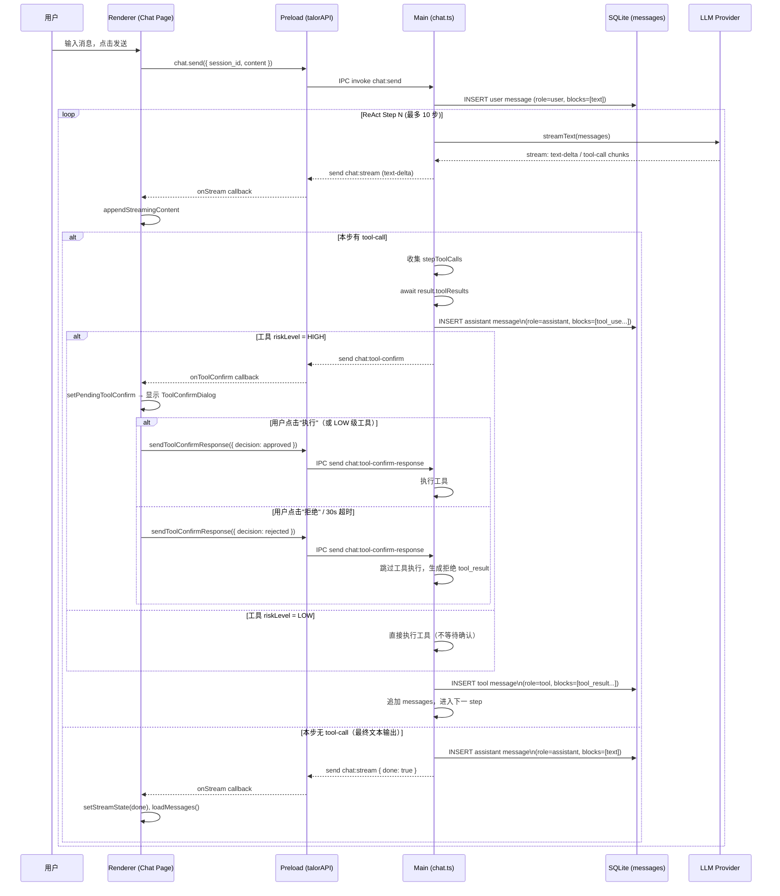
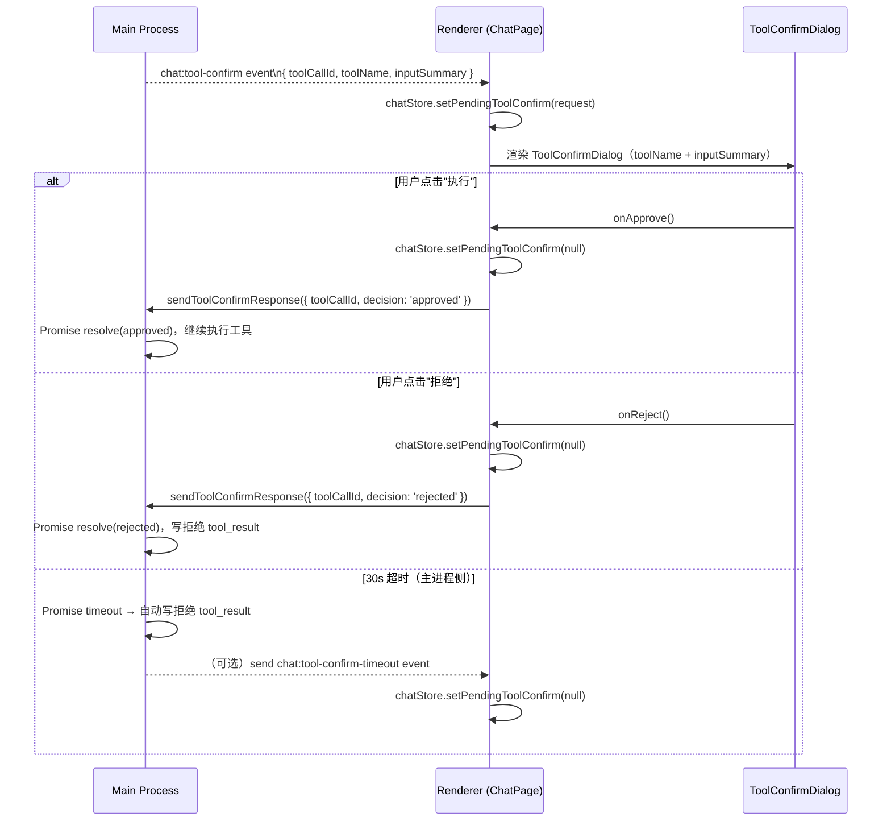

<!--
doc-id: FD-talor-desktop-p0-agent-loop
status: draft
version: 1.0
last-updated: 2026-04-25
depends-on: [OVERVIEW-talor-desktop, REQ-talor-desktop-p0-agent-loop]
generates: [IMPL-001, IMPL-002, IMPL-003, IMPL-004, IMPL-005, IMPL-006, IMPL-007]
-->

# FEATURE — talor-desktop P0 Agent Loop

> 追溯链：US-001 / US-002 / US-003 → 本文档（FD-talor-desktop-p0-agent-loop）→ IMPL-001, IMPL-002, IMPL-003, IMPL-004, IMPL-005, IMPL-006, IMPL-007
> 依赖的 AC：AC-001-01, AC-001-02, AC-001-03, AC-001-04, AC-001-05, AC-001-06, AC-003-01, AC-003-02, AC-003-03, AC-003-04, AC-003-05, AC-003-06

---

## §F.1 变更背景

关联：US-001（消息模型升级）、US-002（推理链实时入库）、US-003（高风险工具确认）

当前 `messages` 表 `content` 字段为纯文本，`role` 枚举不含 `'tool'`，导致 ReAct 多轮推理链无法持久化。`chat.ts` 的 `toCoreMessages()` 在每次重建 LLM 上下文时只能看到纯文本历史，工具调用中间状态完全丢失。同时，`bash` / `write` / `edit` 等高风险工具在用户无感知的情况下直接执行，不满足生产级 AI Coding 工具的最低安全要求。

本次变更是三个层面的协同改造：数据模型（ContentBlock schema）→ 执行层（ReAct 写库 + 确认流）→ UI 层（ToolConfirmDialog），三者有严格依赖顺序。

---

## §F.2 全局影响

### 新增共享类型文件

新建 `src/shared/types/message.ts`，同时被 main process 和 renderer 引用（electron-vite 构建允许 shared 目录跨进程共用类型）。

**新增 ContentBlock 类型定义**：

```typescript
// src/shared/types/message.ts

export type ContentBlock =
  | TextBlock
  | ImageBlock
  | FileBlock
  | ToolUseBlock
  | ToolResultBlock

export interface TextBlock {
  type: 'text'
  text: string
}

export interface ImageBlock {
  type: 'image'
  image: string        // base64 data URL
  mimeType: string
}

export interface FileBlock {
  type: 'file'
  filename: string
  mimeType: string
  path: string
}

export interface ToolUseBlock {
  type: 'tool_use'
  toolCallId: string
  toolName: string
  input: unknown
}

export interface ToolResultBlock {
  type: 'tool_result'
  toolCallId: string
  toolName: string
  output: string       // 已截断，≤ 50KB
  isError: boolean
}

export const MAX_TOOL_RESULT_BYTES = 50 * 1024  // 50KB
export const HIGH_RISK_TOOLS = ['bash', 'write', 'edit'] as const
export type HighRiskTool = typeof HIGH_RISK_TOOLS[number]
```

### DB Schema 变更（清库迁移）

**旧 messages 表**（已有，见 `src/main/db/index.ts`）：
```sql
CREATE TABLE messages (
    id          TEXT PRIMARY KEY,
    session_id  TEXT NOT NULL,
    role        TEXT NOT NULL CHECK(role IN ('user','assistant','system')),
    content     TEXT NOT NULL,   -- 纯文本
    created_at  TEXT NOT NULL,
    FOREIGN KEY (session_id) REFERENCES sessions(id) ON DELETE CASCADE
);
```

**新 messages 表（delta）**：
```sql
-- 迁移策略：DROP + 重建（清库重来）
DROP TABLE IF EXISTS messages;

CREATE TABLE messages (
    id           TEXT PRIMARY KEY,
    session_id   TEXT NOT NULL,
    role         TEXT NOT NULL CHECK(role IN ('user','assistant','system','tool')),
    content      TEXT NOT NULL,                          -- JSON: ContentBlock[]
    content_type TEXT NOT NULL DEFAULT 'blocks',
    created_at   TEXT NOT NULL,
    FOREIGN KEY (session_id) REFERENCES sessions(id) ON DELETE CASCADE
);

CREATE INDEX IF NOT EXISTS idx_messages_session ON messages(session_id);
```

**变更点**：
1. `role` CHECK 增加 `'tool'` 枚举值
2. 新增 `content_type TEXT NOT NULL DEFAULT 'blocks'` 列
3. `content` 语义从纯文本升级为 `JSON ContentBlock[]`

### 新增 IPC 通道

| 通道名 | 方向 | 类型 | 说明 |
|--------|------|------|------|
| `chat:tool-confirm` | main → renderer | send | HIGH 级工具执行前请求确认 |
| `chat:tool-confirm-response` | renderer → main | send | 用户确认/拒绝响应 |

---

## §F.3 状态机变更

### 新增：工具确认状态（ToolConfirmState）

```
[无 pending] ──(HIGH 级工具触发)──→ [等待确认 pending]
[等待确认]   ──(用户点击"执行")──→ [无 pending]  + 工具执行
[等待确认]   ──(用户点击"拒绝")──→ [无 pending]  + 写拒绝 tool_result
[等待确认]   ──(30s 超时)────────→ [无 pending]  + 写超时 tool_result
```

### 新增：ChatState.pendingToolConfirm

在现有 `ChatState`（`src/renderer/store/chatStore.ts`）新增字段：

```typescript
pendingToolConfirm: ToolConfirmRequest | null
setPendingToolConfirm: (req: ToolConfirmRequest | null) => void
```

其中 `ToolConfirmRequest`（见 §F.4）。

### 现有状态机无变更

`StreamState`（idle / streaming / done / error / aborted）保持不变。工具确认是 streaming 状态内的子流程，不影响顶层 stream 状态。

---

## §F.4 接口协议变更

### 新增：ToolConfirmRequest / ToolConfirmResponse

```typescript
// src/shared/types/message.ts（追加）

export interface ToolConfirmRequest {
  sessionId: string
  messageId: string
  toolCallId: string
  toolName: string           // 'bash' | 'write' | 'edit'
  inputSummary: string       // 用于 UI 展示的参数摘要（≤ 500 chars）
  inputFull: unknown         // 完整 input，用于实际执行
}

export type ToolConfirmDecision = 'approved' | 'rejected'

export interface ToolConfirmResponse {
  toolCallId: string
  decision: ToolConfirmDecision
}
```

**inputSummary 生成规则**：
- `bash`：`command` 字段原文（最多 500 chars）
- `write`：`path` + 内容前 20 行（每行 ≤ 80 chars）
- `edit`：`path` + `old_str` 前 10 行

### 变更：MessageRow / ChatMessage

| 字段 | 旧值 | 新值 |
|------|------|------|
| `MessageRow.role` | `'user' \| 'assistant' \| 'system'` | `'user' \| 'assistant' \| 'system' \| 'tool'` |
| `ChatMessage.role` (preload) | `'user' \| 'assistant' \| 'system'` | `'user' \| 'assistant' \| 'system' \| 'tool'` |
| `MessageRow.content` | 纯文本字符串 | `JSON.stringify(ContentBlock[])` |
| `MessageRow.content_type` | 不存在 | `'blocks'`（新增列，DEFAULT 'blocks'） |

### 变更：messageRepo.create()

```typescript
// 旧签名
create(params: {
  id: string
  session_id: string
  role: 'user' | 'assistant' | 'system'
  content: string
}): ChatMessage

// 新签名（delta）
create(params: {
  id: string
  session_id: string
  role: 'user' | 'assistant' | 'system' | 'tool'
  content: ContentBlock[]   // 序列化为 JSON string 写入 DB
}): ChatMessage
```

### 变更：toCoreMessages() 输入

旧实现从 `row.content`（纯文本）手动拼装 content parts，新实现从 `ContentBlock[]` 直接映射到 Vercel AI SDK 格式：

| ContentBlock.type | Vercel AI SDK 格式 |
|-------------------|--------------------|
| `text` | `{ type: 'text', text }` |
| `image` | `{ type: 'image', image }` |
| `tool_use` | `{ type: 'tool-call', toolCallId, toolName, args: input }` |
| `tool_result` | `{ type: 'tool-result', toolCallId, toolName, result: output }` |
| `file` | 维持现有占位符逻辑（不变） |

**role 映射**：

| MessageRow.role | Vercel AI SDK role |
|-----------------|--------------------|
| `user` | `'user'` |
| `assistant` | `'assistant'` |
| `system` | `'system'` |
| `tool` | `'tool'`（Vercel AI SDK v4 支持） |

### 新增：preload chat API

```typescript
// 追加到 talorAPI.chat（preload/index.ts）

onToolConfirm: (
  callback: (event: ToolConfirmRequest) => void
): (() => void)

sendToolConfirmResponse: (response: ToolConfirmResponse): void
```

### 变更：ToolDefinition（新增 riskLevel）

```typescript
// src/main/tools/types.ts（delta）
export interface ToolDefinition {
  name: string
  description: string
  parameters: Record<string, unknown>
  schema?: Record<string, unknown>
  riskLevel?: 'HIGH' | 'LOW'    // 新增可选字段，默认 'LOW'
  execute: (input: unknown, context: ToolExecuteContext) => Promise<{ output: unknown }>
}
```

各内置工具在注册时标注：
- `bash`、`write`、`edit`：`riskLevel: 'HIGH'`
- `read`、`glob`、`grep`、`ls`：`riskLevel: 'LOW'`（默认不写也可）

---

## §F.5 并发与幂等要求

| 操作 | 幂等键 | 处理方式 |
|------|--------|---------|
| tool confirm 请求 | `toolCallId`（UUID） | 每个 toolCallId 只发一次 confirm 事件，主进程用 Map 追踪 pending confirms |
| tool confirm 响应 | `toolCallId` | 主进程等待时收到重复 response → 忽略（Promise 已 resolve） |
| 写入 assistant/tool message | 消息 `id`（UUID） | SQLite PRIMARY KEY 约束保证唯一性，重复 insert 抛异常（已有机制） |

| 并发风险 | 策略 |
|----------|------|
| 同一 session 并发两次 chat:send | 已有 `activeStreams.get(sessionId)` 检查，第二次请求 abort 第一次 |
| 多 session 同时进行确认流程 | 每个 session 独立 pendingConfirms Map，无冲突 |
| confirm 超时 vs 用户点击响应竞态 | Promise.race(userResponse, timeoutPromise)；先到先解决，后到忽略 |

---

## §F.6 涟漪分析

| 变更内容 | 影响文件 | Breaking Change? | 迁移步骤 |
|----------|----------|-----------------|---------|
| messages 表 schema 变更 | `src/main/db/index.ts` | ✅ 是（清库） | DROP + 重建，旧数据丢失 |
| MessageRow.role 增加 'tool' | `src/main/repos/session-repo.ts` | ✅ 是 | 更新 TypeScript 类型 + CHECK 约束 |
| MessageRow.content 语义变更 | `session-repo.ts`、`chat.ts` | ✅ 是 | create() 序列化，listBySession() 反序列化 |
| ChatMessage.role 增加 'tool' | `src/preload/index.ts`、`renderer/types/chat.ts` | ✅ 是 | 更新 MessageRole 类型 |
| 新增 ContentBlock 共享类型 | 新建 `src/shared/types/message.ts` | — | 新文件，无迁移 |
| 新增 chat:tool-confirm IPC | `preload/index.ts`、`renderer/hooks/useStreamingMessage.ts` | — | 新增，不影响现有 |
| ToolDefinition 新增 riskLevel | `src/main/tools/types.ts`、各 builtin tool 文件 | 向后兼容（可选字段） | 各 builtin 工具注册时补充标注 |
| chatStore 新增 pendingToolConfirm | `src/renderer/store/chatStore.ts` | — | 新增字段，不影响现有 |

**需同步修改的关联模块 checklist**：

- [ ] `src/main/db/index.ts` — DROP + 重建 messages 表
- [ ] `src/main/repos/session-repo.ts` — 类型 + 序列化逻辑
- [ ] `src/main/ipc/chat.ts` — toCoreMessages + ReAct 写库 + confirm 流程
- [ ] `src/main/tools/types.ts` — riskLevel 字段
- [ ] `src/main/tools/builtin/` — 各文件注册时加 riskLevel 标注（bash/write/edit）
- [ ] `src/preload/index.ts` — MessageRole 类型 + chat confirm API
- [ ] `src/renderer/types/chat.ts` — MessageRole 类型
- [ ] `src/renderer/store/chatStore.ts` — pendingToolConfirm 状态
- [ ] `src/renderer/hooks/useStreamingMessage.ts` — 订阅 onToolConfirm
- [ ] `src/renderer/pages/Chat/index.tsx` — 渲染 ToolConfirmDialog
- [ ] `src/renderer/components/ToolConfirmDialog.tsx` — 新建组件
- [ ] `src/shared/types/message.ts` — 新建共享类型

---

## §F.7 流程图

### ReAct Loop + 推理链写库



### ToolConfirmDialog 交互



---

## §F.8 AC 验证契约

### §F.8.0 验证环境规划

**代码分支**：`feature/p0-agent-loop`（待创建）

**基础设施依赖表**：

| 服务 | 启动方式 | 健康检查 |
|------|---------|---------|
| talor-desktop（被测应用） | `npm run dev`（开发模式） | Electron 窗口正常显示 |
| SQLite chat.db | 应用启动时自动初始化 | `sqlite3 ~/.talor/chat.db .tables` 有 messages 表 |
| LLM Provider（工具调用验证） | 需配置支持 tool calling 的模型（如 claude-3-5-sonnet / gpt-4o） | Settings → Provider 测试连接通过 |
| Workspace 目录 | 任意本地目录 | 在会话中通过 WorkspaceSelector 设置 |

**AC 数据冲突分析与隔离策略**：

- AC-001-xx（DB schema 验证）：每条 AC 依赖干净的 DB 状态；建议每次验证前备份并重置 `~/.talor/chat.db`
- AC-003-xx（工具确认 UI）：依赖 LLM 决策调用特定工具，存在不确定性；建议 system prompt 中明确指定使用目标工具
- 多条 AC 可在同一 session 中顺序验证（AC-001-02 → AC-001-03 → AC-001-04 顺序依赖）

---

### §F.8.1 验证契约总表

| AC ID | 验证策略 | 工具选择 | 断言要点 | 参数溯源 |
|-------|---------|---------|---------|---------|
| AC-001-01 | SQLite CLI 检查 schema | `sqlite3` CLI | 1. `PRAGMA table_info(messages)` 含 content_type 列 2. `CHECK` 约束含 'tool' 3. `SELECT COUNT(*) FROM messages` = 0 | DB 路径：`~/.talor/chat.db`；列名：来自 §F.2 DB Schema 变更 |
| AC-001-02 | 发送消息后查 DB | 手动操作 + sqlite3 | `SELECT content, content_type FROM messages WHERE role='user'` → content 为合法 JSON，含 `{type:"text"}` block | 消息文本：来自 §1.8 AC-001-02 Given |
| AC-001-03 | 触发工具调用后查 DB | 手动对话 + sqlite3 + main log | `SELECT content FROM messages WHERE role='assistant'` → JSON 含 `{type:"tool_use"}` block | toolCallId 格式：UUID；toolName："glob"；来自 §1.8 AC-001-03 Given |
| AC-001-04 | 工具执行后查 DB | 手动对话 + sqlite3 | `SELECT content FROM messages WHERE role='tool'` → JSON 含 `{type:"tool_result", isError:false}` block | toolCallId 与 AC-001-03 对应；来自 §1.8 AC-001-04 Given |
| AC-001-05 | 重启后重建 context | 手动操作 + main process log | 重启后发消息，在 main log 中确认 `toCoreMessages` 参数包含历史 tool_use/tool_result 消息 | 历史对话需含 2 步工具调用；来自 §1.8 AC-001-05 Given |
| AC-001-06 | bash 执行大输出后查 DB | 手动对话 + sqlite3 | `SELECT length(content) FROM messages WHERE role='tool'` ≤ 55000 bytes；content 末尾含截断提示 | 截断阈值：`MAX_TOOL_RESULT_BYTES = 51200`（来自 §F.2 ContentBlock 定义） |
| AC-003-01 | 触发 bash 工具时观察 UI | 手动对话 + 视觉验证 | 1. ToolConfirmDialog 出现 2. 标题含"bash" 3. 正文含命令内容 | toolName："bash"；inputSummary 生成规则：来自 §F.4 inputSummary 生成规则 |
| AC-003-02 | 点击"执行"后验证 DB | 手动操作 + sqlite3 | 1. 弹框关闭 2. bash 执行（log 确认）3. tool_result block isError=false | decision: 'approved'；来自 §1.8 AC-003-02 |
| AC-003-03 | 点击"拒绝"后验证 DB | 手动操作 + sqlite3 | 1. 弹框关闭 2. bash 未执行 3. tool_result block isError=true，output 含"用户拒绝" | decision: 'rejected'；来自 §1.8 AC-003-03 |
| AC-003-04 | 30s 超时自动拒绝 | 手动操作 + sqlite3 + 计时 | 30s 后弹框关闭，tool_result block isError=true，output 含"确认超时" | 超时时间：30000ms；来自 §F.5 Promise.race |
| AC-003-05 | 触发 glob 工具时观察 UI | 手动对话 + 视觉验证 | ToolConfirmDialog 不出现；glob 直接执行 | toolName："glob"；riskLevel: 'LOW'；来自 §F.4 ToolDefinition |
| AC-003-06 | write 工具确认框内容 | 手动对话 + 视觉验证 | 1. 弹框显示文件路径 2. 显示内容前 20 行 | inputSummary 生成规则 write：来自 §F.4 |

**Setup 设计意图（全局）**：
1. 验证前备份 `~/.talor/chat.db` → `~/.talor/chat.db.bak`
2. 删除现有 DB，重启应用触发清库迁移（验证 AC-001-01）
3. 配置一个支持 tool calling 的 Provider + 设置好 workspace
4. system prompt（可选）：提示 LLM 优先使用 glob/bash 工具

**Teardown 设计意图（全局）**：
1. 验证完成后可恢复 `~/.talor/chat.db.bak`

---

## §F.9 变更传播

| 变更项 | 传播至 |
|--------|--------|
| ContentBlock 类型定义 → | implementation.md（所有涉及消息序列化的 IMPL） |
| HIGH_RISK_TOOLS 常量 → | implementation.md（工具注册 IMPL） |
| chat:tool-confirm IPC 通道 → | implementation.md（preload IMPL + chat.ts IMPL） |
| messages 表 schema → | implementation.md（DB 迁移 IMPL） |
