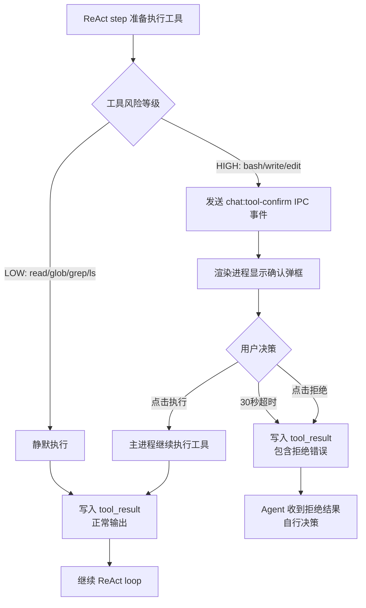

<!--
doc-id: REQ-talor-desktop-p0-agent-loop
status: draft
version: 1.0
last-updated: 2026-04-25
depends-on: [OVERVIEW-talor-desktop]
generates: [FD-talor-desktop-p0-agent-loop]
-->

# talor-desktop P0 Agent Loop 需求文档

> 本文档是 L2 产品需求，定义 P0 三项核心改造的用户故事和验收标准。
> 依赖 L1 现状文档 `vibe/overviews/OVERVIEW-talor-desktop.md`。
> 追溯链：`OVERVIEW-talor-desktop.md` → `requirements.md`（本文档）→ `feature.md` → `implementation.md`

---

## §1.1 需求背景

talor-desktop 当前已具备多轮 ReAct 工具调用循环的骨架（`chat.ts` 第 334 行），但存在三个根本性缺陷，导致其无法达到 opencode / Claude Code 同等的生产可用水平：

1. **消息模型残缺**：`messages` 表 `content` 字段为纯文本（`TEXT`），无法存储 `tool_use` / `tool_result` content blocks。每次重启后 Agent 无法感知历史工具调用链，等同于每次对话都是全新上下文，严重削弱多轮 Agent 能力。

2. **推理链不入库**：即使 ReAct loop 在内存中完成了多步工具调用，最终只有 `fullText`（最后一轮纯文本）被写入数据库。下一次对话重建 `toCoreMessages()` 时，所有中间 tool_use / tool_result 消息丢失，LLM 无法续接。

3. **危险工具无确认**：`bash` / `write` / `edit` 等高风险工具在用户无感知的情况下直接执行，缺乏授权确认环节，不符合任何生产级 AI Coding 工具的最低安全要求。

---

## §1.2 目标

### 主要目标

| ID | 目标 | 度量标准 |
|----|------|---------|
| O1 | 消息模型升级：content 字段支持 JSON ContentBlock[] | 重启后对话历史完整恢复，含 tool_use / tool_result blocks |
| O2 | 推理链完整入库：每个 ReAct step 的 tool_use 和 tool_result 实时持久化 | 任意时刻重启，下次对话 LLM 可见完整历史工具调用 |
| O3 | 高风险工具执行前获得用户明确授权 | bash / write / edit 执行前必弹确认框，用户点击"执行"才继续 |

### 明确排除

| 排除项 | 原因 |
|--------|------|
| context window 自动压缩（summarize） | 后续迭代，P0 仅做基础保护（截断最早消息） |
| 工具 undo / 回滚 | 后续迭代 |
| PTY terminal | 后续迭代 |
| 多模态附件的 content block 迁移 | 附件已有独立处理路径，P0 不改 |
| MCP 工具分级（MCP 工具全部走 HIGH 确认） | P0 阶段 MCP 工具一律静默执行，确认框仅限内置工具 |

---

## §1.3 业务术语表

| 术语 | 定义 | 代码命名 | 易混淆项 |
|------|------|----------|----------|
| ContentBlock | 消息内容的原子单元，有类型标注（text / tool_use / tool_result / image / file） | `ContentBlock` | MessagePart（旧类型，废弃） |
| tool_use block | 表示一次工具调用请求的 ContentBlock，含 toolCallId / toolName / input | `ToolUseBlock` | tool_result block |
| tool_result block | 表示一次工具执行结果的 ContentBlock，含 toolCallId / toolName / output / isError | `ToolResultBlock` | tool_use block |
| ReAct step | Agent 推理循环的一轮：LLM 输出 → 执行工具 → 追加消息 | `reactStep` | 单次 streamText 调用 |
| 推理链 | 一次用户消息触发的完整多步工具调用序列，含所有 tool_use + tool_result messages | `reasoningChain` | 单条 assistant message |
| assistant message | role='assistant' 的消息，content 可含 text block 和/或 tool_use blocks | `assistantMessage` | tool message |
| tool message | role='tool' 的消息，content 含一组 tool_result blocks，对应一轮 tool_use | `toolMessage` | assistant message |
| HIGH 级工具 | 执行前必须弹确认框的内置工具：bash / write / edit | `HIGH_RISK_TOOLS` | LOW 级工具 |
| LOW 级工具 | 静默执行的只读内置工具：read / glob / grep / ls | `LOW_RISK_TOOLS` | HIGH 级工具 |
| 工具确认请求 | 主进程向渲染进程发送的确认事件，含工具名 + 参数摘要 | `ToolConfirmRequest` | tool_call IPC 事件 |
| 工具确认响应 | 渲染进程回传的用户决策：approved / rejected | `ToolConfirmResponse` | tool_result |
| 清库迁移 | 丢弃全部历史 messages 数据，重建表结构 | `dropAndRecreate` | 兼容迁移 |

---

## §1.4 用户故事

### US-001: 消息模型升级（开发者视角 / 系统行为）

**作为** 使用 talor-desktop 的开发者
**我希望** 重启应用后仍能续接上次含工具调用的对话
**以便于** Agent 不用每次"失忆"，可以在原有推理链基础上继续工作

**真实数据样例**：
- 场景：用户发送"分析 src 目录结构"，Agent 执行了 `glob` + `read` 两步工具调用后回复
- 当前行为：重启后 messages 表只有一条 assistant text，LLM 不知道之前调用过哪些工具
- 期望行为：重启后 messages 表有完整记录：user → assistant(tool_use:glob) → tool(tool_result:glob) → assistant(tool_use:read) → tool(tool_result:read) → assistant(text:"目录结构为…")
- 数据样例（messages 表存储格式）：
  ```json
  // role='assistant', content_type='blocks'
  [{"type":"tool_use","toolCallId":"call-001","toolName":"glob","input":{"pattern":"src/**/*"}}]
  
  // role='tool', content_type='blocks'
  [{"type":"tool_result","toolCallId":"call-001","toolName":"glob","output":"src/main/index.ts\nsrc/renderer/App.tsx","isError":false}]
  ```

**边界 Case**：
- 当 content_type='blocks' 但 JSON parse 失败时 → 该消息降级为空 text block，不 crash
- 当旧数据库（无 content_type 列）启动时 → 执行清库迁移，清空 messages 表，重建结构
- 当 tool_use blocks 保存但对应 tool_result 缺失时（中途 abort）→ 重建 messages 时跳过孤儿 tool_use

---

### US-002: 推理链实时入库

**作为** 使用 talor-desktop 的开发者
**我希望** Agent 的每一步工具调用都实时保存到数据库
**以便于** 即使中途崩溃或 abort，已完成的步骤也不丢失

**真实数据样例**：
- 场景：用户发送"列出项目所有文件并统计行数"，Agent 计划执行 glob → bash 两步
- step 1 完成（glob 成功）时：立即写入 assistant(tool_use:glob) + tool(tool_result:glob)
- step 2 开始前用户点击 abort：数据库已有 step 1 的完整记录
- 下一次发消息时：LLM 能看到 step 1 的结果，可以直接从 step 2 续做

**边界 Case**：
- 当工具执行结果超过 100KB 时 → output 截断到前 50KB + `\n[截断：原始输出 XXX 字节]`
- 当同一 session 并发两个 chat:send 时 → 已有 activeStreams 防护，不会并发
- 当 step 写库失败时 → 记录 error log，继续执行（不中断 Agent）

---

### US-003: 高风险工具执行确认

**作为** 使用 talor-desktop 的开发者
**我希望** 在 Agent 准备执行 bash / write / edit 前看到确认弹框
**以便于** 我能审查命令/内容并决定是否授权

**真实数据样例**：
- 场景：Agent 计划执行 `bash`，命令为 `git commit -am "auto commit"`
- 当前行为：直接执行，用户无感知
- 期望行为：
  1. 弹出确认框，标题"执行工具：bash"，内容显示完整命令
  2. 用户点击"执行" → bash 正常运行，结果写入 tool_result
  3. 用户点击"拒绝" → bash 不执行，tool_result 写入 `{"error":"用户拒绝执行"}`，Agent 可据此调整策略

- 场景：Agent 计划执行 `write`，写入路径 `src/main/index.ts`，内容 300 行
- 确认框显示：工具名 "write"，路径 "/Users/quinn/project/src/main/index.ts"，内容前 20 行预览

**边界 Case**：
- 当确认框 30 秒内无响应时 → 自动拒绝，防止主进程卡死
- 当用户快速连续触发多个 HIGH 级工具时 → 串行排队显示确认框，不叠加
- 当用户点击"拒绝"后 Agent 继续下一步时 → Agent 收到拒绝 tool_result，可自行决策继续或放弃

---

## §1.5 业务流程图

### P0-1 + P0-2：消息模型升级 + 推理链入库

```mermaid
flowchart TD
    A[用户发送消息] --> B[chat:send IPC]
    B --> C[保存 user message\ncontent_type=blocks]
    C --> D[ReAct step N]
    D --> E{LLM 输出}
    E -->|含 tool_use| F[实时写入\nassistant message\nblocks=[tool_use]]
    F --> G[执行工具]
    G --> H[实时写入\ntool message\nblocks=[tool_result]]
    H --> D
    E -->|纯 text| I[写入 assistant message\nblocks=[text]]
    I --> J[发送 chat:stream done]
    J --> K[渲染进程刷新消息列表]
```

### P0-3：工具执行确认流程



---

## §1.6 功能清单

| ID | 功能 | 所属 US | 优先级 |
|----|------|---------|--------|
| F01 | 清库迁移：DROP + 重建 messages 表，新增 content_type 列 | US-001 | P0 |
| F02 | ContentBlock 类型定义（共享类型，main/renderer 复用） | US-001 | P0 |
| F03 | messageRepo 读写支持 ContentBlock JSON 序列化/反序列化 | US-001 | P0 |
| F04 | toCoreMessages() 从 ContentBlock[] 重建 Vercel AI SDK messages | US-001 | P0 |
| F05 | ReAct step 完成后立即写入 assistant(tool_use) + tool(tool_result) | US-002 | P0 |
| F06 | tool_result output 超限截断（50KB） | US-002 | P0 |
| F07 | 工具风险分级：HIGH_RISK_TOOLS 常量定义 | US-003 | P0 |
| F08 | 主进程工具执行前发送 chat:tool-confirm IPC 事件 | US-003 | P0 |
| F09 | 主进程等待 chat:tool-confirm-response（30s 超时自动拒绝） | US-003 | P0 |
| F10 | preload 暴露 chat.onToolConfirm / chat.sendToolConfirmResponse | US-003 | P0 |
| F11 | ToolConfirmDialog 组件（显示工具名 + 参数摘要 + 执行/拒绝按钮） | US-003 | P0 |
| F12 | chatStore 新增 pendingToolConfirm 状态 | US-003 | P0 |

---

## §1.7 优先级与取舍原则

### 优先级排序

**正确性 > 安全性 > 性能 > 体验**

1. **正确性**：消息模型必须是权威真相（messages 表），任何情况下不允许 DB 和内存状态不一致
2. **安全性**：HIGH 级工具必须经用户授权，宁可中断 Agent 也不静默执行
3. **性能**：tool_result 大输出截断，不允许单条消息超过 50KB
4. **体验**：确认框 UI 清晰可读即可，不需要 diff 高亮

### 关键取舍声明

| 场景 | 决策 |
|------|------|
| 消息模型 schema 变更 | 清库重来（丢失历史数据），不做兼容迁移 |
| content_type 缺失的旧消息 | parse 失败时降级为空 text block，不 crash |
| tool_result 大输出 | 截断到 50KB，不存全量 |
| 确认框超时 | 自动拒绝，不自动批准 |
| 用户拒绝工具执行 | Agent 收到拒绝 tool_result，由 Agent 自行决策，不强制终止 loop |
| MCP 工具风险分级 | P0 阶段全部 MCP 工具静默执行（与内置工具一致处理），后续迭代再分级 |

### 降级策略

| 场景 | 降级方案 |
|------|---------|
| DB 迁移失败 | 日志记录，提示用户手动删除 `~/.talor/chat.db` 重启 |
| 工具确认 IPC 超时 | 自动写入拒绝 tool_result，Agent 继续执行 |
| ContentBlock JSON parse 失败 | 该消息降级为空 text block，记录 warn 日志 |

---

## §1.8 验收标准

> **断言类型说明**：
> - `[响应]` — IPC 响应层验证
> - `[数据]` — 数据库/存储层验证
> - `[事件]` — IPC 事件/副作用验证
> - `[页面]` — UI 渲染层验证

---

### P0-1 / P0-2：消息模型升级 + 推理链入库

#### AC-001-01: 清库迁移执行

- **Given**: 数据库文件 `~/.talor/chat.db` 存在，`messages` 表无 `content_type` 列（旧版 schema）
- **When**: 启动 talor-desktop（`npm run dev` 或生产包）
- **Then**:
  - `[数据]` `messages` 表包含 `content_type TEXT NOT NULL DEFAULT 'blocks'` 列
  - `[数据]` `messages` 表中 `role` 列允许值包含 `'tool'`（CHECK 约束更新）
  - `[数据]` 旧有 messages 记录已清空（COUNT = 0）

**验证前置条件**：存在旧版 chat.db，推荐使用 SQLite CLI 或 DB Browser for SQLite；预估 <30s

---

#### AC-001-02: user message 以 ContentBlock[] 存储

- **Given**: talor-desktop 运行中，存在活跃会话 session_id="sess-001"
- **When**: 用户发送纯文本消息"分析 src 目录结构"（无附件）
- **Then**:
  - `[数据]` messages 表新增记录：role='user', content_type='blocks', content 为合法 JSON 数组，反序列化后包含 `{type:"text", text:"分析 src 目录结构"}`

**验证前置条件**：talor-desktop 正常运行，已配置 provider；预估 <10s

---

#### AC-001-03: assistant message 含 tool_use block 存储

- **Given**: talor-desktop 运行中，session 已设置 workspace，LLM 决策调用 `glob` 工具，toolCallId="call-abc123", input=`{"pattern":"src/**/*"}`
- **When**: ReAct loop 第 1 步 LLM 输出 tool_use（内存中已有）
- **Then**:
  - `[数据]` messages 表新增记录：role='assistant', content_type='blocks', content 为 JSON 数组，含 `{type:"tool_use", toolCallId:"call-abc123", toolName:"glob", input:{pattern:"src/**/*"}}`

**验证前置条件**：配置支持 tool calling 的模型；预估 <30s

---

#### AC-001-04: tool message 含 tool_result block 存储

- **Given**: AC-001-03 的 glob 工具已执行完毕，output="src/main/index.ts\nsrc/renderer/App.tsx", isError=false
- **When**: ReAct loop 第 1 步工具结果返回
- **Then**:
  - `[数据]` messages 表新增记录：role='tool', content_type='blocks', content 为 JSON 数组，含 `{type:"tool_result", toolCallId:"call-abc123", toolName:"glob", output:"src/main/index.ts\nsrc/renderer/App.tsx", isError:false}`

**验证前置条件**：同 AC-001-03；预估 <30s

---

#### AC-001-05: 重启后对话历史完整重建

- **Given**: 完成一次含 2 步工具调用的 Agent 对话（glob → bash），messages 表有 5 条记录：user + assistant(tool_use) + tool(tool_result) + assistant(tool_use) + tool(tool_result) + assistant(text)
- **When**: 重启 talor-desktop，在同一 session 发送新消息"继续上次分析"
- **Then**:
  - `[响应]` chat:send IPC 调用时传给 LLM 的 messages 参数包含完整历史，含所有 tool_use / tool_result 消息（可通过 main process log 确认）
  - `[页面]` 历史消息在 UI 中正常显示（tool_use/tool_result 消息以 ToolCallLog 形式呈现）

**验证前置条件**：先完成一次多步工具对话，再重启；预估 <2min

---

#### AC-001-06: tool_result 大输出截断

- **Given**: 工具执行返回超过 50KB 的 output（如 bash 命令输出大量日志）
- **When**: tool_result 写入数据库
- **Then**:
  - `[数据]` messages 表 content 中 tool_result block 的 output 长度 ≤ 51200 字符，末尾含文本 `\n[截断：原始输出 XXX 字节]`

**验证前置条件**：可通过 bash 工具执行 `cat /dev/urandom | head -c 200000` 模拟大输出；预估 <30s

---

### P0-3：工具执行确认

#### AC-003-01: HIGH 级工具触发确认弹框

- **Given**: talor-desktop 运行中，session 设置了 workspace，Agent 决策执行 `bash` 工具，command=`git status`
- **When**: ReAct loop 准备执行 bash 前
- **Then**:
  - `[事件]` 主进程发送 `chat:tool-confirm` IPC 事件，payload 含 `{toolName:"bash", input:{command:"git status"}, toolCallId:"call-xyz"}`
  - `[页面]` UI 显示 ToolConfirmDialog，标题含"bash"，正文显示命令 `git status`，有"执行"和"拒绝"按钮

**验证前置条件**：配置支持 tool calling 的模型，设置 workspace；预估 <1min

---

#### AC-003-02: 用户点击"执行"后工具正常运行

- **Given**: AC-003-01 中确认弹框已显示
- **When**: 用户点击"执行"按钮
- **Then**:
  - `[页面]` 确认弹框关闭
  - `[事件]` 主进程收到 approved 响应，bash 工具正常执行
  - `[数据]` messages 表写入对应 tool_result block，isError=false（假设命令成功）

**验证前置条件**：同 AC-003-01；预估 <30s

---

#### AC-003-03: 用户点击"拒绝"后工具不执行

- **Given**: AC-003-01 中确认弹框已显示
- **When**: 用户点击"拒绝"按钮
- **Then**:
  - `[页面]` 确认弹框关闭
  - `[数据]` messages 表写入 tool_result block，output 含"用户拒绝执行"，isError=true
  - `[事件]` bash 工具未被调用（可通过 log 确认无 bash 进程 spawn）
  - `[页面]` Agent 继续运行（ReAct loop 不中断），根据拒绝结果做后续决策

**验证前置条件**：同 AC-003-01；预估 <30s

---

#### AC-003-04: 确认弹框 30 秒超时自动拒绝

- **Given**: AC-003-01 中确认弹框已显示，用户无任何操作
- **When**: 30 秒超时
- **Then**:
  - `[页面]` 确认弹框自动关闭
  - `[数据]` messages 表写入 tool_result block，output 含"确认超时，自动拒绝"，isError=true
  - `[事件]` 主进程继续 ReAct loop（工具未执行）

**验证前置条件**：同 AC-003-01，需等待 30s；预估 <2min

---

#### AC-003-05: LOW 级工具静默执行不弹框

- **Given**: talor-desktop 运行中，Agent 决策执行 `glob` 工具（LOW 级）
- **When**: ReAct loop 准备执行 glob
- **Then**:
  - `[事件]` 主进程不发送 `chat:tool-confirm` 事件
  - `[页面]` UI 不显示确认弹框
  - `[事件]` glob 工具直接执行，结果通过 `chat:tool-result` 事件推送

**验证前置条件**：配置支持 tool calling 的模型，设置 workspace；预估 <30s

---

#### AC-003-06: write 工具确认框显示路径和内容预览

- **Given**: Agent 决策执行 `write` 工具，path="src/main/index.ts", content 为 300 行代码
- **When**: 确认弹框显示
- **Then**:
  - `[页面]` 弹框正文显示文件路径 "src/main/index.ts"
  - `[页面]` 弹框正文显示内容前 20 行预览（超出部分折叠或截断）

**验证前置条件**：同 AC-003-01；预估 <1min

---

## §1.9 变更传播

| 变更项 | 传播至 |
|--------|--------|
| 新增/修改 AC → | feature.md (§F.8), implementation.md |
| ContentBlock 类型变更 → | feature.md (§F.3 接口协议), 所有消息相关代码 |
| HIGH_RISK_TOOLS 列表变更 → | feature.md (§F.3), implementation.md |
| 术语定义变更 → | feature.md (§F.3) |
