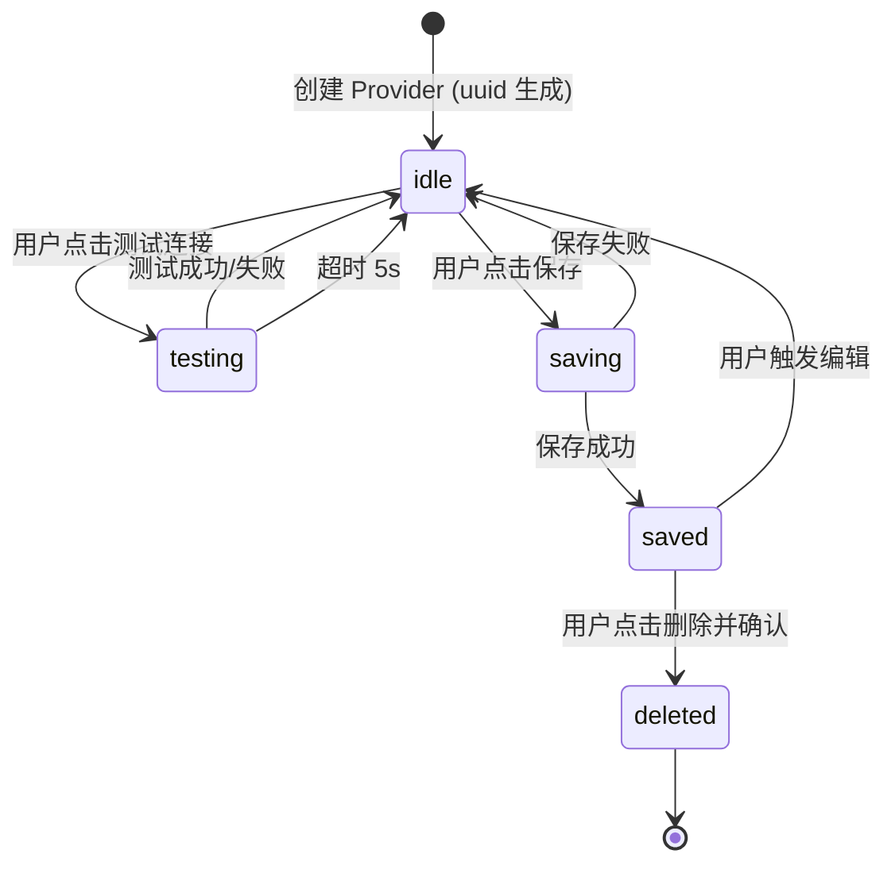
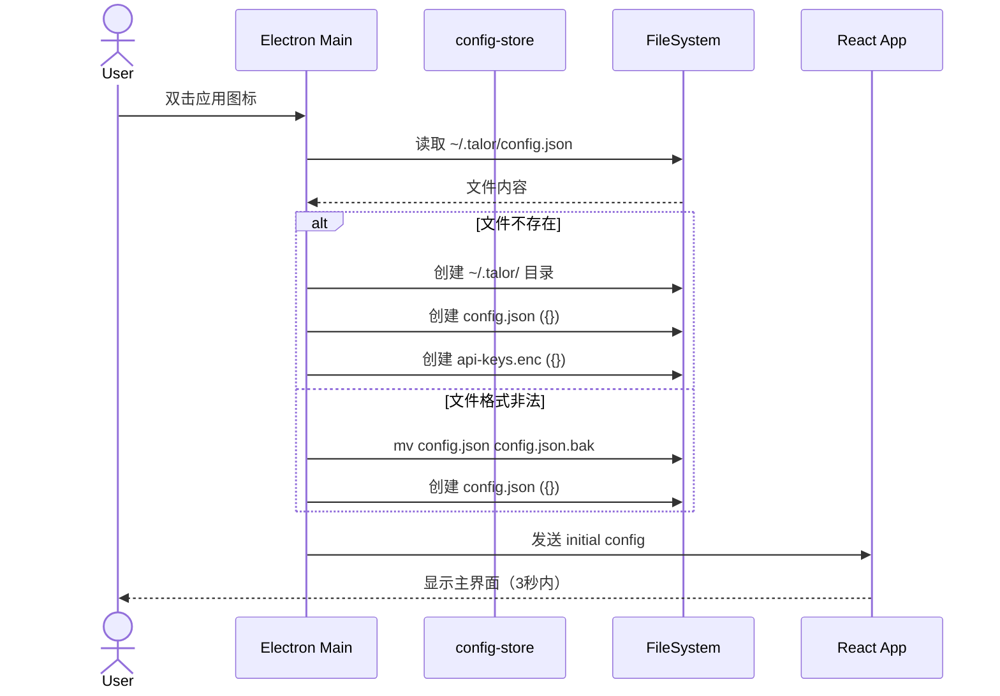
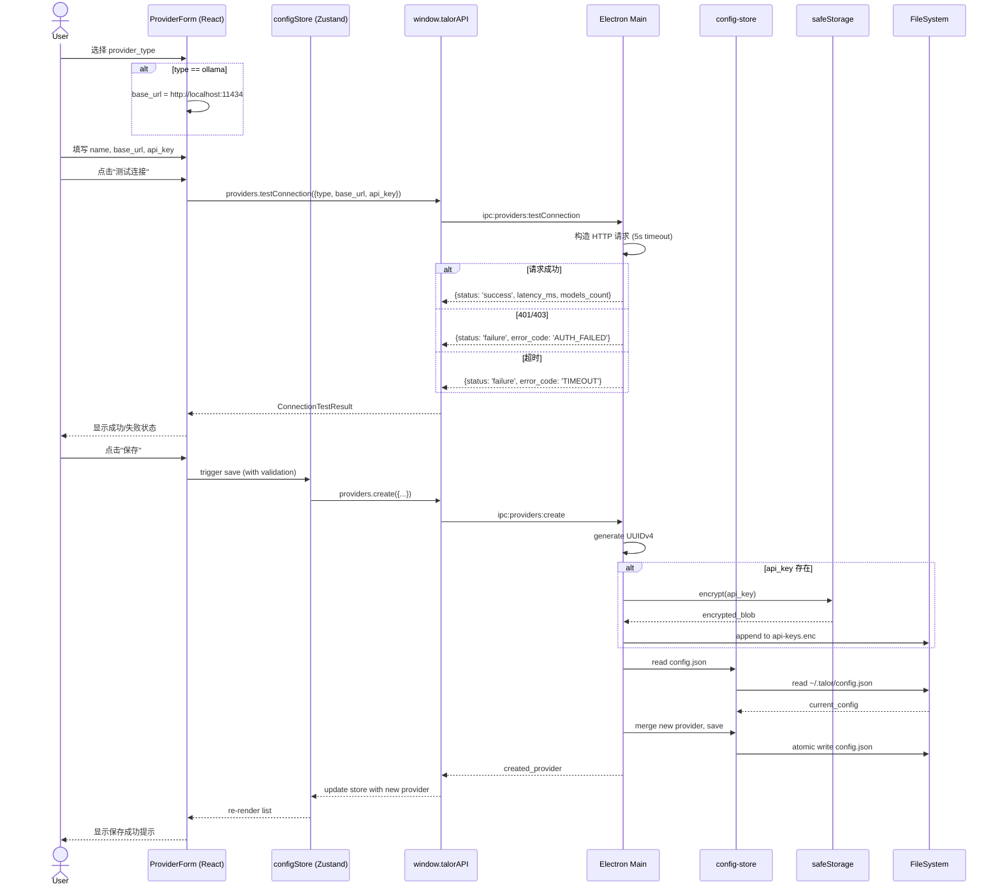

<!--
doc-id: FD-talor-phase1
status: archived
version: 1.0
last-updated: 2026-03-21
depends-on: [US-001, US-002, US-003, US-004]
generates: IMPL-talor-phase1
-->

# Talor Phase 1 功能设计文档

> **迭代级文档**。描述本次迭代**要改什么、怎么设计**。
> 迭代完成后，将本文档中的变更合并到 OVERVIEW / OVERVIEW-talor-phase1.md，然后标记 archived。
>
> **追溯链**：US-001 / US-002 / US-003 / US-004 → 本文档（FD-talor-phase1）→ IMPL-talor-phase1
> **依赖的 AC**：AC-001-01 ~ AC-001-05, AC-002-01 ~ AC-002-07, AC-003-01 ~ AC-003-08, AC-004-01 ~ AC-004-08
>
> 产品需求见 `REQUIREMENTS.md §1.4`。
> 实施计划见 `IMPLEMENTATION.md`。

---

## Pre-generation Checklist

- [x] 已读 OVERVIEW-talor-phase1.md — **N/A：greenfield 项目，无现有模块状态**
- [x] 本次变更涉及哪些状态机转换的新增或修改？— 本迭代为全新搭建，无现有状态机。UI 状态（表单状态、加载状态）由 Zustand 管理
- [x] 是否涉及全局架构变更（新增中间件、Schema 大改、新 ADR）？— 是：Electron + React + TypeScript 新架构，需新建 ADR
- [x] 是否有并发/幂等要求？幂等键是什么？— 是：Provider CRUD 操作需要幂等。幂等键为 `provider.id`（创建时为 UUIDv4，更新/删除时为 `provider.id`）
- [x] 修改本功能会影响哪些下游服务？— N/A：greenfield 项目，全部新代码，无下游依赖

---

## F.1 变更背景

**关联需求**：US-001（客户端启动）、US-002（Provider 新增）、US-003（Provider 编辑/删除/设默认）、US-004（连接测试）

**变更原因**：

Talor 现有产品依赖 Python FastAPI 后端 + Web 前端分离运行，用户必须分别启动两个服务才能使用。Phase 1 的核心目标是从 0 搭建 Talor 桌面客户端（Electron + TypeScript），实现窗口框架和 Provider 配置管理，为后续 Agent 执行引擎和会话管理奠定基础。Phase 1 是纯前端桌面应用，不涉及任何后端逻辑改造。

**变更范围**：

- 新建 `talor-desktop/` 目录，Electron main / preload / renderer 三层架构
- Electron main process：窗口管理、IPC handler、config-store、provider-tester
- React renderer：Provider CRUD 页面、Zustand 配置状态管理
- Provider 配置持久化：electron-store + safeStorage 加密 API Key
- 连接测试服务：main process 发起 HTTP 请求，支持 ollama / openai / anthropic / google
- 配置目录 `~/.talor/` 自动创建与损坏恢复

---

## F.2 全局影响

> 本迭代为 greenfield 项目，全部为新增，无历史代码修改。

### 新增 ADR / 方案选型

| ADR-ID | 决策 | 原因 | 备选方案及放弃原因 | 日期 |
|--------|------|------|-----------------|------|
| ADR-001 | Electron + TypeScript + React 19 + Zustand + Tailwind CSS | 成熟生态、跨平台、TypeScript 一致性高、社区资源丰富 | Tauri：Rust 生态学习成本高，Phase 1 以快速交付为目标 | 2026-03-21 |
| ADR-002 | main process 通过 IPC handle 封装所有磁盘和网络操作，renderer 通过 preload 暴露的 API 调用 | 安全性原则：renderer 不可直接访问 fs/network；避免 preload 直接暴露 Node.js API | renderer 直接 import fs：通过 contextIsolation=false 暴露 Node.js，安全风险高 | 2026-03-21 |
| ADR-003 | API Key 使用 Electron safeStorage 加密存储到 `~/.talor/api-keys.enc`，非敏感配置存储到 `~/.talor/config.json` | 安全性：敏感凭证不得明文存储；OS 级加密更安全 | electron-store 加密：加密密钥明文存储在 app 目录，安全性不如 OS 级 safeStorage | 2026-03-21 |
| ADR-004 | Provider 配置以 `provider.id`（UUIDv4）为唯一键，name 为业务展示名，允许重复但提示用户 | 唯一性由系统分配 ID 保证，用户可自由命名 | name 唯一约束：用户命名体验受限，且编辑场景需特殊处理 | 2026-03-21 |
| ADR-005 | 配置文件存放在 `~/.talor/` 目录（用户主目录下的 .talor 子目录） | 符合 Unix 惯例（. 开头的配置目录），与 `talor/` Python 项目配置隔离 | 工作目录内：平台差异大，用户权限问题多 | 2026-03-21 |

### 新建 Schema

**配置文件格式**（`~/.talor/config.json`）：

```typescript
// ~/.talor/config.json（明文）
interface AppConfig {
  config_dir: string;                                  // 配置目录路径
  providers: Record<string, Provider>;                // key = provider.id
  window_bounds: {
    width: number;
    height: number;
    x: number;
    y: number;
    is_maximized: boolean;
  };
}

// ~/.talor/api-keys.enc（safeStorage 加密）
// 每个 Provider 的 api_key 单独加密存储
// 加密前格式: Record<provider_id, api_key>
```

**Provider 数据模型**：

```typescript
// Provider 类型枚举
type ProviderType = 'ollama' | 'openai' | 'anthropic' | 'google';

interface Provider {
  id: string;           // UUIDv4
  type: ProviderType;
  name: string;         // 业务展示名（用户自定义）
  base_url: string;     // 服务端点
  models: string[];     // 可用模型列表（从 API 获取）
  enabled: boolean;     // 是否启用
  is_default: boolean;  // 是否为默认 Provider（同一时刻仅一个为 true）
  created_at: string;   // ISO 8601
  updated_at: string;   // ISO 8601
}
```

### 环境差异变更

| 配置项 | dev | staging | prod |
|--------|-----|---------|-------|
| config_dir | `~/.talor/` | `~/.talor/` | `~/.talor/` |
| 窗口默认尺寸 | 1200x800 | 1200x800 | 1200x800 |
| 连接测试超时 | 5000ms | 5000ms | 5000ms |
| 日志级别 | debug | info | error |

### 新增 Patterns

| Pattern 名称 | 使用场景 | 实现位置 |
|-------------|---------|---------|
| IPC Bridge | renderer 通过 preload 暴露的 API 与 main process 通信 | `src/preload/index.ts` → `window.talorAPI` |
| Config Store Singleton | electron-store 单例封装，确保配置读写一致性 | `src/main/store/config-store.ts` |
| SafeStorage Encryption | API Key 的 OS 级加密/解密封装 | `src/main/services/safe-storage.ts` |
| Provider Tester | 按 provider_type 构造测试请求，返回标准化结果 | `src/main/services/provider-tester.ts` |
| Zustand Config Store | renderer 侧配置状态管理，分离 UI 状态和配置状态 | `src/renderer/store/configStore.ts` |

---

## F.3 新增状态机转换

> 本项目为 greenfield 新建，无现有状态机。此处定义 Phase 1 新增的 **Provider 配置生命周期状态**。

### Provider 实体生命周期



### Provider 测试状态

| 状态 | 值 | 含义 |
|------|-----|------|
| `idle` | `'idle'` | 未测试或测试已完成 |
| `testing` | `'testing'` | 测试请求进行中 |
| `success` | `'success'` | 测试成功，含 latency_ms |
| `failure` | `'failure'` | 测试失败，含 error_code + message |

### 表单状态

| 状态 | 触发 | 退出条件 |
|------|------|---------|
| `closed` | 初始 / 保存成功 / 用户取消 | 点击新增或编辑按钮 |
| `creating` | 点击新增 | 保存成功或取消 |
| `editing` | 点击编辑（预填充数据） | 保存成功或取消 |
| `submitting` | 点击保存（验证通过后） | 保存成功或保存失败 |

---

## F.4 新增接口协议

> 定义 main process ↔ renderer 之间的 IPC 通信协议。

### IPC 通道定义

**Preload 暴露 API**（`window.talorAPI`）：

```typescript
interface TalorAPI {
  // 配置管理
  config: {
    get(): Promise<AppConfig>;
    save(config: AppConfig): Promise<void>;
  };

  // Provider CRUD
  providers: {
    list(): Promise<Provider[]>;
    create(provider: Omit<Provider, 'id' | 'created_at' | 'updated_at'>): Promise<Provider>;
    update(id: string, updates: Partial<Provider>): Promise<Provider>;
    delete(id: string): Promise<void>;
    setDefault(id: string): Promise<void>;
  };

  // 连接测试
  providers: {
    testConnection(config: {
      type: ProviderType;
      base_url: string;
      api_key?: string;
    }): Promise<ConnectionTestResult>;
  };

  // 窗口管理
  window: {
    minimize(): void;
    maximize(): void;
    close(): void;
    isMaximized(): Promise<boolean>;
  };
}

interface ConnectionTestResult {
  status: 'success' | 'failure';
  latency_ms?: number;
  models_count?: number;
  error_code?: string;   // CONNECTION_REFUSED | TIMEOUT | AUTH_FAILED | QUOTA_EXCEEDED | UNKNOWN
  message?: string;       // 用户可读错误信息
}
```

### IPC Handler 实现位置

| 通道 | Handler 文件 | 职责 |
|------|------------|------|
| `config:get` / `config:save` | `src/main/ipc/config.ts` | 读写 config.json |
| `providers:list` / `providers:create` / `providers:update` / `providers:delete` / `providers:setDefault` | `src/main/ipc/providers.ts` | Provider CRUD 逻辑 |
| `providers:testConnection` | `src/main/ipc/providers.ts` → `provider-tester.ts` | 发起 HTTP 测试请求 |
| `window:minimize` / `window:maximize` / `window:close` | `src/main/ipc/window.ts` | 窗口控制 |

### 各 Provider 测试端点

| Provider | HTTP Method | 端点路径 | 认证方式 |
|----------|------------|---------|---------|
| ollama | GET | `{base_url}/api/tags` | 无 / Bearer（可选） |
| openai | GET | `{base_url}/v1/models` | Bearer `api_key` |
| anthropic | GET | `{base_url}/v1/models` | Bearer `api_key` |
| google | GET | `{base_url}/v1/models` | Bearer `api_key` |

---

## F.5 并发与幂等要求

### 幂等要求

| 操作 | 是否要求幂等 | 幂等键 | 处理方式 |
|------|------------|--------|---------|
| Provider 创建 | ✅ 是 | 无幂等键（UUID 新建，天然幂等） | 创建时生成 UUIDv4，重复请求产生不同 ID |
| Provider 更新 | ✅ 是 | `provider.id` | 更新前校验 ID 存在性，以 ID 为准更新 |
| Provider 删除 | ✅ 是 | `provider.id` | 删除前校验存在性，重复删除返回成功 |
| 设置默认 Provider | ✅ 是 | `provider.id` | 同一时刻只允许一个 Provider 的 `is_default=true`；设默认时先将所有 Provider 的 `is_default` 置为 `false`，再将目标设为 `true`（两步原子写） |
| 配置保存 | ✅ 是 | 无状态幂等 | 整体替换 config.json，原子写入（writeFileSync + rename） |

### 并发锁策略

| 场景 | 锁类型 | 实现方式 | 超时配置 |
|------|--------|---------|---------|
| config.json 写入 | 文件锁 | `fs.access` 先检查，写入用 atomic rename | 500ms 超时，超时抛错 |
| 同一 Provider 同时测试连接 | 请求取消 | AbortController 取消旧请求 | N/A |

### 重试机制

| 操作 | 是否重试 | 最大重试次数 | 重试间隔 | 不重试的条件 |
|------|---------|------------|---------|-----------|
| 连接测试 HTTP 请求 | ✅ | 1 次 | 0ms（立即重试） | 超时 / 401/403（认证失败不重试） |
| config.json 写入 | ❌ | — | — | 写入失败需用户手动解决权限问题 |
| API Key 加密/解密 | ❌ | — | — | OS 级操作失败无法重试，需错误提示用户 |

### 竞态条件风险点

| 风险场景 | 可能后果 | 防护策略 |
|---------|---------|---------|
| 两个渲染进程同时保存 config.json | 配置丢失（后写覆盖先写） | main process 单线程处理写入，renderer 无直接 fs 访问权 |
| 用户快速连续点击测试按钮 | 多个请求并发，状态混乱 | AbortController 取消前序请求，只保留最新 |
| Provider 编辑时同时被另一窗口删除 | 编辑保存后数据消失 | 保存前校验 provider.id 仍存在于 config.json |

---

## F.6 涟漪分析

> greenfield 项目，无下游依赖。所有模块均为本次新增。

### 下游影响

| 变更内容 | 影响的下游模块/服务 | Breaking Change? | 迁移步骤 |
|---------|-----------------|----------------|---------|
| `~/.talor/config.json` 格式（Phase 1） | Phase 2/3 数字员工配置存储 | ⚠️ 后续迭代需向后兼容 config.json 格式 | Phase 2 起，Schema 变更需设计 migration 策略 |
| `window.talorAPI` IPC 接口 | renderer 所有页面 | ⚠️ 后续新增 IPC 通道需向后兼容 | IPC 通道只增不改，废弃通道标记 `@deprecated` |
| API Key 存储格式（api-keys.enc） | Phase 2/3 Agent 执行引擎（读取 api_key） | ⚠️ 格式变更需迁移脚本 | safeStorage 加密格式由 OS 保证，暂无需迁移 |

### 需要同步修改的关联模块

- N/A：greenfield 项目，无现有代码修改

### 需要通知的团队

- N/A：单人维护项目

---

## F.7 流程图

### 启动流程



### Provider 新增流程



### Provider 测试连接流程

```mermaid
sequenceDiagram
    actor User
    participant UI as ConnectionTest Button
    participant IPC as window.talorAPI
    participant Main as Electron Main
    participant ProviderTester as provider-tester

    User->>UI: 点击"测试连接"
    alt base_url 为空
        UI-->>User: 显示"请先填写 base_url"
    else base_url 已填写
        UI->>UI: 按钮变为 loading, isTesting=true
        UI->>IPC: providers.testConnection({type, base_url, api_key})
        IPC->>Main: ipc:providers:testConnection
        Main->>ProviderTester: test(type, base_url, api_key)

        par 并行执行
            ProviderTester->>ProviderTester: 发起 HTTP 请求
            ProviderTester-->>Main: result (5s timeout)
        end

        alt 2xx 响应
            Main-->>IPC: {status: 'success', latency_ms, models_count}
        else 401/403
            Main-->>IPC: {status: 'failure', error_code: 'AUTH_FAILED', message: '认证失败'}
        else ECONNREFUSED
            Main-->>IPC: {status: 'failure', error_code: 'CONNECTION_REFUSED', message: '无法连接到服务器'}
        else 超时
            Main-->>IPC: {status: 'failure', error_code: 'TIMEOUT', message: '连接超时'}
        end

        IPC-->>UI: ConnectionTestResult
        UI->>UI: isTesting=false, 显示结果状态
        UI-->>User: 绿色成功 / 红色失败 + 错误信息
```

---

## F.8 目录结构设计

```
talor-desktop/
├── src/
│   ├── main/                        # Electron Main Process
│   │   ├── index.ts                 # main 入口，窗口创建
│   │   ├── ipc/
│   │   │   ├── config.ts           # config:get, config:save
│   │   │   ├── providers.ts        # providers:list/create/update/delete/setDefault/testConnection
│   │   │   └── window.ts          # window:minimize/maximize/close
│   │   ├── store/
│   │   │   └── config-store.ts     # electron-store 封装，原子写入
│   │   └── services/
│   │       ├── provider-tester.ts  # 各 Provider HTTP 测试逻辑
│   │       └── safe-storage.ts     # safeStorage 加密/解密封装
│   ├── preload/
│   │   └── index.ts                # contextBridge.exposeInMainWorld('talorAPI', {...})
│   └── renderer/                    # React App
│       ├── main.tsx                # React 入口
│       ├── App.tsx                 # 根组件
│       ├── pages/
│       │   ├── Home.tsx           # 主界面（Phase 1: 设置入口）
│       │   └── Settings/
│       │       ├── index.tsx      # 设置页布局
│       │       ├── ProviderList.tsx
│       │       └── ProviderForm.tsx
│       ├── components/
│       │   ├── Header.tsx         # 顶部导航栏
│       │   ├── ConnectionTest.tsx # 连接测试按钮+状态
│       │   ├── ConfirmDialog.tsx  # 删除确认对话框
│       │   └── EmptyState.tsx     # 空状态展示
│       ├── store/
│       │   └── configStore.ts    # Zustand: provider 列表、form 状态、test 状态
│       ├── api/
│       │   └── talorAPI.ts       # window.talorAPI 类型封装
│       ├── types/
│       │   └── config.ts         # AppConfig, Provider, ConnectionTestResult
│       └── lib/
│           └── validation.ts     # 表单验证函数
├── public/
│   └── icon.svg                   # Hex-T logo (256x256)
├── package.json
├── tsconfig.json
├── tsconfig.main.json             # Main process TypeScript 配置
├── tsconfig.preload.json          # Preload TypeScript 配置
├── vite.config.ts                 # Vite for renderer
├── electron-builder.yml           # electron-builder 打包配置
├── tailwind.config.js
├── postcss.config.js
├── eslint.config.js
├── prettier.config.js
└── README.md
```

---

## F.9 关键技术决策详述

### 为什么不用 Tauri

Phase 1 的核心目标是**快速交付可用的桌面应用框架**。Electron 相比 Tauri：
- TypeScript / React 生态完全复用，无需学习 Rust
- 社区资源丰富，问题解决成本低
- Phase 1 仅需窗口 + 配置 CRUD，Tauri 的性能优势在 Phase 1 不显著
- 后续 Agent 执行引擎若用 TypeScript 实现，Electron 可无缝集成

若后续发现性能瓶颈，可在 Phase 3 后评估迁移 Tauri。

### 为什么 API Key 单独加密存储

`config.json` 需要被 Phase 2+ 的 Agent 执行引擎读取（非 Electron 进程），而 safeStorage 加密的内容只能在 Electron 进程中解密。因此：
- `config.json`：非敏感配置（base_url、models、enabled 等），明文可读
- `api-keys.enc`：API Key 加密存储，仅 Electron main process 可解密读取

### 原子写入保证

config.json 写入使用 **write-then-rename** 模式：
```
1. 写入 ~/.talor/config.json.tmp
2. fs.rename(config.json.tmp, config.json)  // atomic on POSIX
3. 成功则完成，失败则删除 .tmp
```
防止写入过程中崩溃导致配置文件损坏。

### Vite 作为 renderer 构建工具

- 比 webpack 快 10x（HMR 体验好）
- 与 Electron 无缝集成（electron-vite 生态成熟）
- 与 React 19 + TypeScript 兼容性良好
