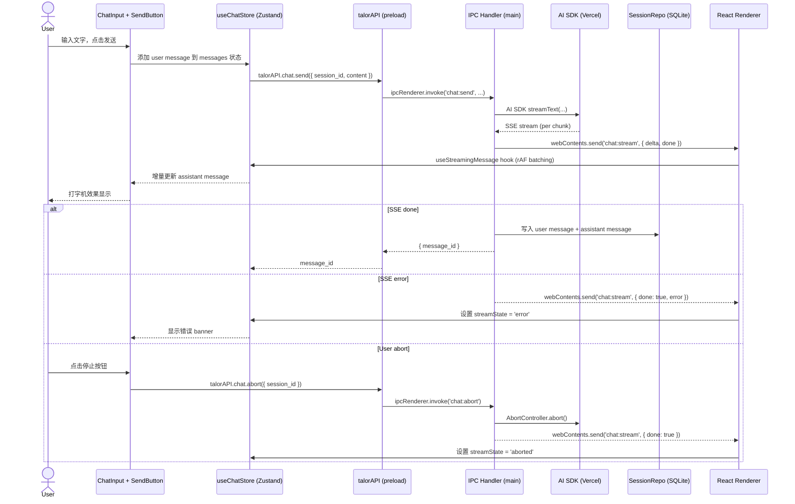
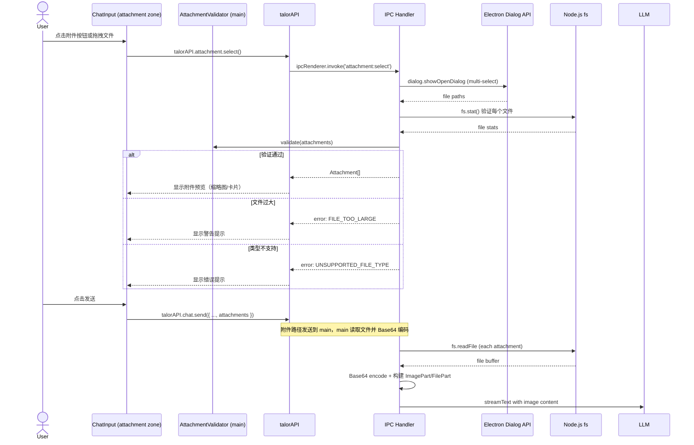
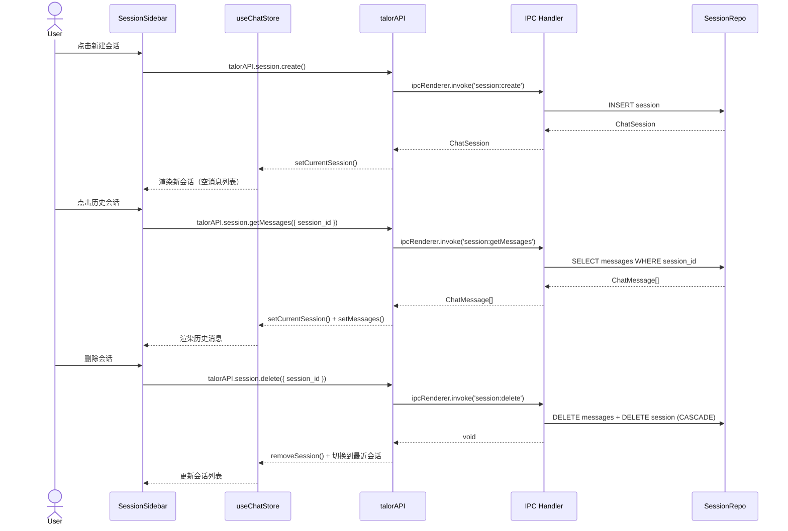

<!--
doc-id: FD-talor-desktop-phase2
status: review
version: 1.0
last-updated: 2026-03-21
depends-on: [REQ-talor-phase2]
generates: [IMPL-talor-phase2]
-->

# Talor Desktop Phase 2 功能设计文档

> **迭代级文档**。描述本次迭代要改什么、怎么设计。
> 迭代完成后，将本文档中的变更合并到 OVERVIEW-talor-desktop.md，然后标记 archived。
>
> **追溯链**：US-001~US-005 → 本文档（FD-talor-desktop-phase2）→ IMPL-talor-phase2
> **依赖的 AC**：AC-001-01 ~ AC-001-08, AC-002-01 ~ AC-002-04, AC-003-01 ~ AC-003-06, AC-004-01 ~ AC-004-02, AC-005-01 ~ AC-005-11
>
> 产品需求见 `REQUIREMENTS.md §1.4 US-001~US-005`。
> 模块现状见 `OVERVIEW-talor-desktop.md`。
> 实施计划见 `IMPLEMENTATION.md`。

---

## Pre-generation Checklist（生成前必须回答）

- [x] 已读 OVERVIEW-talor-desktop.md，了解模块当前状态（IPC 通道、Patterns、Gotchas）
- [x] 本次变更涉及哪些状态机转换的新增或修改？（ChatSession 生命周期、Message 生命周期、流式状态机）
- [x] 是否涉及全局架构变更（新增中间件、Schema 大改、新 ADR）？**是**：新增 AI SDK 集成层、新增 SQLite 会话持久化、新增 SSE 流式 IPC 通道
- [x] 是否有并发/幂等要求？幂等键是什么？（session:id 唯一键，message:id 唯一键，send 消息非幂等）
- [x] 修改本功能会影响哪些下游服务？无下游服务，纯桌面端实现

---

## F.1 变更背景

**关联需求**：US-001（流式对话）、US-002（多轮上下文）、US-003（会话管理）、US-004（Provider 切换）、US-005（消息附件）

**变更原因**：

Phase 1 已完成 Talor Desktop 的桌面客户端框架和 Provider 配置管理。用户现在可以在设置页面添加 LLM Provider 并测试连接。Phase 2 的核心目标是将桌面客户端从"配置工具"升级为"可用的 AI 对话产品"。

当前的核心差距：用户配置好 Provider 后，没有地方可以真正和 AI 对话。Phase 2 需要在 Electron + TypeScript 架构内实现完整的 Agent 执行引擎，包括 LLM 连接、流式响应、多轮上下文、会话持久化和文件附件支持，全部使用 Vercel AI SDK 连接 LLM Provider，不依赖 Python 后端。

**变更范围**：

- 新增 LLM 集成层（Vercel AI SDK + Provider 配置读取）
- 新增 SSE 流式 IPC 通道（main fetch → IPC push → renderer hook）
- 新增 Chat 页面（会话列表侧边栏 + 聊天主区域 + 流式消息渲染）
- 新增 SQLite 会话持久化（sessions 表 + messages 表）
- 新增消息附件支持（文件选择 + 拖拽 + Base64 编码 + 多模态 LLM 调用）
- 新增 Provider 多模态能力检测
- 新增流式中断（AbortController）

---

## F.2 全局影响

### 新增 ADR / 方案选型

| ADR-ID | 决策 | 原因 | 备选方案及放弃原因 | 日期 |
|--------|------|------|-----------------|------|
| ADR-006 | 使用 Vercel AI SDK (`ai` npm) 作为 LLM 集成层 | 支持 OpenAI/Anthropic/Google/Ollama，统一 streamText API，支持多模态 | 直接调用 fetch：需自行处理各 Provider 差异，工作量大 | 2026-03-21 |
| ADR-007 | SSE 流式：main process fetch → `webContents.send()` per chunk → renderer rAF batching | Electron 安全模型不允许 renderer 直接访问网络；main 持有 AbortController 可正确中断 | EventSource：无法设置自定义 headers（API Key）；WebSocket：协议过重 | 2026-03-21 |
| ADR-008 | 会话和消息使用 SQLite（`better-sqlite3`）持久化到 `~/.talor/chat.db` | 结构化查询优于 JSON 文件，支持并发写入，垮重启保留历史 | electron-store JSON：消息量大时查询性能差；Phase 1 已用 electron-store | 2026-03-21 |
| ADR-009 | 流式状态下禁止重复发送（debounce guard） | 防止 SSE 乱序和 LLM 请求重复 | 无保护：会导致消息顺序错乱，LLM 上下文污染 | 2026-03-21 |

### Schema 变更（diff 视角）

**新增 SQLite Schema**（`~/.talor/chat.db`）：

```sql
CREATE TABLE sessions (
    id TEXT PRIMARY KEY,       -- UUIDv4
    title TEXT NOT NULL,        -- 会话标题，默认 "新会话"
    provider_id TEXT NOT NULL, -- 关联 Provider ID
    model_id TEXT,             -- 模型 ID（如 ollama/qwen3:4b）
    created_at TEXT NOT NULL,   -- ISO 8601
    updated_at TEXT NOT NULL    -- ISO 8601（最后一条消息时间）
);

CREATE TABLE messages (
    id TEXT PRIMARY KEY,       -- UUIDv4
    session_id TEXT NOT NULL,  -- 关联会话 ID
    role TEXT NOT NULL,        -- 'user' | 'assistant' | 'system'
    content TEXT NOT NULL,     -- 主文本内容（JSON 字符串，含 parts）
    created_at TEXT NOT NULL,  -- ISO 8601
    FOREIGN KEY (session_id) REFERENCES sessions(id) ON DELETE CASCADE
);

CREATE INDEX idx_messages_session ON messages(session_id);
```

> 变更说明：Phase 1 的 `electron-store` 继续用于 Provider 配置（`~/.talor/config.json`）；Phase 2 新增 SQLite 用于会话和消息持久化（`~/.talor/chat.db`）。两者独立，互不影响。

**新增 TypeScript 类型**（`src/renderer/types/` 或 `src/main/types/`）：

```typescript
// 消息部分类型
type MessagePart = TextPart | ImagePart | FilePart;

interface TextPart {
  type: 'text';
  content: string;
}

interface ImagePart {
  type: 'image';
  mime_type: string;
  data: string; // base64 encoded
  filename?: string;
}

interface FilePart {
  type: 'file';
  mime_type: string;
  filename: string;
  size_bytes: number;
  path: string; // local file path
}

// 消息类型
type MessageRole = 'user' | 'assistant' | 'system';

interface ChatMessage {
  id: string;             // UUIDv4
  session_id: string;     // 关联会话 ID
  role: MessageRole;
  parts: MessagePart[];   // 消息部分数组（至少一个 part）
  created_at: string;     // ISO 8601
}

// 流式状态
type StreamState = 'idle' | 'streaming' | 'done' | 'error' | 'aborted';

// 会话类型
interface ChatSession {
  id: string;             // UUIDv4
  title: string;
  provider_id: string;
  model_id?: string;
  created_at: string;
  updated_at: string;
}
```

### 环境差异变更

| 配置项 | dev 变更 | staging 变更 | prod 变更 |
|--------|---------|------------|---------|
| `~/.talor/chat.db` | 新建 | 新建 | 新建 |
| LLM 请求超时 | 60s | 60s | 60s |
| 首 token 超时（TTFT） | 10s | 10s | 10s |
| SSE chunk push 间隔 | rAF batching（~16ms） | rAF batching | rAF batching |

### 新增 Patterns

| Pattern 名称 | 使用场景 | 参考代码 |
|-------------|---------|---------|
| AI SDK Provider Bridge | 将 Phase 1 的 Provider 配置转换为 AI SDK compatible format | `src/main/services/llm-provider.ts` |
| SSE Streaming IPC | main fetch SSE → chunk push to renderer | `src/main/ipc/chat.ts` |
| Streaming Renderer Hook | rAF batching + 打字机效果渲染 | `src/renderer/hooks/useStreamingMessage.ts` |
| Abort Guard | 流式进行中禁止重复发送 | `src/renderer/hooks/useChatInput.ts` |
| Attachment Validator | 文件大小 + MIME 类型预验证 | `src/main/services/attachment-validator.ts` |
| SQLite Session Repo | 会话和消息的 CRUD 封装 | `src/main/repos/session-repo.ts` |

---

## F.3 新增/变更的状态机转换

> 完整现有状态机见 `OVERVIEW-talor-desktop.md §O.6`。

### 新增状态机：会话生命周期

```
[*] --> session_created: 用户点击新建会话
session_created --> active: 进入聊天页
active --> deleted: 用户删除会话并确认
deleted --> [*]

active --> active: 用户切换到另一会话
active --> active: 用户发送消息（创建 message）
```

### 新增状态机：消息流式状态

```
[*] --> idle: 会话初始化完成

idle --> streaming: 用户发送消息（chat:send）
streaming --> done: SSE stream 完成（finish 事件）
streaming --> error: SSE 出错（error 事件）
streaming --> aborted: 用户点击停止（chat:abort）
streaming --> idle: done / error / aborted（等待下一条消息）

aborted --> idle: 状态重置
error --> idle: 错误提示显示后，允许用户重试
done --> idle: 流式消息追加后，等待下一条
```

### 新增状态机：附件输入状态

```
[*] --> empty: 无附件
empty --> has_attachments: 用户选择/拖拽文件
has_attachments --> empty: 用户移除所有附件
has_attachments --> validating: 用户点击发送（进入验证流程）
validating --> empty: 验证失败（错误提示）
validating --> sending: 验证通过（进入 chat:send）
```

### 新增禁止转换

| 源状态 | 目标状态 | 禁止原因 |
|--------|---------|---------|
| `streaming` | `streaming` | 流式进行中禁止重复发送（ADR-009） |
| `validating` | `idle` | 验证中不能取消（防止 race condition） |
| `sending` | `idle` | 发送请求已发出，只能等 done/error/aborted |

---

## F.4 新增/变更的接口协议

> 完整的现有 IPC 通道见 `OVERVIEW-talor-desktop.md §O.4`。

### 新增 IPC 通道

#### chat:send（invoke，渲染进程 → 主进程）

发送消息并接收流式响应。通过 `chat:stream` 事件接收增量内容。

```
// src/main/ipc/chat.ts
chat:send({
  session_id: string,          // 目标会话 ID
  content: string,             // 用户输入文本
  attachments?: Attachment[],  // 附件数组（可选）
}) -> { message_id: string }  // 返回创建的消息 ID
```

**错误码**：

| error_code | 含义 | HTTP 来源 |
|-----------|------|---------|
| `LLM_CONNECTION_FAILED` | 无法连接到 LLM 服务 | 连接超时/网络错误 |
| `AUTH_FAILED` | 认证失败（401/403） | API Key 无效 |
| `RATE_LIMITED` | 请求频率超限（429） | Provider 限速 |
| `LLM_ERROR` | LLM 返回错误（500 等） | Provider 内部错误 |
| `LLM_TIMEOUT` | 请求超时（> 60s） | LLM 处理超时 |
| `PROVIDER_NO_VISION` | Provider 不支持多模态 | 图片附件 + 非多模态模型 |
| `FILE_TOO_LARGE` | 文件超过 50MB | 本地验证 |
| `UNSUPPORTED_FILE_TYPE` | 不支持的文件类型 | 本地验证 |
| `FILE_NOT_FOUND` | 附件文件不存在 | 本地验证 |

#### chat:abort（invoke，渲染进程 → 主进程）

中断正在进行的流式响应。AbortController 取消 fetch，流式状态切换为 `aborted`。

```
// src/main/ipc/chat.ts
chat:abort({ session_id: string }) -> void
```

#### chat:stream（send，主进程 → 渲染进程）

SSE chunk 推送事件，每个事件携带一个增量文本片段。

```
// src/main/ipc/chat.ts
chat:stream(event, {
  session_id: string,
  message_id: string,
  delta: string,           // 增量文本
  done: boolean,           // 是否完成
  error?: string,          // 错误码（done=true 且有 error 时）
}) -> void
```

#### session:list（invoke）

列出所有会话。

```
// src/main/ipc/session.ts
session:list() -> ChatSession[]
```

#### session:create（invoke）

创建新会话。使用默认 Provider。

```
// src/main/ipc/session.ts
session:create() -> ChatSession
```

#### session:delete（invoke）

删除会话（级联删除 messages）。

```
// src/main/ipc/session.ts
session:delete({ session_id: string }) -> void
```

#### session:rename（invoke）

重命名会话标题。

```
// src/main/ipc/session.ts
session:rename({ session_id: string, title: string }) -> ChatSession
```

#### session:getMessages（invoke）

获取指定会话的所有消息。

```
// src/main/ipc/session.ts
session:getMessages({ session_id: string }) -> ChatMessage[]
```

---

## F.5 并发与幂等要求

### 幂等要求

| 操作 | 是否要求幂等 | 幂等键 | 处理方式 |
|------|------------|--------|---------|
| `session:create` | ✅ 是 | — | UUIDv4 自动生成，无重复风险 |
| `session:delete` | ✅ 是 | `session_id` | 软删除或幂等忽略（已删除则返回 void） |
| `session:rename` | ✅ 是 | `session_id + title` | 重复 rename 返回当前值 |
| `chat:send` | ❌ 否 | — | 用户主动操作，流式状态 guard 防止重复 |
| `session:getMessages` | ✅ 是 | `session_id` | 纯查询，天然幂等 |
| `chat:abort` | ✅ 是 | `session_id` | 中断无结果也返回 void |

### 并发锁策略

| 场景 | 锁类型 | 实现方式 | 超时配置 |
|------|--------|---------|---------|
| 同一会话的并发发送 | 状态锁 | 流式状态 `streaming` guard（UI 禁用发送按钮 + IPC 层二次检查） | 无超时（状态转换自动释放） |
| SQLite 并发写入 | DB 文件锁 | better-sqlite3 WAL 模式 | 默认 |

### 重试机制

| 操作 | 是否重试 | 最大重试次数 | 重试间隔 | 不重试的条件 |
|------|---------|------------|---------|-----------|
| LLM 请求（网络错误） | ✅ | 1 次 | 2s | 认证失败（401/403）、业务校验失败（4xx）、主动 abort |
| LLM 请求（超时） | ❌ | — | — | 超时表示 Provider 负载高，重试可能继续超时 |

### 竞态条件风险点

| 风险场景 | 可能后果 | 防护策略 |
|---------|---------|---------|
| 快速连续点击发送两次 | 流式消息乱序或重复 | streaming 状态 guard（UI disabled + IPC 检查） |
| abort 和 stream 完成同时到达 | 状态不一致 | IPC 层按到达顺序处理，renderer 以 `done: true` 事件为准 |
| 会话删除时仍有流式请求进行中 | 消息写入已删除会话 | 先 abort，再删除（IPC 层保证顺序） |

---

## F.6 涟漪分析（Ripple Analysis）

### 下游影响

| 变更内容 | 影响的下游模块/服务 | Breaking Change? | 迁移步骤 |
|---------|-----------------|----------------|---------|
| 新增 IPC 通道（chat:*, session:*） | preload/index.ts（新增 API），renderer/api/talorAPI.ts（新增方法） | ⚠️ 需确认 | 新增 API 不影响 Phase 1 现有调用 |
| 新增 SQLite chat.db | electron-store 继续用于 config.json，无影响 | ❌ 无 | 新建数据库，不迁移 Phase 1 数据 |
| 新增 better-sqlite3 依赖 | electron-builder 打包配置 | ⚠️ 需确认 | better-sqlite3 需 native rebuild，确保打包配置正确 |
| Provider 多模态能力检测 | Provider 类型定义需新增 `supports_vision: boolean` | ⚠️ 需确认 | 可向后兼容（默认 false） |

### 需要同步修改的关联模块

- [ ] `talor-desktop/src/preload/index.ts`：新增 `talorAPI.chat` 和 `talorAPI.session` 对象
- [ ] `talor-desktop/src/renderer/api/talorAPI.ts`：新增 chat/session 方法（Proxy 扩展）
- [ ] `talor-desktop/src/main/index.ts`：注册新的 IPC handler
- [ ] `talor-desktop/package.json`：新增 `ai`、`better-sqlite3`、`react-markdown`、`remark-gfm` 依赖
- [ ] `talor-desktop/electron-builder.yml`：确保 native 模块正确打包
- [ ] `vibe/overviews/OVERVIEW-talor-desktop.md`：Phase 2 完成后合并变更，标记状态更新
- [ ] `CLAUDE.md`：Phase 2 完成时更新"当前开发重点"

### 需要通知的团队

- [ ] 无（单人项目，无需通知）

---

## F.7 流程图

### 发送消息并接收流式响应（SSE）



### 上传附件流程



### 会话管理流程



---

## F.8 组件结构

### 新增文件清单

| 文件路径 | 职责 |
|---------|------|
| `src/main/ipc/chat.ts` | chat:send, chat:abort IPC handlers |
| `src/main/ipc/session.ts` | session:list/create/delete/rename/getMessages IPC handlers |
| `src/main/services/llm-provider.ts` | Provider → AI SDK 模型配置转换 |
| `src/main/services/chat-streamer.ts` | SSE 流式拉取 + chunk push |
| `src/main/repos/session-repo.ts` | SQLite sessions/messages CRUD |
| `src/main/services/attachment-validator.ts` | 文件大小/类型验证 |
| `src/main/services/vision-detector.ts` | Provider 多模态能力检测 |
| `src/main/db/index.ts` | better-sqlite3 初始化 + WAL 模式 |
| `src/preload/index.ts` | 扩展 talorAPI：chat + session 对象 |
| `src/renderer/api/talorAPI.ts` | 扩展 Proxy：chat + session 方法 |
| `src/renderer/pages/Chat/` | 聊天页面（含侧边栏） |
| `src/renderer/pages/Chat/ChatSidebar.tsx` | 会话列表侧边栏 |
| `src/renderer/pages/Chat/ChatMain.tsx` | 聊天主区域 |
| `src/renderer/pages/Chat/ChatMessage.tsx` | 消息气泡组件 |
| `src/renderer/pages/Chat/StreamingMessage.tsx` | 流式消息打字机效果 |
| `src/renderer/pages/Chat/ChatInput.tsx` | 输入框 + 附件按钮 |
| `src/renderer/pages/Chat/AttachmentPreview.tsx` | 附件预览组件 |
| `src/renderer/hooks/useStreamingMessage.ts` | SSE 流式 hook（rAF batching） |
| `src/renderer/hooks/useChatInput.ts` | 发送 guard + abort |
| `src/renderer/store/chatStore.ts` | Zustand chat 状态管理 |
| `src/renderer/types/chat.ts` | ChatMessage, ChatSession, MessagePart 类型 |
| `src/renderer/components/MarkdownRenderer.tsx` | Markdown 渲染（含代码高亮） |
| `src/renderer/components/TypingIndicator.tsx` | AI 思考中 3-dot 动画 |

### 修改文件清单

| 文件路径 | 变更说明 |
|---------|---------|
| `src/main/index.ts` | 注册新的 IPC handlers |
| `src/preload/index.ts` | 扩展 talorAPI 对象（chat/session） |
| `src/renderer/App.tsx` | 新增路由：Home → Chat（Phase 1 的 Home → Settings 改为 Chat → Settings） |
| `src/renderer/api/talorAPI.ts` | 扩展 Proxy |
| `src/renderer/store/configStore.ts` | 复用 Phase 1 Provider 配置 |
| `package.json` | 新增依赖 |
| `electron-builder.yml` | native 模块打包配置 |
