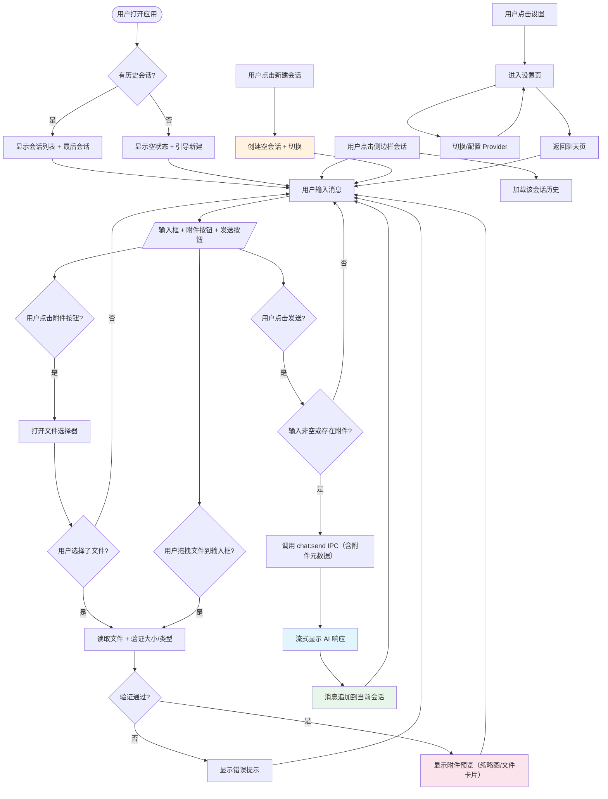

<!--
doc-id: REQ-talor-phase2
status: draft
version: 1.0
last-updated: 2026-03-21
depends-on: [OVERVIEW-talor-desktop]
generates: FEATURE-talor-phase2
-->

# Talor Desktop Phase 2 需求文档

> 纯用户视角。本文档描述**用户需要什么**，不描述系统如何实现。
> 所有术语命名以 §1.3 术语表为准——AI 在编写代码、注释、变量名时必须严格遵循。
> 项目现状见 `vibe/overviews/OVERVIEW-talor-desktop.md`。功能设计见 `FEATURE-talor-phase2.md`。实施计划见 `IMPLEMENTATION.md`。

---

## Pre-generation Checklist

- [x] 已与需求方确认业务背景和核心目标（对话决策已确认）
- [x] 已列出所有业务术语并确认定义（特别是易混淆词）
- [x] 每个用户故事已附真实数据样例（非 schema）
- [x] 边界 Case 和异常场景已逐一列举
- [x] 已确认消息类型支持范围：文本（Text）、附件（Attachment）、图片（Image）；AI 工具调用结果在 Phase 3

---

## 1.1 需求背景

Phase 1 已完成 Talor Desktop 的桌面客户端框架和 Provider 配置管理。用户现在可以在设置页面添加 LLM Provider 并测试连接。Phase 2 的核心目标是将桌面客户端从"配置工具"升级为"可用的 AI 对话产品"——用户选择一个 Provider，直接发起对话，实时看到流式响应，并在多轮对话中保持上下文。

当前的痛点：用户配置好 Provider 后，没有地方可以真正和 AI 对话。Phase 1 的 Provider 配置能力是 Phase 2 的基础设施，两者结合才形成完整的桌面 AI 交互体验。Phase 2 不依赖任何 Python 后端，全部在 Electron + TypeScript 架构内实现，使用 Vercel AI SDK 连接 LLM Provider。

---

## 1.2 目标

- [x] **目标 1**：用户在选择 Provider 后输入文字，实时看到 AI 流式响应，打字机效果，延迟感知 < 200ms
- [x] **目标 2**：用户在同一个会话中连续对话，AI 记住之前上下文，实现真正的多轮对话
- [x] **目标 3**：用户可在多个会话之间切换，每个会话独立维护对话历史
- [x] **目标 4**：用户切换 Provider 时，当前的对话不受影响（使用创建时选定的模型）
- [x] **目标 5**：LLM 请求失败时，用户看到明确的错误提示而非白屏或静默失败
- [x] **目标 6**：用户可在消息中附加文件（图片/文档），AI 能感知并响应文件内容

**本次不包含的目标**（明确排除，避免范围蔓延）：

- Tool 调用（bash/read/write 等内置工具）
- employees/*.jsonc 数字员工契约加载
- 对话历史的 SQLite 持久化（Phase 3）
- 消息编辑、Regenerate、重发
- MCP 工具集成
- SSE 断线重连
- 消息权限审批流程

---

## 1.3 业务术语表（Glossary）

> ⭐ 关键：AI 在命名变量、函数、注释、数据库字段时**必须以此表为准**，不得使用同义词。

| 术语 | 定义 | 代码命名 | 易混淆项 |
|------|------|---------|---------|
| 会话（Session） | 一个独立的对话上下文，包含多轮消息历史，会话之间互不影响 | `session` / `ChatSession` | Conversation：session 是持久化的对话单元，conversation 更口语化 |
| 消息（Message） | 会话中的一条记录，分为 user/assistant/system 三种角色 | `message` / `ChatMessage` | Turn：turn 通常指单次交互（一问一答），message 是持久化单元 |
| 消息部分（MessagePart） | 消息的内容单元，一条消息可包含多个 parts（如文字 + 图片） | `messagePart` / `MessagePart` | 消息的子单元，一个 message 由多个 part 组成 |
| 消息类型（MessageType） | 消息的内容类型：文本（text）、附件（attachment） | `messageType` | Content type：MessageType 是语义分类，content_type 是 MIME 类型 |
| 附件（Attachment） | 用户附加到消息中的文件，包含文件路径、名称、大小、MIME 类型 | `attachment` / `Attachment` | 上传：Phase 2 用本地文件路径（无需上传），Phase 3 才有云端上传 |
| 文本部分（TextPart） | 文本类型的消息部分，包含纯文本内容 | `textPart` / `TextPart` | Attachment：TextPart 是文字，Attachment 是文件 |
| 文件部分（FilePart） | 文件类型的消息部分，包含附件元数据（名称/大小/类型） | `filePart` / `FilePart` | TextPart：FilePart 展示文件卡片，TextPart 展示文字 |
| 图片部分（ImagePart） | 图片类型的消息部分，展示图片缩略图 | `imagePart` / `ImagePart` | FilePart：ImagePart 有缩略图预览，FilePart 只有文件图标 |
| 流式响应（Streaming Response） | LLM 返回的增量文本，通过 SSE 分块传输，在 UI 上逐步展示 | `stream` / `streamingMessage` | Non-streaming response：一次返回完整内容，无打字机效果 |
| Provider | LLM 服务提供商（如 Ollama、OpenAI、Anthropic、Google），配置在 Phase 1 | `provider` / `LLMProvider` | Model：provider 是服务提供方，model 是具体的模型名称 |
| 模型（Model） | 具体的大语言模型实例（如 ollama/qwen3:4b、openai/gpt-4o） | `model` / `ModelInfo` | Provider：model 隶属于 provider |
| 用户消息（User Message） | 用户主动输入的内容，角色为 user，可包含文本 + 附件 | `userMessage` | Assistant Message：AI 生成的回复 |
| AI 消息（Assistant Message） | AI 生成的回复，可能包含流式中间状态 | `assistantMessage` | User Message：方向相反 |
| Provider 选择器 | 设置页面中的 Provider 下拉列表，供用户切换当前会话使用的 LLM | `providerSelector` | Model 选择器：Phase 2 只有 Provider 选择，Model 选择在 Phase 3 |
| SSE（Server-Sent Events） | 服务端推送的技术，用于 LLM 流式输出到客户端 | `sse` | WebSocket：SSE 是单向的，WebSocket 是双向的 |
| 流式中断（Abort） | 用户主动停止 AI 生成过程 | `abort` / `cancelled` | Error：abort 是用户主动取消，error 是异常 |

---

## 1.4 用户故事

---

### US-001：发起对话并接收流式响应

**用户故事**：作为用户，当我在输入框输入问题并发送时，我希望实时看到 AI 的流式回复，以便获得即时反馈和打字机效果体验。

**正常场景**：

| 输入 | 期望输出 |
|------|---------|
| 用户输入"你好"并发送 | AI 回复"你好！有什么可以帮助你的吗？"，文字逐步显示 |
| 用户输入"用中文解释量子计算" | AI 回复逐步显示，包含完整的解释内容 |
| 用户快速连续点击发送两次 | 第二次点击被忽略（上一个回复完成前不可发送） |

**真实数据样例**：

```
输入：
"你好"

期望输出（流式，逐步显示）：
"你好！很高兴认识你。我是 Talor 的 AI 助手。"

实际传输：
chunk 1: "你好"
chunk 2: "！很高兴认识你"
chunk 3: "。我是 Talor 的 AI 助手。"
```

```
输入：
"1+1等于几"

期望输出：
"1 + 1 = 2"

输入（较长内容）：
"Write a Python function that checks if a string is a palindrome"

期望输出（流式）：
"Here is a Python function to check if a string is a palindrome:\n\n```python\ndef is_palindrome(s: str) -> bool:\n    return s == s[::-1]\n```\n\nThis uses Python's slice notation..."
```

**异常场景 & 边界 Case**：

| 条件 | 系统应 |
|------|--------|
| 当输入为空或仅包含空白字符时 | 禁止发送，输入框保持原样 |
| 当 LLM 服务不可用时（连接失败） | 显示红色错误提示：`error_code=LLM_CONNECTION_FAILED`，文案："无法连接到 LLM 服务，请检查 Provider 配置" |
| 当 LLM 返回错误响应时（401/403/429） | 显示对应错误：`error_code=AUTH_FAILED`（401/403）、`error_code=RATE_LIMITED`（429）、`error_code=LLM_ERROR`（500等） |
| 当 LLM 超时未响应时（> 60s） | 显示错误：`error_code=LLM_TIMEOUT`，文案："请求超时，请重试" |
| 当网络断开时 | 检测到离线状态，显示 `error_code=NETWORK_OFFLINE` |
| 当快速连续发送时 | 忽略重复发送，等待当前流式响应完成 |
| 当 Provider 未配置时 | 引导用户去设置页面配置 Provider |

---

### US-002：多轮对话上下文保持

**用户故事**：作为用户，当我在一个会话中连续对话时，我希望 AI 记住之前的对话内容，以便进行有上下文的深入讨论。

**正常场景**：

| 输入 | 期望输出 |
|------|---------|
| 用户发送"我叫张三"，AI 回复"好的张三..." | 会话历史包含用户消息和 AI 回复 |
| 用户继续发送"我叫什么呢？"，AI 回复"你叫张三" | AI 正确引用了上一轮对话的上下文 |
| 用户刷新页面后重新打开应用 | 之前的对话历史完整保留在侧边栏中 |

**真实数据样例**：

```
=== 第一轮 ===
输入："我叫张三"
AI 回复："好的张三，很高兴认识你！"

=== 第二轮 ===
输入："我叫什么名字？"
期望输出："你叫张三。"

=== 第三轮 ===
输入："用 Python 写一个 hello world"
期望输出（流式）：
"Here is a Python hello world:\n\n```python\nprint('Hello, World!')\n```"
```

**异常场景 & 边界 Case**：

| 条件 | 系统应 |
|------|--------|
| 当上下文超过模型最大 token 限制时 | 截断最早的对话轮次（保留 system prompt），继续对话 |
| 当会话消息数超过 100 条时 | 继续追加，系统在后台做截断处理 |
| 当切换 Provider 时 | 当前会话保持原 Provider，新建会话使用新 Provider |
| 当 Provider 模型不同时 | 可能出现上下文不兼容（参数差异），由 LLM 自己处理 |

---

### US-003：会话管理

**用户故事**：作为用户，当我想开始新话题时，我希望新建一个会话；当我需要回顾历史时，我希望从侧边栏选择并继续对话。

**正常场景**：

| 输入 | 期望输出 |
|------|---------|
| 用户点击"新建会话"按钮 | 创建一个空会话，切换到该会话，当前会话内容保留 |
| 用户在侧边栏点击一个历史会话 | 加载该会话的消息历史，显示在主聊天区域 |
| 用户右键/长按一个会话 | 显示删除选项，确认后删除该会话及所有消息 |
| 用户在侧边栏点击会话标题 | 进入编辑状态，可重命名会话标题 |

**真实数据样例**：

```
场景：用户第一次打开应用
侧边栏：[空]
主区域：请选择一个会话或新建会话

场景：用户新建了三个会话
侧边栏：
  - "新会话" (2026-03-21) ← 当前
  - "Python 编程问题" (2026-03-20)
  - "量子计算讨论" (2026-03-19)

场景：用户删除了"量子计算讨论"
侧边栏：
  - "新会话" (2026-03-21)
  - "Python 编程问题" (2026-03-20)
主区域：显示"Python 编程问题"的消息历史
```

**异常场景 & 边界 Case**：

| 条件 | 系统应 |
|------|--------|
| 当用户删除当前选中的会话时 | 删除后自动切换到最近的一个会话，若无则显示空状态 |
| 当会话标题过长时（> 30 字符） | 截断显示，tooltip 显示完整标题 |
| 当会话列表超过 50 个时 | 支持滚动，最新的在前 |
| 当会话数据损坏时（无法解析） | 跳过该会话，显示灰色占位，记录日志 |

---

### US-004：Provider 切换与模型选择

**用户故事**：作为用户，当我想使用不同的 LLM Provider 时，我希望在设置中切换，当前对话使用新 Provider 发起。

**正常场景**：

| 输入 | 期望输出 |
|------|---------|
| 用户在设置页选择一个 Provider（如从 Ollama 切换到 OpenAI） | Provider 配置中的 `is_default` 更新，新会话使用该 Provider |
| 用户在设置页新增一个 Provider | Provider 列表立即更新显示 |

**异常场景 & 边界 Case**：

| 条件 | 系统应 |
|------|--------|
| 当切换 Provider 后，当前会话正在流式响应中 | 当前响应正常完成，新消息使用新 Provider |
| 当选中的 Provider 被删除时 | 自动切换到默认 Provider，显示提示 |
| 当 Provider 的 API Key 无效时（已在 Phase 1 testConnection 中验证） | 显示 `error_code=AUTH_FAILED`，切换 Provider 不受影响 |

---

### US-005：消息附件（文件/图片）

**用户故事**：作为用户，当我想讨论一个文件或图片时，我希望将其附加到消息中发送，AI 能感知并响应文件内容。

**正常场景**：

| 输入 | 期望输出 |
|------|---------|
| 用户点击附件按钮，选择本地图片文件（PNG/JPG/GIF） | 图片预览缩略图出现在输入框下方，文件名和大小显示 |
| 用户点击附件按钮，选择本地文档文件（PDF/TXT/MD） | 文件卡片出现在输入框下方，显示文件图标、文件名和大小 |
| 用户点击附件后，再点击附件上的 X 按钮 | 附件从输入框移除 |
| 用户发送带附件的消息 | 消息中显示附件内容（图片缩略图或文件卡片），AI 响应提及附件内容 |
| 用户拖拽文件到输入框区域 | 文件被识别并附加到消息中，等同于点击附件按钮 |

**真实数据样例**：

```
=== 场景 1：发送图片 ===
用户附加：/Users/quinn/Desktop/screenshot.png（2.3MB，image/png）
发送消息："帮我分析这个截图"
消息展示：
  [用户] 帮我分析这个截图
    [图片缩略图: screenshot.png, 2.3MB]
AI 回复（流式）：
  "这个截图显示..."

=== 场景 2：发送文档 ===
用户附加：/Users/quinn/Desktop/report.pdf（1.2MB，application/pdf）
发送消息："总结一下这个文档"
消息展示：
  [用户] 总结一下这个文档
    [文件卡片: report.pdf, 1.2MB]
AI 回复：
  "这份文档的主要内容是..."

=== 场景 3：多个附件 ===
用户附加：图片1.png + 图片2.jpg
发送消息："比较这两张图片"
消息展示：
  [用户] 比较这两张图片
    [图片: 图片1.png]
    [图片: 图片2.jpg]
AI 回复（流式）：
  "这两张图片的共同点是..."
```

**异常场景 & 边界 Case**：

| 条件 | 系统应 |
|------|--------|
| 当附件大小超过 50MB 时 | 显示警告：`error_code=FILE_TOO_LARGE`，文案："文件过大，请选择 50MB 以下的文件" |
| 当附件类型不支持时 | 显示错误：`error_code=UNSUPPORTED_FILE_TYPE`，文案："不支持此文件类型，支持的图片：PNG/JPG/GIF/WebP，支持的文档：PDF/TXT/MD/JSON/CSV" |
| 当附件文件不存在时（已被删除） | 显示错误：`error_code=FILE_NOT_FOUND`，文案："找不到该文件，可能已被移动或删除" |
| 当 Provider 不支持多模态（不支持图片输入）时 | 显示错误：`error_code=PROVIDER_NO_VISION`，文案："当前 Provider 不支持图片，请切换到支持多模态的模型或移除图片附件" |
| 当用户附加文件后清空输入框只留附件时 | 允许发送（文件本身可作为问题） |
| 当附件正在上传/读取时 | 输入框显示加载状态，禁用发送按钮 |

---

## 1.5 业务流程图



---

## 1.6 功能清单

| ID | 功能描述 | 所属用户故事 | 优先级 | 备注 |
|----|---------|------------|--------|------|
| F-001 | LLM 集成层：AI SDK 封装 + Provider 配置读取 | US-001 | P0 | 核心基础设施 |
| F-002 | 流式 IPC 通道：main fetch → IPC push → renderer hook | US-001 | P0 | SSE 流式输出 |
| F-003 | AI 聊天消息组件：流式文字渲染 + Markdown 支持 | US-001 | P0 | rAF batching |
| F-004 | 输入框组件：多行输入 + 发送/取消快捷键 | US-001 | P0 | Enter 发送，Shift+Enter 换行 |
| F-005 | 多轮上下文管理：消息历史加载 + 新消息追加 | US-002 | P0 | AI SDK messages 数组 |
| F-006 | 会话管理：创建/切换/删除会话 | US-003 | P0 | 内存存储 |
| F-007 | 会话侧边栏 UI：会话列表 + 新建按钮 | US-003 | P0 | |
| F-008 | 会话历史保留：应用重启后会话列表 + 消息历史不丢失 | US-003 | P0 | SQLite 持久化（Phase 2 实现） |
| F-009 | Provider 切换：设置页选择默认 Provider | US-004 | P1 | 复用 Phase 1 Provider CRUD |
| F-010 | 流式加载状态：AI 思考中显示 typing indicator | US-001 | P1 | 3 个点动画 |
| F-011 | Markdown 渲染：支持代码块 + 语法高亮 + 复制按钮 | US-001 | P1 | |
| F-012 | 消息角色标识：user/assistant 视觉区分 | US-001 | P1 | |
| F-013 | 流式中断：用户可主动取消当前生成 | US-001 | P1 | AbortController |
| F-014 | 错误处理：各类 LLM 错误码 + 用户可读文案 | US-001 | P1 | |
| F-015 | 会话重命名：点击标题编辑 | US-003 | P2 | |
| F-016 | 消息附件：文件选择器 + 拖拽上传 + 附件预览 | US-005 | P0 | Electron dialog API |
| F-017 | 消息附件展示：图片缩略图 + 文件卡片组件 | US-005 | P0 | |
| F-018 | 附件验证：文件大小限制（50MB）+ 类型过滤 | US-005 | P0 | |
| F-019 | 多模态支持：图片 Base64 编码注入 LLM 上下文 | US-005 | P0 | AI SDK vision API |
| F-020 | Provider 多模态能力检测：自动判断 Provider 是否支持 vision | US-005 | P0 | |

---

## 1.7 优先级与取舍原则

### 优先级排序

**本需求的优先级顺序（从高到低）**：

1. **正确性**：流式输出必须准确呈现 LLM 内容，不丢字、不乱序
2. **稳定性**：LLM 请求失败必须有明确错误提示，不静默失败
3. **体验**：流式打字机效果 + 多轮上下文感知
4. **性能**：首 token 延迟 < 500ms，UI 保持 60fps
5. **功能完整性**：会话管理（创建/切换/删除）必须可用

### 关键取舍声明

- **出错时**：阻断用户流程并显示错误提示，不静默失败、不跳过、不白屏
- **流式 vs 完整**：Phase 2 始终使用流式输出，不提供非流式降级选项
- **持久化 vs 内存**：Phase 2 实现 SQLite 持久化，对话重启后可恢复（不等到 Phase 3）
- **Tool 调用**：Phase 2 不做，Phase 3 统一实现

### 降级策略

| 场景 | 降级行为 | 禁止行为 |
|------|---------|---------|
| LLM 连接失败 | 显示错误 banner：`error_code=LLM_CONNECTION_FAILED`，文案："无法连接到 LLM 服务，请检查 Provider 配置" | 不显示空白页、不静默失败 |
| Provider 未配置 | 引导页提示"请先在设置中添加 Provider" | 不让用户发送消息 |
| 流式中断后 | 清空当前流式消息，保留之前已完成的回复 | 不留下残缺的流式片段 |
| Markdown 渲染失败时 | 降级为纯文本显示，不崩溃 | 不阻塞后续消息 |
| 附件文件不存在 | 显示 `error_code=FILE_NOT_FOUND`，不崩溃 | 不静默跳过附件 |
| 附件类型不支持 | 显示 `error_code=UNSUPPORTED_FILE_TYPE`，不崩溃 | 不发送后才发现 |
| Provider 不支持多模态 | 显示 `error_code=PROVIDER_NO_VISION`，引导移除附件或切换 Provider | 不强制发送导致 LLM 返回错误 |
| 附件大小超限 | 显示 `error_code=FILE_TOO_LARGE`，不崩溃 | 不静默截断或拒绝发送 |

---

## 1.8 验收标准

### US-001 验收标准

- [ ] **AC-001-01**：Given 用户已配置默认 Provider → When 用户输入"你好"并发送 → Then AI 回复逐步显示（流式打字机效果），最终完整内容出现
- [ ] **AC-001-02**：Given 输入框为空 → When 用户点击发送 → Then 消息不发送，输入框保持原样（无变化）
- [ ] **AC-001-03**：Given AI 正在流式响应中 → When 用户再次点击发送 → Then 第二次发送被忽略，等待当前响应完成
- [ ] **AC-001-04**：Given LLM 服务不可用（断网） → When 用户发送消息 → Then 显示 `error_code=LLM_CONNECTION_FAILED` 红色错误 banner
- [ ] **AC-001-05**：Given LLM 返回 401/403 认证错误 → When 用户发送消息 → Then 显示 `error_code=AUTH_FAILED` + "认证失败，请检查 API Key"
- [ ] **AC-001-06**：Given LLM 请求超时（> 60s） → When 用户发送消息 → Then 显示 `error_code=LLM_TIMEOUT` + "请求超时，请重试"
- [ ] **AC-001-07**：Given AI 正在响应中 → When 用户点击停止按钮 → Then 流式响应中断，已显示的部分保留，不再继续
- [ ] **AC-001-08**：Given AI 回复包含 Markdown 代码块 → When 流式响应完成 → Then 代码块正确渲染，含语法高亮

### US-002 验收标准

- [ ] **AC-002-01**：Given 用户发送"我叫张三"并收到回复 → When 用户继续发送"我叫什么？" → Then AI 回复包含"张三"（证明上下文保持）
- [ ] **AC-002-02**：Given 用户连续发送 5 轮对话 → When 每轮发送前查看消息列表 → Then 历史消息逐轮递增，显示完整对话链
- [ ] **AC-002-03**：Given 会话消息超过 20 轮 → When 用户发送第 21 条消息 → Then AI 仍能正确响应，不因消息数增加而崩溃
- [ ] **AC-002-04**：Given Provider 支持的上下文窗口较小（如 4096 tokens） → When 对话接近上下文上限 → Then AI SDK 自动截断最早的旧消息，保留最新上下文

### US-003 验收标准

- [ ] **AC-003-01**：Given 用户在侧边栏点击"新建会话" → Then 新会话立即创建并切换，当前会话消息保留
- [ ] **AC-003-02**：Given 用户在侧边栏点击一个历史会话 → Then 该会话的消息历史完整加载到主聊天区
- [ ] **AC-003-03**：Given 用户点击删除一个历史会话 → Then 弹出确认对话框，用户确认后该会话从列表和存储中移除
- [ ] **AC-003-04**：Given 用户删除当前选中的会话 → Then 删除后自动切换到列表第一个会话（若有）
- [ ] **AC-003-05**：Given 用户关闭应用后重新打开 → Then 会话列表包含之前的所有会话，每条会话的历史消息完整保留
- [ ] **AC-003-06**：Given 会话数超过 20 个 → When 用户滚动侧边栏 → Then 可滚动查看，最新的会话在顶部

### US-004 验收标准

- [ ] **AC-004-01**：Given 用户在设置页将 Provider A 设为默认 → When 用户新建会话 → Then 新会话使用 Provider A
- [ ] **AC-004-02**：Given 用户在设置页删除当前默认 Provider → Then 自动切换到另一个 Provider，显示切换提示

### US-005 验收标准

- [ ] **AC-005-01**：Given 用户在输入框点击附件按钮 → Then 打开系统文件选择器，支持图片和文档类型
- [ ] **AC-005-02**：Given 用户选择一个 PNG 图片文件 → Then 图片缩略图出现在输入框下方，显示文件名和大小
- [ ] **AC-005-03**：Given 用户选择一个 PDF 文档文件 → Then 文件卡片出现在输入框下方，显示文件图标、文件名和大小
- [ ] **AC-005-04**：Given 用户点击附件上的移除按钮 → Then 附件从输入框移除，无残留
- [ ] **AC-005-05**：Given 用户发送带图片附件的消息 → Then AI 回复提及图片内容（证明 AI 感知到了附件）
- [ ] **AC-005-06**：Given 用户附加 50MB 的文件 → Then 显示 `error_code=FILE_TOO_LARGE` 警告，文件不被附加
- [ ] **AC-005-07**：Given 用户附加一个 EXE 可执行文件 → Then 显示 `error_code=UNSUPPORTED_FILE_TYPE` 错误，文件不被附加
- [ ] **AC-005-08**：Given 用户附加一个已被删除的文件 → Then 显示 `error_code=FILE_NOT_FOUND` 错误，文件不被附加
- [ ] **AC-005-09**：Given 用户附加图片但当前 Provider 不支持多模态 → Then 显示 `error_code=PROVIDER_NO_VISION` 错误，引导切换 Provider 或移除附件
- [ ] **AC-005-10**：Given 用户拖拽文件到输入框区域 → Then 文件被识别并附加到消息中，等同于点击附件按钮
- [ ] **AC-005-11**：Given 用户在消息历史中查看带附件的消息 → Then 附件内容（图片缩略图或文件卡片）正确显示
