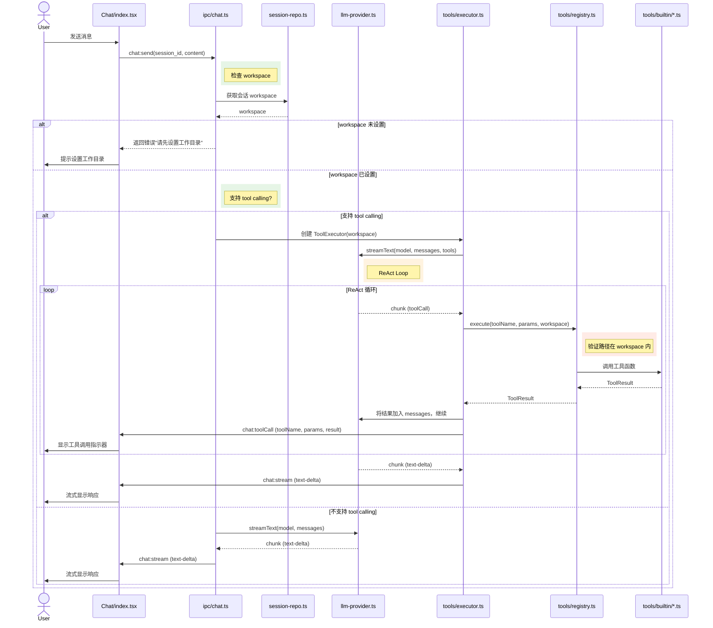

# talor-desktop 工具调用功能设计文档

> **迭代级文档**。描述本次迭代**要改什么、怎么设计**。
> 迭代完成后，将本文档中的变更合并到 OVERVIEW / overview-talor-desktop，然后标记 archived。
>
> **追溯链**：US-000, US-001, US-002, US-003, US-004, US-005, US-006, US-007 → 本文档（FD-talor-desktop-tool-calling）→ IMPL-talor-desktop-tool-calling
> **依赖的 AC**：AC-000-01 ~ AC-007-04
>
> 产品需求见 `requirements.md §1.4 US-000~US-007`。
> 模块现状见 `OVERVIEW-talor-desktop.md`。
> 实施计划见 `implementation.md`。

---

<!--
doc-id: FD-talor-desktop-tool-calling
status: approved
version: 1.1
last-updated: 2026-03-23
depends-on: [US-000, US-001, US-002, US-003, US-004, US-005, US-006, US-007]
generates: [IMPL-talor-desktop-tool-calling]
-->

---

## Pre-generation Checklist（生成前必须回答）

- [x] 已读 OVERVIEW-talor-desktop.md，了解模块当前状态
- [x] 本次变更涉及哪些状态机转换的新增或修改？（无新增状态机，纯功能扩展）
- [x] 是否涉及全局架构变更（新增中间件、Schema 大改、新 ADR）？（是，新增 Tool 模块 + 会话 workspace 字段）
- [x] 是否有并发/幂等要求？幂等键是什么？（工具调用为同步操作，无幂等要求）
- [x] 修改本功能会影响哪些下游服务？（无下游服务，纯前端+主进程变更）

---

## F.1 变更背景

**关联需求**：US-000, US-001, US-002, US-003, US-004, US-005, US-006, US-007（requirements.md §1.4）

**变更原因**：

当前 talor-desktop 仅支持纯文本对话，无法执行实际的文件操作任务。用户需要手动查找文件、复制路径、粘贴内容，流程繁琐。通过引入工具调用能力，用户可在聊天中直接要求 AI 执行 read/write/edit/glob/grep/ls/bash 等文件操作，AI 通过 ReAct 循环自动判断、调用工具、整合结果。

**变更范围**：
1. 新增 `src/main/tools/` 模块（工具注册表 + 7 个内置工具 + ReAct 执行器）
2. 新增并行工具调用支持（ReAct 执行器支持同时执行多个工具）
3. 修改会话表，新增 `workspace` 字段（会话级工作目录）
4. 修改 `src/main/ipc/chat.ts`（集成 ReAct 执行器）
5. 新增 UI 组件：工具调用指示器 + 可展开详情（`src/renderer/`）

---

## F.2 全局影响

### 新增模块/组件

| 组件 | 路径 | 职责 |
|------|------|------|
| 工具注册表 | `src/main/tools/registry.ts` | 存储工具定义（schema）+ 执行器引用 |
| 工具执行器 | `src/main/tools/executor.ts` | ReAct 循环：调用 LLM → 判断工具 → 执行 → 循环 |
| 工具类型定义 | `src/main/tools/types.ts` | ToolDefinition, ToolResult, ToolCallLog 接口 |
| 内置工具 | `src/main/tools/builtin/*.ts` | read/write/edit/glob/grep/ls/bash 7 个工具实现 |
| UI 组件 | `src/renderer/components/ToolCallLog.tsx` | 工具调用日志展示组件 |
| 工作目录选择器 | `src/renderer/components/WorkspaceSelector.tsx` | 会话级工作目录选择 UI |

### Schema 变更

**会话表（sessions）**：
```sql
-- 新增字段
ALTER TABLE sessions ADD COLUMN workspace TEXT;
```

**配置文件（config.json）**：
```json
{
  "tool": {
    "maxReadSizeBytes": 10485760,    // 默认 10MB
    "maxWriteSizeBytes": 10485760    // 默认 10MB
  }
}
```

### Schema / API / 全局协议变更

**变更前**：
```
chat:send IPC 只接收 text + attachments，返回 stream text chunks
```

**变更后**：
```
chat:send IPC 接收 text + attachments + workspace（会话的工作目录）
  ↓
  检查会话是否设置 workspace，未设置则拒绝工具调用
  ↓
  检查模型是否支持 tool_calling（通过 model-availability 检测）
  ↓
  支持：进入 ReAct 循环（streamText + tools，tools 受 workspace 限制）
  不支持：回退到纯文本 stream
```

### 环境差异变更

| 配置项 | dev 变更 | staging 变更 | prod 变更 |
|--------|---------|------------|---------|
| 工具可用路径 | 限制在会话 workspace 内 | 同 dev | 同 dev |
| 读取文件大小限制 | 默认 10MB（可配置） | 同 dev | 同 dev |
| 写入文件大小限制 | 默认 10MB（可配置） | 同 dev | 同 dev |

### 新增 Patterns

| Pattern 名称 | 使用场景 | 参考代码 |
|-------------|---------|---------|
| ReAct Loop | AI 模型多轮工具调用场景 | `src/main/tools/executor.ts` |
| Parallel Tool Execution | AI 模型并行调用多个工具场景 | `src/main/tools/executor.ts` (parallelExecute) |
| Tool Registry | 工具定义+执行器分离模式 | `src/main/tools/registry.ts` |
| Session-level Workspace | 每个会话独立的工作目录隔离 | 会话表 workspace 字段 |
| Streaming Tool Indicator | 流式响应中工具调用状态展示 | `src/renderer/components/ToolCallLog.tsx` |
| Workspace Path Validation | 工具执行时验证路径在工作目录内 | 各工具的 path validation |

---

## F.3 新增/变更的状态机转换

本次功能不涉及会话状态机转换的变更。工具调用属于纯功能扩展，不改变现有的会话/消息状态机。

**新增业务规则**：
- 会话无 workspace → 工具调用不可用
- 工具访问路径超出 workspace → 拒绝执行

---

## F.4 新增/变更的接口协议

### 新增接口

```
// src/main/tools/registry.ts
class ToolRegistry {
  register(tool: ToolDefinition, executor: (params: object, workspace: string) => Promise<ToolResult>): void
  getTool(name: string): ToolDefinition | undefined
  getAllSchemas(): ToolDefinition[]
  execute(name: string, params: object, workspace: string): Promise<ToolResult>
}

// src/main/tools/executor.ts
class ToolExecutor {
  constructor(model: LanguageModel, registry: ToolRegistry, workspace: string)
  run(messages: Message[], onToolCall?: (call: ToolCall) => void): AsyncIterable<StreamChunk>
}

// src/main/repos/session-repo.ts
interface Session {
  id: string
  workspace: string | null  // 新增：工作目录
  // ...
}

// IPC:session:updateWorkspace
ipcMain.handle('session:updateWorkspace', (sessionId, workspacePath) => {
  // 验证路径有效性，更新会话 workspace
})
```

### 变更接口

**变更前**：
```typescript
// src/main/ipc/chat.ts
ipcMain.handle('chat:send', (params) => {
  const result = streamText({ model, messages, onChunk })
  return result
})
```

**变更后**：
```typescript
// src/main/ipc/chat.ts
ipcMain.handle('chat:send', (params) => {
  // 获取会话的 workspace
  const session = sessionRepo.getById(params.session_id)
  if (!session.workspace) {
    throw new Error('WORKSPACE_NOT_SET')
  }
  
  // 检测模型能力
  if (model.supportsToolCalling) {
    // ReAct 循环，传递 workspace
    const executor = new ToolExecutor(model, toolRegistry, session.workspace)
    return executor.run(messages, onToolCall => {
      mainWindow.webContents.send('chat:toolCall', onToolCall)
    })
  } else {
    // 回退到纯文本
    return streamText({ model, messages, onChunk })
  }
})
```

---

## F.5 并发与幂等要求

### 幂等要求

| 操作 | 是否要求幂等 | 幂等键 | 处理方式 |
|------|------------|--------|---------|
| 工具执行 | 否 | N/A | 工具调用是同步操作，每次调用独立 |
| ReAct 循环 | 否 | N/A | 循环次数由模型决定，无幂等需求 |
| 工作目录设置 | 是 | session_id | 同一会话多次设置取最新值 |

### 并发锁策略

| 场景 | 锁类型 | 实现方式 | 超时配置 |
|------|--------|---------|---------|
| 会话 workspace 更新 | 本地锁 | sessionRepo 事务 | 无超时 |

### 重试机制

| 操作 | 是否重试 | 最大重试次数 | 重试间隔 | 不重试的条件 |
|------|---------|------------|---------|-----------|
| 工具执行失败 | 是 | 1 次 | 即时 | 权限错误、文件不存在、超范围等业务错误 |

### 竞态条件风险点

| 风险场景 | 可能后果 | 防护策略 |
|---------|---------|---------|
| 多会话同时设置 workspace | 覆盖问题 | workspace 按 session_id 隔离，无并发冲突 |
| 工具执行中 workspace 被删除 | 执行失败 | 检查 workspace 有效性后再执行 |

---

## F.6 涟漪分析（Ripple Analysis）

### 下游影响

| 变更内容 | 影响的下游模块/服务 | Breaking Change? | 迁移步骤 |
|---------|-----------------|----------------|---------|
| 会话表新增 workspace 字段 | 数据库需迁移 | ⚠️ 需确认 | ALTER TABLE sessions ADD COLUMN workspace |
| chat:send 返回格式变化 | 渲染进程需处理 toolCall 事件 | ⚠️ 需确认 | 新增事件监听 |
| 新增 UI 组件 | 无 | 否 | 新增组件 |

### 需要同步修改的关联模块

- [ ] `src/main/db/schema.sql`：新增 workspace 字段
- [ ] `src/main/repos/session-repo.ts`：新增 updateWorkspace 方法
- [ ] `src/main/providers/llm-provider.ts`：添加 `toolSchemas()` 方法导出工具 schema
- [ ] `src/renderer/pages/Chat/index.tsx`：处理 `chat:toolCall` 事件，更新 UI
- [ ] `src/renderer/pages/Chat/index.tsx`：新增工作目录设置 UI
- [ ] `OVERVIEW-talor-desktop.md`：合并工具模块的职责定义

### 需要通知的团队

- [ ] 无（桌面客户端独立模块）

---

## F.7 流程图



**异常路径**：
- workspace 未设置 → 返回错误，提示设置工作目录
- 工具执行失败 → 错误结果返回给 LLM，LLM 决定是否重试
- 工具执行超时（>30s） → 返回超时错误给 LLM
- 工具访问路径超出 workspace → 返回"无法访问工作目录外"错误
- 模型不支持 tool calling → 回退到纯文本模式