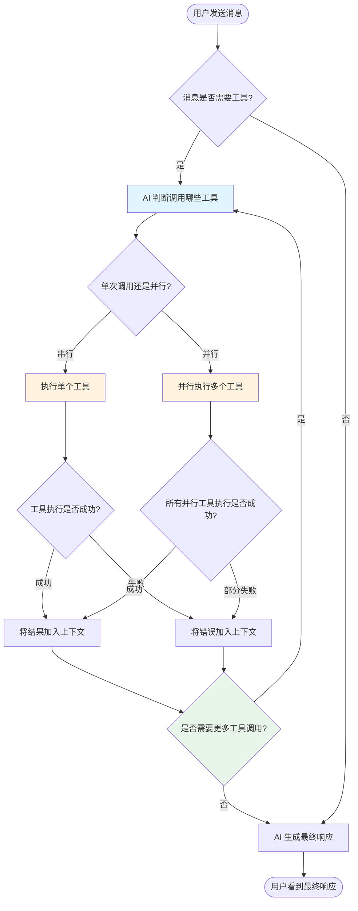

# talor-desktop 工具调用需求文档

> 纯用户视角。本文档描述**用户需要什么**，不描述系统如何实现。
> 所有术语命名以 §1.3 术语表为准——AI 在编写代码、注释、变量名时必须严格遵循。
> 项目现状见 `OVERVIEW-talor-desktop.md`。功能设计见 `feature.md`。实施计划见 `implementation.md`。

---

<!--
doc-id: REQ-talor-desktop-tool-calling
status: approved
version: 1.1
last-updated: 2026-03-23
depends-on: [OVERVIEW-talor-desktop]
generates: [FD-talor-desktop-tool-calling]
-->

## Pre-generation Checklist（生成前必须完成）

- [x] 已与需求方确认业务背景和核心目标
- [x] 已列出所有业务术语并确认定义（特别是易混淆词）
- [x] 每个用户故事已附真实数据样例（非 schema）
- [x] 边界 Case 和异常场景已逐一列举

---

## 1.1 需求背景

当前 talor-desktop 只能进行简单的文字对话，用户无法让 AI 执行实际的文件操作任务。当用户需要 AI 读取代码文件、分析项目结构、或者批量修改文件时，必须手动复制路径、打开文件、再将内容粘贴到聊天窗口，流程繁琐且容易出错。

通过引入工具调用能力，用户可以在聊天中直接要求 AI 执行文件操作任务（读取、写入、搜索等），AI 会自动判断是否需要调用工具、执行工具、并将结果整合到最终响应中。整个过程对用户透明可见，用户可以展开查看工具执行的详细信息。

---

## 1.2 目标

- [ ] **目标 1**：用户发送包含工具调用意图的消息时，AI 自动识别并执行对应工具（read/write/edit/glob/grep/ls），将工具执行结果整合到最终响应中
- [ ] **目标 2**：工具调用过程在 UI 中可见，用户可以看到"AI 正在使用工具"的指示，并可展开查看工具名称、参数和执行结果
- [ ] **目标 3**：ReAct 循环执行正确——AI 可多次调用工具直到获得最终答案，单次对话中工具调用次数无硬性上限
- [ ] **目标 4**：工具执行失败时，错误信息正确反馈给 AI 模型，模型能够据此给出合理的用户提示
- [ ] **目标 5**：架构设计兼容 MCP 工具扩展（未来可扩展）

**本次不包含的目标**：
- 不包含 MCP 协议客户端实现（MCP 作为预留扩展）
- 不包含自定义工具注册功能（v1 仅内置工具）

---

## 1.3 业务术语表（Glossary）

| 术语 | 定义 | 代码命名 | 易混淆项（区分说明） |
|------|------|---------|-------------------|
| 工作目录 | 用户在桌面客户端中选择的项目根目录，工具操作限制在此目录范围内 | `workdir` / `workspace` | 与"系统目录"易混淆：工作目录是用户选择的，系统目录是系统自带的 |
| 工具调用（Tool Calling） | AI 模型通过 function calling 机制调用外部工具函数并获取执行结果的能力 | `tool_calling` | 与"工具执行"易混淆：工具调用指 AI 决定调用哪个工具的动作，工具执行指实际运行工具代码的过程 |
| ReAct 循环 | AI 模型在单次响应中循环执行"思考→判断→调用工具→获取结果→再次思考"直到得到最终答案的执行模式 | `react_loop` | 无 |
| 工具注册表 | 存储所有可用工具定义（名称、描述、参数 schema）和执行器的系统 | `tool_registry` | 与"工具执行器"易混淆：注册表存定义和引用，执行器负责实际执行 |
| 工具执行器 | 负责根据工具名称和参数实际调用工具函数并返回结果的组件 | `tool_executor` | 与"工具注册表"易混淆，见上 |
| 工具调用日志 | 用户界面中显示的工具调用过程记录，包含工具名、参数、执行状态、执行结果 | `tool_call_log` | 与"聊天消息"易混淆：工具调用日志是辅助信息，聊天消息是用户可见的正式内容 |
| 流式响应 | 服务器分块返回数据，客户端实时逐块渲染的通信模式 | `stream_response` | 无 |
| 工具调用指示器 | UI 中显示"AI 正在使用工具"的视觉提示组件 | `tool_call_indicator` | 无 |
| 可展开详情 | 用户可点击展开/收起查看更多细节的 UI 组件 | `expandable_details` | 无 |
| bash 工具 | 在工作目录内执行 shell 命令的工具 | `bash_tool` | 与"文件操作"易混淆：bash 是执行命令，文件操作是读写 |
| 并行工具调用 | AI 模型在同一轮响应中同时调用多个工具的能力 | `parallel_tool_calling` | 与"串行工具调用"易混淆：并行是一次调用多个，串行是顺序调用 |

---

## 1.4 用户故事

---

### US-001：用户请求 AI 读取文件

**用户故事**：作为桌面应用用户，当我在聊天中请求 AI 读取某个文件时，我希望 AI 自动调用 read 工具读取文件内容并展示给我，以便我无需手动查找和打开文件。

**正常场景**：

| 输入 | 期望输出 |
|------|---------|
| 用户发送："请帮我读取 src/main/index.ts 文件" | AI 调用 read 工具，工具返回文件内容，AI 将内容整合到响应中 |

**真实数据样例**：

```
输入：请帮我读取 src/main/index.ts 文件

期望输出（包含工具调用）：
🛠️ 使用工具: read
  参数: {"file_path": "src/main/index.ts"}
  结果: [文件内容已读取]

[AI 整合后的最终响应]
文件内容如下：
...
```

**异常场景 & 边界 Case**：

| 条件 | 系统应 |
|------|--------|
| 当文件路径不存在时 | 工具返回错误，AI 向用户提示"文件不存在" |
| 当文件编码不是 UTF-8 时 | 工具返回错误，AI 向用户提示"无法读取二进制文件" |
| 当文件大小超过 10MB 时 | 工具返回错误，AI 向用户提示"文件过大" |
| 当用户请求读取系统敏感路径时 | 工具返回错误，AI 向用户提示"无法访问该路径" |

---

### US-002：用户请求 AI 搜索文件

**用户故事**：作为桌面应用用户，当我想了解项目中有哪些文件包含特定内容时，我希望 AI 自动调用 glob/grep 工具搜索并列出匹配的文件，以便我快速定位目标文件。

**正常场景**：

| 输入 | 期望输出 |
|------|---------|
| 用户发送："帮我找找项目里有哪些 React 组件" | AI 调用 glob 工具搜索 *.tsx 文件，返回匹配列表 |

**真实数据样例**：

```
输入：帮我找找项目里有哪些 React 组件

期望输出：
🛠️ 使用工具: glob
  参数: {"pattern": "**/*.tsx"}
  结果: ["src/components/Button.tsx", "src/components/Header.tsx", ...]

根据搜索结果，项目中有以下 React 组件：
- src/components/Button.tsx
- src/components/Header.tsx
...
```

**异常场景 & 边界 Case**：

| 条件 | 系统应 |
|------|--------|
| 当搜索模式为空时 | 返回错误，提示"搜索模式不能为空" |
| 当没有匹配文件时 | 返回空列表，AI 提示"未找到匹配文件" |
| 当搜索路径深度超过限制时 | 返回错误，提示"搜索深度超限" |

---

### US-003：用户请求 AI 执行多次工具调用

**用户故事**：作为桌面应用用户，当我请求一个需要多步操作的任务时，我希望 AI 能够多次调用工具（先列出文件，再读取内容，再搜索关键词），直到完成整个任务，以便我只用一条消息就能完成复杂操作。

**正常场景**：

| 输入 | 期望输出 |
|------|---------|
| 用户发送："查看 src 目录下有哪些 TypeScript 文件，然后读取第一个" | AI 调用 ls 获取文件列表 → 调用 read 读取第一个文件 → 返回最终结果 |

**真实数据样例**：

```
输入：查看 src 目录下有哪些 TypeScript 文件，然后读取第一个

期望输出（多步工具调用）：
🛠️ 使用工具: ls
  参数: {"path": "src", "filter": "*.ts"}
  结果: ["file1.ts", "file2.ts", "file3.ts"]

🛠️ 使用工具: read
  参数: {"file_path": "src/file1.ts"}
  结果: [文件内容]

以下是 src 目录下的 TypeScript 文件：
- file1.ts
- file2.ts
- file3.ts

第一个文件 file1.ts 的内容如下：
...
```

**异常场景 & 边界 Case**：

| 条件 | 系统应 |
|------|--------|
| 当某次工具调用失败时 | 继续执行后续工具（如果可能），或在最终响应中说明失败原因 |
| 当超过 10 次工具调用仍无最终答案时 | 停止循环，向用户说明"任务较复杂，已尝试多次" |

---

### US-004：用户查看工具调用详情

**用户故事**：作为桌面应用用户，当 AI 正在使用工具时，我希望看到明显的视觉提示，让我知道 AI 正在处理；我还希望能够展开查看工具调用的详细信息（工具名、参数、执行结果），以便了解 AI 的工作过程。

**正常场景**：

| 输入 | 期望输出 |
|------|---------|
| 用户发送需要工具调用的消息 | UI 显示工具调用指示器（"🛠️ 使用工具中..."），完成后可展开查看详情 |

**真实数据样例**：

```
用户消息："读取 src/main.ts"

UI 展示：
[用户消息: 读取 src/main.ts]

[AI 响应区域]
🛠️ 使用工具: read (展开▼)
   工具名: read
   参数: {"file_path": "src/main.ts"}
   状态: ✅ 完成
   结果: [文件内容]

[最终响应]
文件 src/main.ts 的内容如下：
...
```

**异常场景 & 边界 Case**：

| 条件 | 系统应 |
|------|--------|
| 当工具调用很快速时 | 指示器可以快速闪烁后消失，不强制展示 |
| 当工具执行超时（>30秒） | 指示器显示超时状态，AI 决定是否重试或放弃 |

---

### US-005：用户请求 AI 写入文件

**用户故事**：作为桌面应用用户，当我想让 AI 生成或修改文件内容时，我希望 AI 调用 write/edit 工具直接创建或修改文件，以便我无需手动编辑文件。

**正常场景**：

| 输入 | 期望输出 |
|------|---------|
| 用户发送："创建一个新文件 src/test.ts，内容是 console.log('hello')" | AI 调用 write 工具创建文件，返回成功提示 |

**真实数据样例**：

```
输入：创建一个新文件 src/test.ts，内容是 console.log('hello')

期望输出：
🛠️ 使用工具: write
  参数: {"file_path": "src/test.ts", "content": "console.log('hello')"}
  结果: ✅ 文件已创建

已创建文件 src/test.ts，内容如下：
console.log('hello')
```

**异常场景 & 边界 Case**：

| 条件 | 系统应 |
|------|--------|
| 当文件已存在且用户要求覆盖时 | 执行覆盖，并在响应中说明"文件已存在，已覆盖" |
| 当文件已存在但用户未明确覆盖时 | 工具返回错误，AI 询问"文件已存在，是否覆盖？" |
| 当父目录不存在时 | 工具返回错误，AI 提示"父目录不存在" |
| 当写入路径在允许范围外时 | 工具返回错误，AI 提示"无法写入该路径" |

---

### US-006：用户请求 AI 执行 Shell 命令

**用户故事**：作为桌面应用用户，当我想让 AI 执行一些命令行操作时，我希望 AI 调用 bash 工具在工作目录内执行命令，以便我无需手动打开终端。

**正常场景**：

| 输入 | 期望输出 |
|------|---------|
| 用户发送："帮我运行 npm install" | AI 调用 bash 工具执行命令，返回命令输出 |

**真实数据样例**：

```
输入：帮我运行 npm install

期望输出：
🛠️ 使用工具: bash
  参数: {"command": "npm install", "workdir": "src"}
  结果: [命令输出]

npm install 执行完成，输出如下：
added 123 packages in 10s
```

**异常场景 & 边界 Case**：

| 条件 | 系统应 |
|------|--------|
| 当命令执行超时时 | 工具返回超时错误，AI 提示"命令执行超时" |
| 当命令执行失败时 | 工具返回错误码和输出，AI 向用户展示错误信息 |
| 当命令试图访问工作目录外路径时 | 工具返回错误，AI 提示"无法访问工作目录外" |
| 当命令为危险操作时（如 rm -rf /） | 工具拒绝执行，返回错误 |

---

### US-007：用户请求 AI 并行执行多个工具

**用户故事**：作为桌面应用用户，当我需要同时执行多个独立的任务时，我希望 AI 同时调用多个工具（而非顺序执行），以便更快地获得结果。

**正常场景**：

| 输入 | 期望输出 |
|------|---------|
| 用户发送："帮我同时搜索 src 目录下的所有 .ts 文件和 .tsx 文件" | AI 并行调用 glob 工具两次，返回两个搜索结果 |

**真实数据样例**：

```
输入：帮我同时搜索 src 目录下的所有 .ts 文件和 .tsx 文件

期望输出：
🛠️ 使用工具: glob (并行)
  参数: {"pattern": "**/*.ts"}
  结果: ["file1.ts", "file2.ts"]

🛠️ 使用工具: glob (并行)
  参数: {"pattern": "**/*.tsx"}
  结果: ["comp1.tsx", "comp2.tsx"]

搜索结果：
- .ts 文件：file1.ts, file2.ts
- .tsx 文件：comp1.tsx, comp2.tsx
```

**异常场景 & 边界 Case**：

| 条件 | 系统应 |
|------|--------|
| 当部分并行工具执行失败时 | 成功的工具返回结果，失败的工具返回错误，AI 汇总展示 |
| 当所有并行工具都失败时 | 工具返回错误，AI 提示"所有工具执行失败" |
| 当并行工具数量超过限制时（最多 5 个） | 只执行前 5 个工具，提示"部分工具已忽略" |

---

## 1.5 业务流程图



---

## 1.6 功能清单

| ID | 功能描述 | 所属用户故事 | 优先级 | 备注 |
|----|---------|------------|--------|------|
| F-001 | 工具注册表：定义 read/write/edit/glob/grep/ls/bash 工具的 schema 和执行器 | US-001, US-002, US-005, US-006 | P0 | 基础组件 |
| F-002 | ReAct 循环执行器：循环调用 LLM + 工具直到获取最终答案 | US-003 | P0 | 核心逻辑 |
| F-003 | read 工具：读取文件内容，支持 offset/limit | US-001 | P0 | 内置工具 |
| F-004 | write 工具：创建或覆盖文件 | US-005 | P0 | 内置工具 |
| F-005 | edit 工具：基于字符串替换编辑文件 | US-005 | P1 | 内置工具 |
| F-006 | glob 工具：按模式搜索文件路径 | US-002 | P0 | 内置工具 |
| F-007 | grep 工具：搜索文件内容 | US-002 | P0 | 内置工具 |
| F-008 | ls 工具：列出目录内容 | US-002 | P0 | 内置工具 |
| F-009 | bash 工具：在工作目录内执行 shell 命令 | US-006 | P0 | 内置工具 |
| F-010 | 工具调用指示器：UI 显示工具执行中状态 | US-004 | P0 | UI 组件 |
| F-011 | 可展开详情：显示工具名称、参数、执行结果 | US-004 | P0 | UI 组件 |
| F-012 | 工具错误处理：工具失败时错误正确传递并显示 | US-001, US-002, US-005, US-006 | P0 | 错误处理 |
| F-013 | 工具 schema 导出：生成 AI SDK 兼容的工具定义 | US-001, US-002, US-005, US-006 | P0 | 接口定义 |
| F-014 | MCP 兼容接口：工具模块接口支持未来扩展 MCP 工具 | 全局 | P2 | 预留扩展 |

---

## 1.7 优先级与取舍原则

### 优先级排序

**本需求的优先级顺序（从高到低）**：

1. **安全**：文件操作必须在用户选择的工作目录范围内，禁止访问系统敏感路径
2. **正确性**：工具调用必须正确执行，错误必须正确返回给 AI 模型
3. **性能**：工具执行响应时间应 < 2 秒（对用户无感知）
4. **体验**：工具调用过程对用户可见，展开详情功能正常

### 关键概念定义

| 概念 | 定义 |
|------|------|
| 工作目录 | 每个会话独立的工作目录，工具操作限制在该目录范围内（会话级别） |
| 系统敏感路径 | `/etc/`, `/root/`, `~/.ssh/`, `~/.aws/`, `~/.npm/` 等系统配置目录 |
| 读取文件大小限制 | 默认 10MB，可通过 `~/.talor/config.json` 的 `tool.maxReadSizeBytes` 字段配置 |
| 写入文件大小限制 | 默认 10MB，可通过 `~/.talor/config.json` 的 `tool.maxWriteSizeBytes` 字段配置 |

### 关键取舍声明

- **工作目录**：每个会话独立设置工作目录，工具权限仅限该目录，无法访问其他会话的目录
- **文件大小限制**：读取默认 10MB，写入默认 10MB，可通过配置调整
- **bash 安全约束**：命令必须在工作目录内执行，危险命令（rm -rf / 等）被拒绝执行
- **出错时**：工具执行失败时阻断流程，返回错误给 AI 模型，不静默失败
- **工具数量 vs 扩展性**：v1 实现 7 个内置工具（read/write/edit/glob/grep/ls/bash），接口设计兼容 MCP（未来可扩展）

### 降级策略

| 场景 | 降级行为 | 禁止行为 |
|------|---------|---------|
| 会话未设置工作目录 | 工具调用不可用，提示"请先设置工作目录" | 不允许跨目录操作 |
| LLM 不支持 tool calling | 回退到纯文本响应，提示用户"当前模型不支持工具调用" | 不自动切换模型 |
| 工具执行超时（>30s） | 返回超时错误给 AI 模型 | 不无限等待，不显示卡死 |
| 文件操作权限不足 | 返回权限错误给 AI 模型 | 不跳过执行，不返回假数据 |
| 读取文件超过 10MB | 返回错误"文件大小超过读取限制（默认10MB）" | 不截断处理 |
| 写入文件超过 10MB | 返回错误"文件大小超过写入限制（默认10MB）" | 不截断处理 |

---

## 1.8 验收标准

> ⭐ **本节是 AC 的唯一权威来源**。FEATURE 和 IMPLEMENTATION 文档只引用 AC ID，不重新定义。

### US-000：会话工作目录

- [ ] **AC-000-01**：Given 用户创建新会话 → When 会话未设置工作目录 → Then 会话 workspace 字段为空，工具调用不可用
- [ ] **AC-000-02**：Given 用户在会话中点击"设置工作目录" → When 用户在系统文件选择器中选择目录 → Then 工作目录保存到会话的 workspace 字段，当前会话工具调用可用
- [ ] **AC-000-03**：Given 会话已设置工作目录 → When 用户切换到其他会话 → Then 每个会话保持独立的工作目录设置
- [ ] **AC-000-04**：Given 工具执行时 → When 工具访问的路径超出工作目录范围 → Then 工具返回错误，AI 响应提示"无法访问工作目录外的路径"

### US-001 验收标准

- [ ] **AC-001-01**：Given 用户发送"请帮我读取 src/main/index.ts" → When AI 调用 read 工具读取文件 → Then 工具返回文件内容，AI 响应包含文件内容
- [ ] **AC-001-02**：Given 文件路径不存在 → When 用户请求读取 → Then 工具返回错误，AI 响应提示"文件不存在"
- [ ] **AC-001-03**：Given 文件为二进制/非 UTF-8 → When 用户请求读取 → Then 工具返回错误，AI 响应提示"无法读取二进制文件"
- [ ] **AC-001-04**：Given 访问系统敏感路径（如 /etc/passwd） → When 用户请求读取 → Then 工具返回错误，AI 响应提示"无法访问该路径"
- [ ] **AC-001-05**：Given 文件大小超过 50MB（或配置的限制） → When 用户请求读取 → Then 工具返回错误，AI 响应提示"文件大小超过限制"

### US-002 验收标准

- [ ] **AC-002-01**：Given 用户发送"帮我找找项目里有哪些 React 组件" → When AI 调用 glob 工具搜索 *.tsx → Then 工具返回匹配文件列表，AI 响应列出文件
- [ ] **AC-002-02**：Given 搜索模式为空 → When 用户发送搜索请求 → Then 返回错误，提示"搜索模式不能为空"
- [ ] **AC-002-03**：Given 无匹配文件 → When 用户发送搜索请求 → Then 工具返回空列表，AI 响应提示"未找到匹配文件"
- [ ] **AC-002-04**：Given 用户发送"搜索 src 目录下包含 'TODO' 的文件" → When AI 调用 grep 工具 → Then 工具返回匹配文件和行号，AI 响应展示结果

### US-003 验收标准

- [ ] **AC-003-01**：Given 用户发送"查看 src 目录下的文件，然后读取第一个" → When AI 执行多轮工具调用（ls → read） → Then 完成所有工具调用后返回最终响应
- [ ] **AC-003-02**：Given 工具调用过程中某次失败 → When AI 获取错误结果 → Then AI 决定是否继续，最终响应包含失败信息
- [ ] **AC-003-03**：Given 连续 10 次工具调用仍未得到最终答案 → When AI 检测循环上限 → Then 停止循环，响应提示"任务较复杂，已尝试多次"

### US-004 验收标准

- [ ] **AC-004-01**：Given 用户发送需要工具调用的消息 → When AI 开始工具调用 → Then UI 显示工具调用指示器（🛠️ 使用工具中...）
- [ ] **AC-004-02**：Given 工具调用指示器显示中 → When 用户点击展开 → Then 显示工具名称、参数、执行结果
- [ ] **AC-004-03**：Given 工具调用完成后 → When 响应已返回 → Then 工具调用指示器消失或保留为可展开状态
- [ ] **AC-004-04**：Given 工具执行超时（>30s） → When 超时发生 → Then 指示器显示超时状态，AI 收到超时错误

### US-005 验收标准

- [ ] **AC-005-01**：Given 用户发送"创建新文件 src/test.ts，内容是 hello" → When AI 调用 write 工具 → Then 文件成功创建，AI 响应确认
- [ ] **AC-005-02**：Given 文件已存在 → When 用户请求创建同名文件 → Then 工具返回错误，AI 询问是否覆盖
- [ ] **AC-005-03**：Given 父目录不存在 → When 用户请求创建文件 → Then 工具返回错误，AI 提示"父目录不存在"
- [ ] **AC-005-04**：Given 用户发送"把 src/test.ts 的 'hello' 改成 'world'" → When AI 调用 edit 工具 → Then 文件内容更新，AI 响应确认
- [ ] **AC-005-05**：Given 写入文件大小超过 10MB（或配置的限制） → When 用户请求写入 → Then 工具返回错误，AI 响应提示"文件大小超过写入限制"

### US-006 验收标准

- [ ] **AC-006-01**：Given 用户发送"帮我运行 npm install" → When AI 调用 bash 工具 → Then 命令在工作目录内执行，返回输出
- [ ] **AC-006-02**：Given 命令执行超时时 → When 用户请求执行耗时命令 → Then 工具返回超时错误，AI 提示"命令执行超时"
- [ ] **AC-006-03**：Given 命令执行失败时 → When AI 调用 bash 工具 → Then 工具返回错误码和输出，AI 向用户展示错误信息
- [ ] **AC-006-04**：Given 命令试图访问工作目录外路径时 → When 用户请求执行 → Then 工具返回错误，AI 提示"无法访问工作目录外"
- [ ] **AC-006-05**：Given 危险命令（如 rm -rf /） → When 用户请求执行 → Then 工具拒绝执行，返回错误

### US-007 验收标准

- [ ] **AC-007-01**：Given 用户发送"同时搜索 .ts 和 .tsx 文件" → When AI 并行调用 glob 工具两次 → Then 两个搜索结果同时返回，AI 汇总展示
- [ ] **AC-007-02**：Given 并行工具中部分执行失败 → When AI 执行多个并行工具 → Then 成功的返回结果，失败的返回错误，AI 汇总展示
- [ ] **AC-007-03**：Given 并行工具全部执行失败 → When AI 执行多个并行工具 → Then AI 提示"所有工具执行失败"
- [ ] **AC-007-04**：Given 并行工具数量超过 5 个 → When AI 尝试并行调用超过 5 个工具 → Then 只执行前 5 个，提示"部分工具已忽略"